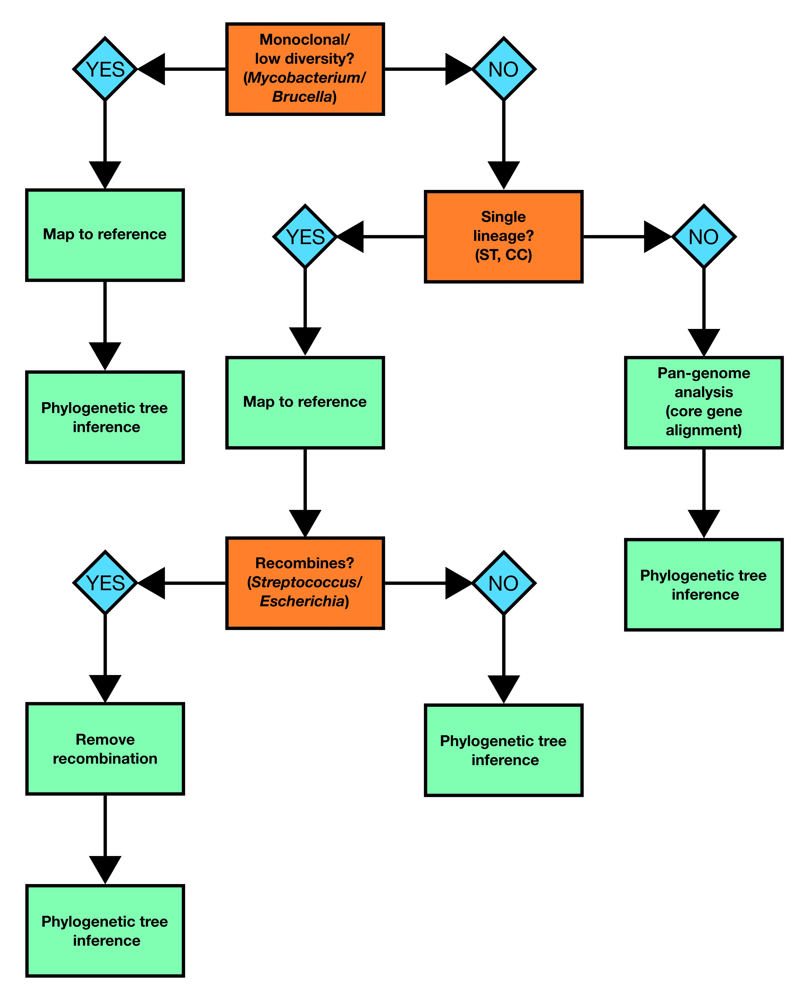

::: {.callout-tip}
## Learning Objectives

- Understand that there are different ways to approach your analyses depending on which species you're analysing

:::

Before starting your analysis, it's important to understand the characteristics of the species you're working with as this will determine how best to proceed.  In particular, you need to understand how much genetic diversity or plasticity is present in your bug and whether or not it recombines.  For instance the approach you take to build a phylogenetic tree of *Mycobacterium tuberculosis* genomes will differ from the methods you'd use to build a tree with *Escherichia coli*.  To help with making your decision, we've provided a flowchart which outlines the best approach to take depending on what your dataset is composed of:

This week, we're going to work with three different bacterial species that each require a different analysis path through the diagram above.

- _Mycobacterium tuberculosis_ - a monoclonal (i.e. relatively little genomic diversity) organism that doesn't recombine so we'll build a phylogenetic tree by mapping to a reference.
- _Staphylococcus aureus_ - a diverse organism with low levels of recombination. We're going to be working with a dataset consisting of more than a single lineage so we'll take the approach of building a core gene alignment to use to infer our phylogenetic tree.
- _Streptococcus pneumoniae_ - a diverse organism that frequently recombines. As the dataset consists of isolates from a single lineage/serotype, we're going to map to a reference and identify and remove recombinant regions before building our phylogenetic tree.

## Summary

::: {.callout-tip}
## Key Points

:::