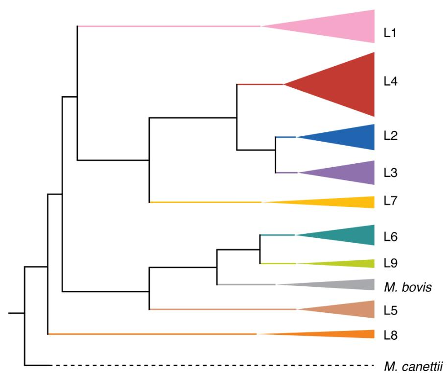

::: {.callout-tip}
## Learning Objectives

- Understand what TB is.

:::

## *Mycobacterium tuberculosis*

*Mycobacterium tuberculosis*, the bacterium that causes tuberculosis (TB) in humans, is a significant pathogen with a considerable global impact. In 2020, the World Health Organization estimated that TB was responsible for 10.6 million active cases and 1.6 million deaths across the globe.  This means that *M .tuberculosis* causes greater mortality than any other single pathogen. *M. tuberculosis* is a small, aerobic, nonmotile bacillus. The high lipid content of its cell wall makes the cell impervious to Gram staining, so it is classified as an acid-fast bacillus. The bacterium is able to survive and multiply within macrophages, which are cells that usually kill bacteria. This ability to evade the immune system contributes to its virulence. *M. tuberculosis* is transmitted from person to person via droplets from the throat and lungs of people with active respiratory disease. In healthy individuals, the immune system can often wall off the bacteria and prevent them from spreading within the body. However, in immunocompromised individuals, such as those with HIV, the bacteria can spread and cause active disease.

In 1998, the first complete genome sequence of a *M. tuberculosis* strain, the virulent laboratory reference strain H37Rv, was published (Cole 1998).The genome of *M. tuberculosis* is a single circular chromosome that is approximately 4.4 million base pairs in size and contains around 4000 genes.  *M. tuberculosis* is a member of the Mycobacterium tuberculosis complex (MTBC), which includes different lineages, some referred to as *M. tuberculosis sensu stricto* (lineage 1 to lineage 4 and lineage 7), others as *M. africanum* (lineage 5 and lineage 6), two recently discovered lineages (lineage 8 and lineage 9), and several animal-associated ecotypes such as *M. bovis* and *M. caprae*. Some lineages are geographically widespread, while others like L5 and L6 (mainly found in West Africa), are more restricted. A simplified phylogeny showing the relationship of the various MTBC lineages is shown below.

Increasingly, *M. tuberculosis* is resistant to many of the frontline antimicrobials used to treat TB such as isoniazid and rifampicin which is an enormous clinical, financial, and public health challenge across the world. Traditionally, susceptibility of TB isolates to different antimicrobials was conducted in the laboratory but in recent years, antimicrobial profiling using genomic sequencing has been shown to be nearly as accurate as lab methods, especially for the most commonly used drugs.  Catalogues of genetic variants that are known to confer resistance to particular antimicrobials are used to type TB genomes potentially saving time and money. 

## Course dataset

We will be analysing a dataset of Namibian *M. tuberculosis* genomes that was recently published (Claasens 2022). The original dataset consisted of 136 drug-resistant TB isolates collected from patients between 2016-2018 across Namibia. For the purposes of this course, mainly to save time,  we're only going to analyse 50 genomes from the dataset.

## MTBC ancestral reference sequence

The most widely used reference genomes when doing reference-based alignment of MTBC short reads are the H37Rv type strain originally sequenced in 1998 and the putative MTBC ancestral sequence that was inferred by Comas *et al.* in 2013.  As both of these sequences were based on lineage 4 sequences, they do not capture the complete structural variation likely to be found in the MTBC.  To improve this ancestral sequence, Harrison *et al.* compared closed (i.e. complete with no gaps) genomes from across the MTBC and inferred a new MTBC ancestral sequence, MTBC0 (Harrison 2023).  This is the reference sequence we'll use this week.

## Summary

::: {.callout-tip}
## Key Points

:::

#### References

Claasens M, *et al.* Whole-Genome Sequencing for Resistance Prediction and Transmission Analysis of *Mycobacterium tuberculosis* Complex Strains from Namibia. *Microbiology Spectrum*. 2022. [DOI](https://doi.org/10.1128/spectrum.01586-22)

Cole ST, *et al.* Deciphering the biology of *Mycobacterium tuberculosis* from the complete genome sequence. *Nature*. 1998. [DOI](https://doi.org/10.1038/31159)

Harrison L, *et al.* An imputed ancestral reference genome for the *Mycobacterium tuberculosis* complex better captures structural genomic diversity for reference-based alignment workflows. *bioRxiv*. 2023. [DOI](https://doi.org/10.1101/2023.09.07.556366)

World Health Organization. Global Tuberculosis Report 2021. Geneva: World Health Organization; 2021. [Link](https://www.who.int/publications/i/item/9789240037021)

