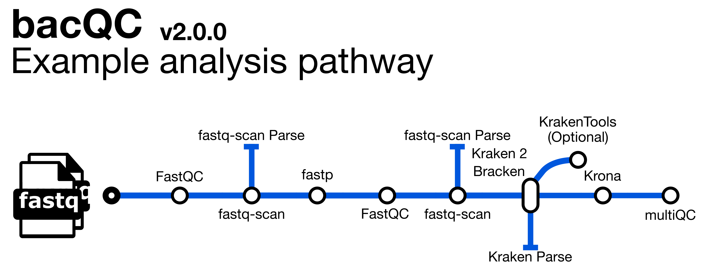

::: {.callout-tip}
#### Learning Objectives

- Understand what the bacQC pipeline can do.
- Learn to identify poor quality sequence data
- Learn to identify contamination by non-target species in sequence data

:::

## Pipeline Overview



**bacQC** is a bioinformatics analysis pipeline written in Nextflow that automates the **Q**uality **C**ontrol of short read sequencing data.  It runs the following tools: 

- [`fastQC`](https://www.bioinformatics.babraham.ac.uk/projects/fastqc/) - assesses sequencing read quality
- [`fastq-scan`](https://github.com/rpetit3/fastq-scan) - calculates FASTQ summary statistics
- [`fastp`](https://github.com/OpenGene/fastp) - performs adapter/quality trimming on sequencing reads
- [`Kraken2`](https://ccb.jhu.edu/software/kraken2/) - assigns taxonomic labels to reads
- [`Bracken`](https://ccb.jhu.edu/software/bracken/) - refines `Kraken2` assignments
- [`MultiQC`](https://multiqc.info/) - summarises and creates visualizations for outputs from `fastQC`, `fastp` and `MultiQC`

See [Course Software](appendices/02-course_software.md) for a more detailed description of each tool.

Along with the outputs produced by the above tools, the pipeline produces the following summaries containing results for all samples run through the pipeline:

- `raw_fastq-scan_summary.tsv` - final summary of FASTQ summary statistics for input files in TSV format
- `trim_fastq-scan_summary.tsv` - final summary of FASTQ summary statistics for trimmed FASTQ files
- `read_stats_summary.tsv` - final summary of pre- and post-trimming sequence statistics in TSV format
- `species_composition.tsv` - final summary of taxonomic assignment in TSV format in TSV format
- `multiqc_report.html` - final summary of sequence quality, trimming and species composition for input files in HTML format

## Preparing Files

On our computers, for each of the three species we will be working with on the course, we have a directory in `~/Documents/bacterial_genomics` for each species where we will do all our analysis. 
We already included the following in each species directory: 
 
- `data` → contains the sequencing files we will be working with. 
- `resources` → where we include other files we will be using such as reference genomes, and some background datasets that will be used with some of the tools we will cover. 
- `scripts` → where we include some scripts that we will use during the course. You will also create several scripts during the course, which you will save here. 
- `sample_info.csv` → a table with some metadata for our samples.

:::{.callout-exercise}

Your first task is to **create two new directories** in each species folder called `report` and `results`. 
You can do this either using the file explorer <i class="fa-solid fa-folder"></i> or from the command line (using the `mkdir` command). 

:::

### Data

Your analysis starts with FASTQ files (if you need a reminder of what a FASTQ file is, look at the [Intro to NGS > FASTQ](02-intro_wgs.html#FASTQ_Files) section of the materials). The Illumina files come as compressed FASTQ files (`.fastq.gz` format) and there's two files per sample, corresponding to read 1 and read 2. 
This is indicated by the file name suffix: 

- `*_1.fastq.gz` for read 1
- `*_2.fastq.gz` for read 2

You can look at the files you have available in any of the species directories from the command line using: 

```bash
ls data/reads
```

### Metadata

A critical step in any analysis is to make sure that our samples have all the relevant metadata associated with them. This is important to make sense of our results and produce informative reports at the end. There are many types of information that can be collected from each sample and for effective genomic surveillance, we need at the very minimum three pieces of information:

- **When**: date when the sample was collected (not when it was sequenced!).
- **Where**: the location where the sample was collected (not where it was sequenced!).
- **Source**: the source of the the sample e.g. host, environment.

Of course, this is the `minimum` metadata we need for a useful analysis. 
However, the more information you collect about each sample, the more questions you can ask from your data -- so always remember to record as much information as possible for each sample. 

:::{.callout-warning}

**Dates in Spreadsheet Programs**

Note that programs such as _Excel_ often convert date columns to their own format, and this can cause problems when analysing data later on. 
For example, GISAID wants dates in the format YYYY-MM-DD, but by default _Excel_ displays dates as DD/MM/YYYY.  
You can change how _Excel_ displays dates by highlighting the date column, right-clicking and selecting <kbd>Format cells</kbd>, then select "Date" and pick the format that matches YYYY-MM-DD. 
However, every time you open the CSV file, _Excel_ annoyingly converts it back to its default format!

To make sure no date information is lost due to _Excel_'s behaviour, it's a good idea to store information about year, month and day in separate columns (stored just as regular numbers).

:::

## Prepare a samplesheet

Before we run **bacQC**, we need to prepare a CSV file with information about our sequencing files which will be used as an input to the **bacQC** pipeline (for this exercise we're going to QC the MTBC dataset described in Introduction to *Mycobacterium tuberculosis*).  The pipeline's documentation gives details about the format of this samplesheet: https://github.com/avantonder/bacQC/blob/main/docs/usage.md.

:::{.callout-exercise}

Prepare the input samplesheet for `bacQC`.  You can do this using `Excel`, making sure you save it as a CSV file (<kbd>File</kbd> → <kbd>Save As...</kbd> and choose "CSV" as the file format).  Alternatively, you can use the `fastq_dir_to_samplesheet.py` script that can be found in the `scripts` directory:

```bash
python scripts/fastq_dir_to_samplesheet.py data/reads \
    samplesheet.csv \
    -r1 _1.fastq.gz \
    -r2 _2.fastq.gz
```

Now, you can open this file in `Excel` and edit the path to the data (it's good practice to use the actual path rather than the relative path). 

:::

## Running bacQC

Now that we have the samplesheet, we can run the `bacQC` pipeline.  There are [many options](https://github.com/avantonder/bacQC/blob/main/docs/parameters.md) that can be used to customise the pipeline but a typical command is shown below:

```bash
nextflow run avantonder/bacQC \
  -r main \
  -profile singularity \
  --max_memory '16.GB' --max_cpus 8 \
  --input SAMPLESHEET \
  --outdir results/bacqc \
  --kraken2db databases/minikraken2_v1_8GB \
  --brackendb databases/minikraken2_v1_8GB \
  --genome_size GENOME_SIZE 
```

:::{.callout-exercise}
#### Running bacQC

Your first task is to run the **bacQC** pipeline on your data.  In the folder `scripts` (within your analysis directory) you will find a script named `01-run_bacqc.sh`. This script contains the code to run bacQC. Edit this script, adjusting it to fit your input files and the estimated genome size of *M. tuberculosis*.

Now, run the script using `bash scripts/01-run_bacqc.sh`.
  
If the script is running successfully it should start printing the progress of each job in the bacQC pipeline. This will take a little while to finish. <i class="fa-solid fa-mug-hot"></i>

:::{.callout-answer}

We ran the script as instructed using:

```bash
bash scripts/01-run_bacQC.sh
```

While it was running it printed a message on the screen: 

```
NEXTFLOW OUTPUT - TODO
```

:::
:::

:::{.callout-warning}

**Maximum Memory and CPUs**

In our `Nextflow` command above we have set `--max_memory '15.GB' --max_cpus 8` to limit the resources used in the analysis. 
This is suitable for the computers we are using in this workshop. 
However, make sure to set these options to the maximum resources available on the computer where you process your data.

:::

## bacQC results

Before lunch, we left `bacQC` running.  We can look at the output directory (`results/bacqc`) to see the various directories containing output files created by `bacQC`:

| Directory | Description |
|:-- | :---------- |
| `bracken` | Contains the results of the re-estimation of taxonomic abundance by `Bracken` |
|`fastp` | Contains the results of the trimming and adapter removal performed by `fastp` |
|`fastqc` | Contains QC metrics for the FASTQ files generated with `fastQC` |
|`fastqscan` | Contains summary statistics for the FASTQ files generated with `fastq-scan` |
|`kraken2` | Contains the results of taxonomic assignment with `Kraken 2`  |
|`metadata` | Contains summary files for outputs from `fastq-scan` and `Kraken 2` |
|`multiqc` | Contains a html file containing summaries of the various outputs |
|`pipeline_info` | Contains information about the pipeline run |

Now that the `bacQC` pipeline has run, we can assess the quality of our sequence data.  At this stage, we want to identify issues such as:

- Any samples that have very low read coverage i.e. less than 10x
- Any samples where the majority of reads were removed during the trimming process
- Any samples that are contaminated with species other than the target.  Typically the threshold for reads assigned to other species will vary depending on what you want to do with the data, e.g. for a *Mycobacterium tuberculosis* dataset, we might aim for a maximum of 20% reads that map to other species

### The MultiQC summary report

The first thing we'll check is the HTML report file created by `MultiQC`.  Go to `File Explorer`, navigate to `results/bactmap/multiqc/` and double click on `multiqc_report.html`.  This will open the file in your web browser of choice:


#### General statistics

Let's go through each section starting with the `General Statistics`:


This is a compilation of statistics collected from the outputs of fastp, fastQC and Kraken 2.  Sequencing metrics such as the % of duplicated reads and GC content of the reads are shown alongside the results of the taxonomic classification (% reads mapped, num). This is a useful way of quickly identifying samples that are of lower quality due to poor sequencing or species contamination. 

#### fastQC

These plots will resemble some of the plots we showed you in [Introduction to QC](06-intro_qc.md) with the main difference being that they contain the results for all samples in summary plots generated by `MultiQC`.  The first plot shows the number of sequences in each sample (there is a bar for each FASTQ file - there should be the same number of forward and reverse reads if it's paired-end sequencing) and estimates the number of duplicate reads.


The next plot shows the mean Phred score across each base in all the reads for all samples. You'll notice that the sequence quality tends to be lower at the beginning and end of reads - this is why we tend to trim the ends of reads to improve the overall quality.


The third plot shows the frequency distribution of per sequence Phred scores for each sample. Samples with a larger number of lower-quality reads will be shifted to the left. 


Next we have a plot showing the proportion of each base position for which each of the four normal DNA bases has been called. If you click on a line in the plot, it'll bring the result for one of your samples which will make a bit more sense than the MultiQC summary plot!


The fifth plot shows the percentage of bases called G or C in each sample.  The peak should match the approximate %GC content of your organism. In this case the peak is around 65-66% which is what we expect from _M. tuberculosis_.  Contaminated samples will show up as the %GC content is likely to be different from the target species. 


The sixth plot shows the proportion of N's across the sequences. There may be a higher proportion of Ns at the beginning and end of reads but we don't want to see N's in the middle of reads as this implies something has gone wrong during sequencing.


Now, we have the distribution of sequence lengths. Our dataset was sequenced in the same facility so the most common sequence length for all samples is 150 bp.  If you're analysing sequences from different studies you may see different sequence lengths.


The eighth plot shows the number of duplicated reads in each sample. Ideally, you want to see that the majority of your reads are only found once.


This plot shows the percentage of overrepresented sequences in each sample. Samples with a higher percentage of overrepresented sequences may suggest an issue with library construction like over-amplification of particular DNA fragments.


Now we have a plot showing the cumulative percentage count of the proportion of your sequences which has seen adapter sequences at each position. Typically we should only see adapter sequences at the beginning and end of reads. If there is a higher proportion of adapter sequences in the middle of reads, then something seriously wrong has occurred during sequencing!


The final plot summarises the previous plots and highlights which samples may be worth investigating further or discarding altogether.


#### fastp

There are a number of plots showing the results of the fastp step in the pipeline.  The first shows the results of the read filtering step where reads are trimmed, adapters removed and low quality reads are thrown out.  The reads that passed this step are highlighted in blue.


The second plot shows the frequency of duplicated reads in each sample.  If you hover over the plot around 1 on the x-axis you'll see that the majority of reads in each sample only appear once.


The third plot shows the distribution of insert sizes for each set of sequence files.  As we've included data sequenced on different Illumina platforms with different library construction protocols, there's a mix of insert sizes.


The next plot shows the average sequence quality across the reads in each sample. You can see we have drop offs in quality at the beginning and end of reads; this is pretty typical and is an artefact of the sequencing process.


The fifth plot shows the average GC content across the reads in each sample.  As you might expect, the average GC content is conserved across all the samples as they are all from the same organism (MTB).


The final fastp plot shows the average N content across the reads in each sample.  Similar to what we see in the sequence quality plot, the number of Ns tends to increase towards the end of reads.


#### Kraken 2

#### Software versions

This section of the report shows the software run as part of `bacQC` and the versions used.  This is particularly important when reproducing the analysis on a different system or when writing the methods section of a paper.


### The `read_stats_summary.tsv` file

### The `species_composition.tsv` file

:::{.callout-exercise}
#### Check the bacQC results

To assess the quality of our sequence data, we can use the outputs generated by **bacQC**.  

Open `read_stats_summary.tsv` and try to answer the following questions:

- Were there any samples with a estimated post-trimming coverage less than 10x?
- Were there any samples with a low percentage of reads left post-trimming?

Now, open `species_composition.tsv` and answer this question:

- Do any of the samples contain more than 20% reads that weren't assigned to *Mycobacterium tuberculosis*?

Make a note of any samples you think should be removed from any downstream analyses.  Feel free to discuss this with other participants and compare your results/conclusions to see if you reach similar conclusions.

:::{.callout-answer}

The `read_stats_summary.tsv` file showed that there were no samples with a post-trimming coverage less than 10X and 1 samples where the majority (>80%) of the reads had been removed as part of the trimming process. The predicted coverage of this sample is still 27X which is still ok but we should keep an eye on the results of the mapping.

With respect to potential species contamination, no samples contained more than 20% non-_M. tuberculosis_ reads.

:::
:::

## Summary

::: {.callout-tip}
## Key Points

- Quality Control of sequencing reads can be automated using a pipeline like bacQC

:::