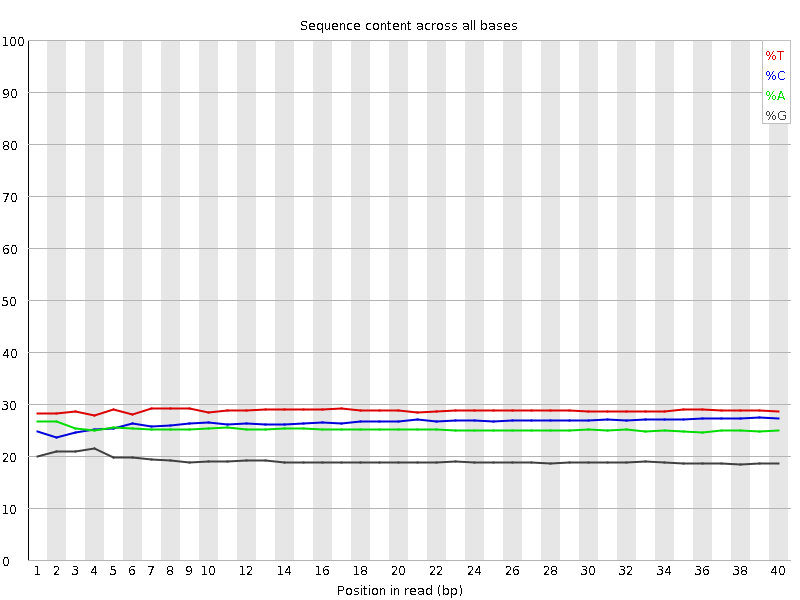
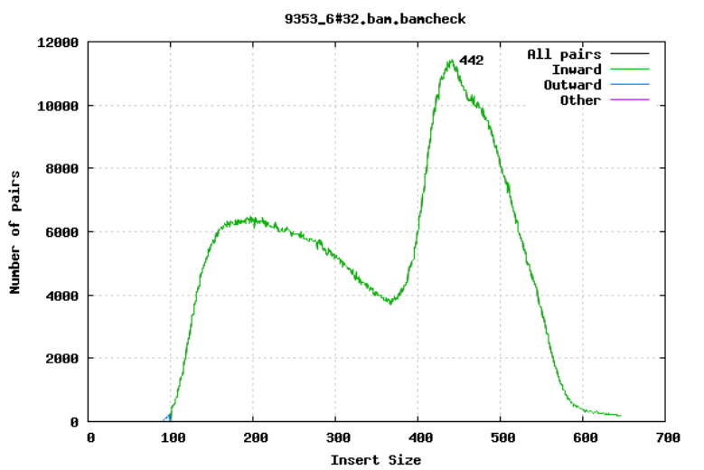
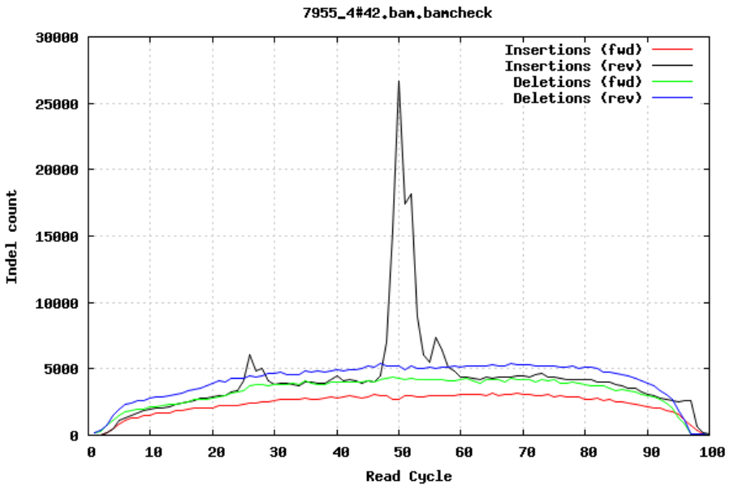

::: {.callout-tip}
## Learning Objectives

- Assess the quality of sequencing data based on common quality metrics and graphs. 
- Interpret and critically evaluate data quality reports.
- Recognise why contamination poses a problem in bacterial genomics applications.

:::

## Introduction

Before we look at our genomic data, lets take time to explore what to look out for when performing **Q**uality **C**ontrol **(QC)** checks on our sequence data. 
For this course, we will largely focus on next generation sequences obtained from Illumina sequencers. 
As you may already know from [Introduction to NGS](03-intro_ngs.md), the main output files expected from our Illumina sequencer are FASTQ files.

## QC assessment of NGS data

**QC** is an important part of any analysis and, in this section, we're going to look at some of the metrics and graphs that can be used to assess the QC of NGS data. 

### Base quality

[Illumina sequencing](https://en.wikipedia.org/wiki/Illumina_dye_sequencing) technology relies on sequencing by synthesis. One of the most common problems with this is __dephasing__. For each sequencing cycle, there is a possibility that the replication machinery slips and either incorporates more than one nucleotide or perhaps misses to incorporate one at all. The more cycles that are run (i.e. the longer the read length gets), the greater the accumulation of these types of errors gets. This leads to a heterogeneous population in the cluster, and a decreased signal purity, which in turn reduces the precision of the base calling. The figure below shows an example of this.

Because of dephasing, it is possible to have high-quality data at the beginning of the read but really low-quality data towards the end of the read. In those cases you can decide to trim off the low-quality reads. In this course, we'll do this using the tool [fastp](https://www.ncbi.nlm.nih.gov/pubmed/30423086/). In addition to trimming and removing low quality reads, `fastp` will also be used to trim Illumina adapter/primer sequences.

The figures below show an example of high-quality read data (left) and poor quality read data (right).

::: {layout-ncol=2}

:::

In addition to __Phasing noise__ and __signal decay__ resulting from dephasing issues described above, there are several different reasons for a base to be called incorrectly. You can lookup these later by clicking [here](https://doi.org/10.1093/bib/bbq077).

### Mismatches per cycle

Aligning reads to a high-quality reference genome can provide insights into the quality of a sequencing run by showing you the mismatches to the reference sequence. In particular, this can help you detect cycle-specific errors. Mismatches can occur due to two main causes: sequencing errors and differences between your sample and the reference genome; this is important to bear in mind when interpreting mismatch graphs. The figures below show an example of a good run and a bad one. In the first figure, the distribution of the number of mismatches is even between the cycles, which is what we would expect from a good run. However, in the second figure, two cycles stand out with a lot of mismatches compared to the other cycles.

::: {layout-ncol=2}

:::

### GC bias
It is a good idea to compare the GC content of the reads against the expected distribution in a reference sequence. The GC content varies between species, so a shift in GC content like the one seen below (right image) could be an indication of sample contamination. In the left image below, we can see that the GC content of the sample is about the same as for the theoretical reference, at ~65%. However, in the right figure, the GC content of the sample shows two distributions: one is closer to 40% and the other closer to 65%, indicating that there is an issue with this sample, likely contamination. 

::: {layout-ncol=2}

:::

### GC content by cycle
Looking at the GC content per cycle can help detect if the adapter sequence was trimmed. For a random library, there is expected to be little to no difference between the different bases of a sequence run, so the lines in this plot should be parallel with each other like in the first of the two figures below. In the second of the figures, the initial spikes are likely due to adapter sequences that have not been removed. 

::: {layout-ncol=2}

:::

<!-- TODO - the second figure is not really a poor run, it's very common due to non-random shearing of DNA fragments. Barcode issues would show up at the end of the sequences. We should clarify this or find a different example. -->

### Insert size
For paired-end sequencing the size of DNA fragments also matters. In the first of the examples below, the insert size peaks around 440 bp. In the second however, there is also a peak at around 200 bp. This indicates that there was an issue with the fragment size selection during library prep.

::: {layout-ncol=2}

:::

### Insertions/Deletions per cycle
Sometimes, air bubbles occur in the flow cell, and this can manifest as false indels. The spike in the second image provides an example of how this can look.

::: {layout-ncol=2}

:::

## Assessment of species composition

Understanding the species composition of sequence data is crucial for the accuracy and reliability of bioinformatics analyses, especially in the context of _de novo_ genome assembly and metagenomics. In particular, for _de novo_ genome assembly, knowing the species present in a sample can help identify and filter out contaminant sequences that do not belong to the target organism, improving the quality of the assembly. An abundance of non-target sequences also means fewer reads belonging to the target species leading to lower coverage when mapping these reads to a reference genome.

## Summary

::: {.callout-tip}
#### Key Points

- Common metrics to assess the quality of raw sequencing data include: base quality, mismatches per cycle, GC bias, GC content per cycle, insert size and indels per cycle.
- Contamination of sequencing data with other organisms is problematic for applications such as _de novo_ genome assembly. 
- Screening the sequencing data for known species can help to remove potential contaminants.
:::

## References
Information on this page has been adapted and modified from the following sources:

- https://github.com/sanger-pathogens/QC-training

- https://www.bioinformatics.babraham.ac.uk/projects/fastqc/