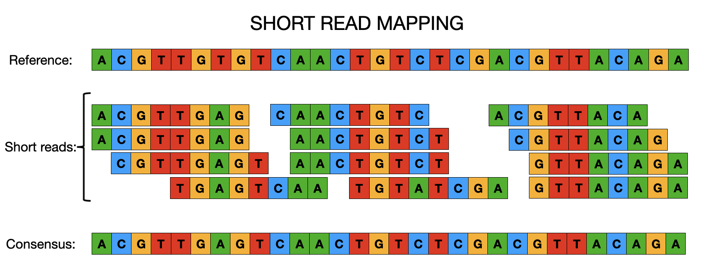

::: {.callout-tip}
## Learning Objectives

- Describe how reference-based mapping can be used to reconstruct genomes of new bacterial isolates.
- Summarise the main steps used in processing short read data to generate new consensus genome sequences.

:::

## Mapping to a reference

There are two main approaches that are used for reconstructing bacterial genomes:

- *de novo* assembly
- reference-based assembly

Each approach has its benefits and limitations and will be appropriate to the species and analysis you'd like to perform.  We'll cover *de novo* assembly later in the week and, for now, will focus on reference-based assembly or mapping.  When it comes to mapping, regardless of whether we're dealing with viruses, bacteria or even much larger genomes, the concepts are essentially the same. Instead of *de novo* (i.e. without any prior knowledge of the genome structure) assembling sequence reads to reconstruct a genome, it is often easier and faster to map/align the sequence data to a previously constructed reference genome.  From there we can easily identify SNPs or INDELs that clearly distinguish closely related populations or individuals and use this information to identify genetic differences that may, for instance, cause drug resistance or increase virulence in pathogens.  It is important to remember that for the mapping of sequence data to work, the reference and resequenced target must have the same genome architecture.  There are a number of different tools for mapping sequence data to a reference genome (e.g. `bwa`, `bowtie2`) and calling variants (e.g. `bcftools`, `freebayes`, `gatk`).

### Picking a reference

Picking the best reference for your dataset is very important as this can have a large effect on the downstream analsyses such as phylogenetic tree construction. For some species with low diversity e.g. _M. tuberculosis_, it is usual to use the same reference (the lab strain H37Rv) regardless of what your dataset is comprised of. If your dataset is comprised of a single lineage (e.g. ST, CC), the best reference to use is one that is from the same or a closely related lineage.  For many of the most commonly sequenced bacteria, there are several different reference sequences available in public databases such as RefSeq, meaning that, in most instances, you can find a suitable reference.  However, for more diverse organisms, a single reference may not represent all the samples in your dataset.  In this instance, you may want consider comparing the similarity of your samples to a number of different reference sequences and pick the one that is similar to most samples in your dataset.

## Steps involved in aligning reads

### Genome Indexing 
As reference genomes can be quite long, most mapping algorithms require that the sequence is indexed. You can think of a genome index in the same way as an index at the end of a textbook, which tells you in which pages of the book you can find certain keywords. Similarly, a genome index is used by mapping algorithms to quickly search through the reference sequence and find a good match with the reads it is trying to align. Each mapping software requires its own index, but we only have to generate the genome index once. 

### Read mapping 
This is the actual step of aligning the reads to a reference genome. There are a few popular read mapping programs such as `bowtie2` or `bwa` (for this workshop, we will use `bwa`). The input to these programs includes the genome index (from the previous step) and the FASTQ file(s) containing the sequence reads. The output is an alignment in a file format called **SAM** (a text-based format which takes up a lot of space) or **BAM** (a compressed binary format thus a much smaller file size). For more information on these file formats, see [Common file formats](appendices/01-file_formats.md).

### BAM Sorting
The mapping programs output the sequencing reads in the order in which they were processed i.e. the order they appear in the FASTQ files. But, for downstream analysis, the reads need to be sorted by the position in the reference genome they mapped to as this makes it faster to process the file. 

### BAM Indexing  
This is similar to the genome indexing mentioned above, but this time involces creating an index for the alignment file. This index is often required for downstream analysis and for visualising the alignment with programs such as the integrated genome viewer (IGV) or Artemis. 

## Variant calling

Once we've mapped our reads to the reference genome and created sorted bam files, we can identify differences between the sequencing reads of our samples and the reference.  These differences or variants typically come in the form of insertions or deletions (INDELs) or Single Nucleotide Polymorphisms/Variants (SNPs/SNVs). As the names suggest INDELs are deletions or insertions in the sequencing reads relative to the reference whilst SNPs are changes in a single position that don't involve an insertion or deletion but reflect a mutation.  Like mapping software, there are a number of different variant callers which use statistical models to determine variants with the most popular being `bcftools`, `GATK` and `FreeBayes`.  All produce the same standard output, VCF files (see [Common file formats](appendices/01-file_formats.md)) which contain the information about the position and type of variant and the evidence for that variant being identified.  The general steps in variant calling are:

### Pileup
The likelihood of the genotype (Allele Frequency) at each position in the reference genome in the mapped reads is calculated.  For example, if 90/100 reads at a position have the same nucleotide as the reference then the alternative allele frequency at that position is (100-90)/100 which is 0.1. This information is then used in the next step to identify variants.

### Variant calling
The information from the pileup is used to identify variants. At this point, all variants are identified regardless of their likelihood.  The variants are then filtered to identify the **true** variants.

### Variant filtering
When filtering, variant callers use metrics such as the number of reads mapping to a position that call a particular nucleotide, the quality of the reads (taken from the FASTQ file) and the number of forward and reverse reads that have the nucleotide to make a decision as to whether the variant is real or not.  Most of the time we're interested in what the majority decision is which we refer to as the consensus.  From the example in the pileup paragraph, we would say that there is insufficient evidence to call a variant in that position as 90% of the reads have the reference nucleotide. This may be due to sequence error or else evidence of a second strain in your sample which has a different nucleotide in that position.

## Consensus calling
Once the variants have been identified, we can apply this information to the reference genome to create a consensus 'pseudogenome'. This is the reference sequence in FASTA format with the variants identified in the sample replacing the nucleotides in the reference sequence. Note, we generally don't consider the INDELs and only use the SNPs to create our pseudogenomes.  This is mainly due to the fact that INDELs are often in homopolymeric regions (runs of the same nucleotide e.g. TTTTTT) which all of the sequencing technologies have trouble resolving and thus the confidence we have in these calls is lower than it is for SNPs.  The other step that needs to be taken at this point is to mask low quality or missing regions, where few or no reads mapped to the reference, and these are usually marked as 'N' in the pseudogenome.

## Summary

::: {.callout-tip}
## Key Points

- Bacterial genomes of low-diversity species can be reconstructed through reference-based alignment. 
- This approach consists of aligning the sequencing reads against a suitable reference genome, identifying potential variants/mutations and creating a consensus sequence by replacing the newly identified variants in the reference genome.

:::

## References

https://github.com/WCSCourses/GenEpiLAC2023/blob/main/Manuals/Mapping_and_Phylogenetics/Mapping%2BPhylo.md