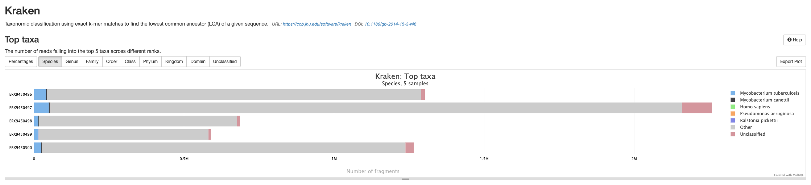
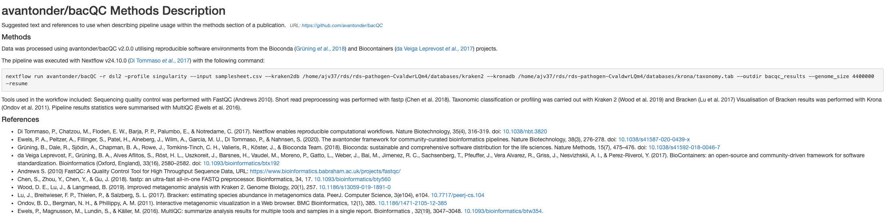

::: {.callout-tip}
#### Learning Objectives

- Run a QC workflow on raw sequencing data.
- Describe what the bacQC pipeline does.
- Identify poor quality sequence data.
- Identify contamination by non-target species in sequence data.

:::

## Pipeline Overview


**bacQC** is a bioinformatics analysis pipeline written in Nextflow that automates the **Q**uality **C**ontrol of short read sequencing data.  It runs the following tools: 

- [`fastQC`](https://www.bioinformatics.babraham.ac.uk/projects/fastqc/) - assesses sequencing read quality
- [`fastq-scan`](https://github.com/rpetit3/fastq-scan) - calculates FASTQ summary statistics
- [`fastp`](https://github.com/OpenGene/fastp) - performs adapter/quality trimming on sequencing reads
- [`Kraken 2`](https://ccb.jhu.edu/software/kraken2/) - assigns taxonomic labels to reads
- [`Bracken`](https://ccb.jhu.edu/software/bracken/) - refines `Kraken 2` assignments
- [`Krona`](https://github.com/marbl/Krona) - provides visualisations of `Bracken` outputs
- [`MultiQC`](https://multiqc.info/) - summarises and creates visualizations for outputs from `fastQC`, `fastp`, `Kraken 2` and `Bracken`

See [Course Software](appendices/02-course_software.md) for a more detailed description of each tool.

Along with the outputs produced by the above tools, the pipeline produces the following summaries containing results for all samples run through the pipeline (found in the `metadata` and `multiqc` directories):

- `raw_fastq-scan_summary.tsv` - final summary of FASTQ summary statistics for input files in TSV format
- `trim_fastq-scan_summary.tsv` - final summary of FASTQ summary statistics for trimmed FASTQ files
- `read_stats_summary.tsv` - final summary of pre- and post-trimming sequence statistics in TSV format
- `species_composition.tsv` - final summary of taxonomic assignment in TSV format in TSV format
- `multiqc_report.html` - final summary of sequence quality, trimming and species composition for input files in HTML format

## Prepare a samplesheet

Before we run `bacQC`, we need to prepare a CSV file with information about our sequencing files which will be used as an input to the `bacQC` pipeline (for this exercise we're going to QC the TB dataset described in [Introduction to _Mycobacterium tuberculosis_](07-intro_tb.md)).  The pipeline's [documentation](https://github.com/avantonder/bacQC/blob/main/docs/usage.md) gives details about the format of this samplesheet.

:::{.callout-exercise}
#### Prepare a samplesheet

Prepare the input samplesheet for `bacQC`.  You can do this using _Excel_, making sure you save it as a CSV file (<kbd>File</kbd> → <kbd>Save As...</kbd> and choose "CSV" as the file format).  Alternatively, you can use the `fastq_dir_to_samplesheet.py` script that can be found in the `scripts` directory:

```bash
python scripts/fastq_dir_to_samplesheet.py data/reads \
    samplesheet.csv \
    -r1 _1.fastq.gz \
    -r2 _2.fastq.gz
```

By default the script will add names to each sample based on the name of the FASTQ files. 
However, you may want to use more meaningful names to each sample. 
If that were the case, you could open the file in _Excel_ and edit it further. 

:::

## Running bacQC

Now that we have the samplesheet, we can run the `bacQC` pipeline.  First, let's activate the `nextflow` software environment:

```bash
mamba activate nextflow
```

There are [many options](https://github.com/avantonder/bacQC/blob/main/docs/parameters.md) that can be used to customise the pipeline but a typical command is shown below:

```bash
nextflow run avantonder/bacQC \
  -r main \
  -profile singularity \
  --max_memory '16.GB' --max_cpus 8 \
  --input SAMPLESHEET \
  --outdir results/bacqc \
  --kraken2db databases/k2_standard_08gb_20240605 \
  --kronadb databases/krona/taxonomy.tab \
  --genome_size GENOME_SIZE 
```

The options we used are: 

- `-r` - tells `Nextflow` to pull the `main` version of `bacQC` from Github
- `-profile singularity` - indicates we want to use the _Singularity_ program to manage all the software required by the pipeline (another option is to use `docker`). See [Data & Setup](../setup.md) for details about their installation.
- `--max_memory` and `--max_cpus` - sets the available RAM memory and CPUs. You can check this with the commands `free -h` and `nproc --all`, respectively.
- `--input` - the samplesheet with the input files, as explained above.
- `--kraken2db` - the path to the directory containing the Kraken2 database files.
- `--kronadb` - the path to Krona's database file (with the `.tab` extension).
- `--genome_size` - the estimated genome size of your samples - `fastq-scan` uses this to calculate the depth of coverage across the genome.

:::{.callout-exercise}
#### Running bacQC

Your first task is to run the `bacQC` pipeline on your data.  In the folder `scripts` (within your analysis directory) you will find a script named `02-run_bacqc.sh`. This script contains the code to run `bacQC`. 

- Edit this script, adjusting it to fit your input files and the estimated genome size of _M. tuberculosis_.

- Run the script using `bash scripts/02-run_bacqc.sh`.
  
If the script is running successfully it should start printing the progress of each job in the bacQC pipeline. This will take a little while to finish. 
<i class="fa-solid fa-mug-hot"></i> 
You can continue working through the materials by using preprocessed data detailed in the following sections. 

:::{.callout-answer}

- The fixed script is: 

```bash
#!/bin/bash

nextflow run avantonder/bacQC \
  -r main \
  -profile singularity \
  --max_memory '16.GB' --max_cpus 8 \
  --input samplesheet.csv \
  --outdir results/bacqc \
  --kraken2db databases/k2_standard_08gb_20240605 \
  --kronadb databases/krona/taxonomy.tab \
  --genome_size 4300000
```

- We ran the script as instructed using:

```bash
bash scripts/02-run_bacQC.sh
```

- While it was running it printed a message on the screen: 

```
executor >  slurm (15)
[80/fd97e3] AVANTONDER_BACQC:BACQC:FASTQSCAN_RAW (ERX9450496)                      [  0%] 0 of 5
[-        ] AVANTONDER_BACQC:BACQC:FASTQSCANPARSE_RAW                              -
[29/21b759] AVANTONDER_BACQC:BACQC:FASTQ_TRIM_FASTP_FASTQC:FASTQC_RAW (ERX9450497) [  0%] 0 of 5
[5b/7c3de6] AVANTONDER_BACQC:BACQC:FASTQ_TRIM_FASTP_FASTQC:FASTP (ERX9450496)      [  0%] 0 of 5
[-        ] AVANTONDER_BACQC:BACQC:FASTQ_TRIM_FASTP_FASTQC:FASTQC_TRIM             -
[-        ] AVANTONDER_BACQC:BACQC:FASTQSCAN_TRIM                                  -
[-        ] AVANTONDER_BACQC:BACQC:FASTQSCANPARSE_TRIM                             -
[-        ] AVANTONDER_BACQC:BACQC:READ_STATS                                      -
[-        ] AVANTONDER_BACQC:BACQC:READSTATS_PARSE                                 -
[-        ] AVANTONDER_BACQC:BACQC:KRAKEN2_KRAKEN2                                 -
[-        ] AVANTONDER_BACQC:BACQC:BRACKEN_BRACKEN                                 -
[-        ] AVANTONDER_BACQC:BACQC:KRAKENPARSE                                     -
[-        ] AVANTONDER_BACQC:BACQC:KRONA_KTIMPORTTAXONOMY                          -
[-        ] AVANTONDER_BACQC:BACQC:MULTIQC
```

:::
:::

## `bacQC` results

In the previous exercise, we left `bacQC` running. While it runs, we can look at the preprocessed output (`preprocessed/bacqc`) to see the various directories containing output files created by `bacQC`:

| Directory | Description |
|:-- | :---------- |
|`bracken` | Contains the results of the re-estimation of taxonomic abundance by `Bracken` |
|`fastp` | Contains the results of the trimming and adapter removal performed by `fastp` |
|`fastqc` | Contains QC metrics for the FASTQ files generated with `fastQC` |
|`fastqscan` | Contains summary statistics for the FASTQ files generated with `fastq-scan` |
|`kraken2` | Contains the results of taxonomic assignment with `Kraken 2`  |
|`krona` | Contains HTML files with visual representations of taxonomic assignments with `Bracken`  |
|`metadata` | Contains summary files for outputs from `fastq-scan` and `Kraken 2` |
|`multiqc` | Contains a HTML file containing summaries of the various outputs |
|`pipeline_info` | Contains information about the pipeline run |

Now that the `bacQC` pipeline has run, we can assess the quality of our sequence data.  At this stage, we want to identify issues such as:

- Any samples that have very low read coverage i.e. less than 10x.
- Any samples where the majority of reads were removed during the trimming process.
- Any samples that are contaminated with species other than the target.  Typically the threshold for reads assigned to other species will vary depending on what you want to do with the data, e.g. for a _Mycobacterium tuberculosis_ dataset, we might aim for a maximum of 20% reads that map to other species.

### The MultiQC summary report

The first thing we'll check is the HTML report file created by `MultiQC`.  Go to the File Explorer aplication <i class="fa-solid fa-folder"></i>, navigate to `preprocessed/bacqc/multiqc/` and double click on `multiqc_report.html`.  This will open the file in your web browser:


#### General statistics

Let's go through each section starting with the "**General Statistics**":


This is a compilation of statistics collected from the outputs of `fastp` and `fastQC`.  Sequencing metrics such as the % of duplicated reads and GC content of the reads are shown. This is a useful way of quickly identifying samples that are of lower quality due to poor sequencing. 

#### fastQC

These plots will resemble some of the plots we showed you in [Introduction to QC](08-intro_qc.md) with the main difference being that they contain the results for all samples in summary plots generated by `MultiQC`.  The first plot shows the number of sequences in each sample as a barplot (there should be the same number of forward and reverse reads if it's paired-end sequencing). An estimate of duplicated reads - i.e. reads that are exactly the same - is also shown.


The next plot shows the mean Phred score across each base in all the reads for all samples. You'll notice that the sequence quality tends to be lower at the beginning and end of reads - this is why we tend to trim the ends of reads to improve the overall quality.


The third plot shows the frequency distribution of per sequence Phred scores for each sample. Samples with a larger number of lower-quality reads will be shifted to the left. 


Next we have a plot showing the proportion of each base position for which each of the four normal DNA bases has been called. If you click on a line in the plot, it'll bring the result for one of your samples, which will make a bit more sense than the MultiQC summary plot.


The fifth plot shows the percentage of bases called G or C in each sample.  The peak should match the approximate %GC content of your organism. In this case the peak is around 65-66% which is what we expect from _M. tuberculosis_.  Contaminated samples will show up as the %GC content is likely to be different from the target species. 


The sixth plot shows the proportion of N's across the sequences. There may be a higher proportion of Ns at the beginning and end of reads but we don't want to see N's in the middle of reads as this implies something has gone wrong during sequencing.


Now, we have the distribution of sequence lengths. Our dataset was sequenced in the same facility so the most common sequence length for all samples is 150 bp.  If you're analysing sequences from different studies you may see different sequence lengths.


The eighth plot shows the number of duplicated reads in each sample. Ideally, you want to see that the majority of your reads are only found once.


This plot shows the percentage of overrepresented sequences in each sample. Samples with a higher percentage of overrepresented sequences may suggest an issue with library construction like over-amplification of particular DNA fragments.


Now we have a plot showing the cumulative percentage count of the proportion of your sequences which has seen adapter sequences at each position. Typically we should only see adapter sequences at the beginning and end of reads. If there is a higher proportion of adapter sequences in the middle of reads, then something seriously wrong has occurred during sequencing!


The final plot summarises the previous plots and highlights which samples may be worth investigating further or discarding altogether.


#### fastp

There are a number of plots showing the results of the `fastp` step in the pipeline.  The first shows the results of the read filtering step where reads are trimmed, adapters removed and low quality reads are thrown out.  The reads that passed this step are highlighted in blue.


The second plot shows the distribution of insert sizes for each set of sequence files.

<!-- TODO: this plot looks strange, we should explain what is expected and why it looks the way it does -->


The next plot shows the average sequence quality across the reads in each sample. You can see we have drop offs in quality at the beginning and end of reads; this is pretty typical and is an artefact of the sequencing process.


The fourth plot shows the average GC content across the reads in each sample.  As you might expect, the average GC content is conserved across all the samples as they are all from the same organism (_M. tuberculosis_).


The final fastp plot shows the average N content across the reads in each sample.  Similar to what we see in the sequence quality plot, the number of Ns tends to increase towards the end of reads.


#### Kraken 2

The next results section of the `MultiQC` report is a summary of the outputs from `Kraken 2`. It's important to note that these results are generated before `Bracken` is run to refine the species assignment of the reads thus the proportion of reads assigned to the target species may be much lower than the results found in the `species_composition.tsv` file you'll mostly be working with.



#### Bracken 

The final results section of the `MultiQC` report is a summary of the outputs from `Bracken`. You will see that there are much fewer reads assigned to Other and more reads assigned to *Mycobacterium tuberculosis* as Bracken has probabilistically re-distributed the `Kraken 2` read assignments.


#### Software versions

This section of the report shows the software run as part of `bacQC` and the versions used.  This is particularly important when reproducing the analysis on a different system or when writing the methods section of a paper.


#### Methods description

A brief description of the methods used in the pipeline is provided with the relevant citations.



### The `read_stats_summary.tsv` file

One of the outputs from running `bacQC` is a summary file summarising the reads in the FASTQ files pre- and post-trimming with `fastp`.  This file can be found in `preprocessed/bacqc/metadata/read_stats_summary.tsv`.

You can open it with spreadsheet software such as _Excel_ from your file browser <i class="fa-solid fa-folder"></i>: 

```
Sample	raw_total_bp	raw_coverage	num_raw_reads	trim_total_bp	trim_coverage	num_trim_reads	%reads_after_trimmed
ERX9450498_ERR9907670_T1	440043124	102.336	2980520	198599257	46.1859	1372732	46.0567954585106
ERX9450499_ERR9907671_T1	377518535	87.795	2550884	170989867	39.7651	1178588	46.2031201732419
ERX9450502_ERR9907674_T1	480127121	111.65700000000001	3637820	224190567	52.1373	1744694	47.95987706923377
ERX9450504_ERR9907676_T1	484152311	112.594	3557654	230112090	53.5144	1733156	48.716260771845725
ERX9450506_ERR9907678_T1	519381556	120.786	3721974	253035696	58.8455	1852758	49.778907644169465
ERX9450508_ERR9907680_T1	439374426	102.18	3396118	205770558	47.8536	1631206	48.03148771626899
ERX9450513_ERR9907685_T1	456807540	106.234	3460956	213737167	49.7063	1658838	47.930051696698825
ERX9450514_ERR9907686_T1	443077738	103.041	3181726	207637480	48.2878	1528944	48.053917904935865
ERX9450515_ERR9907687_T1	475127148	110.495	3486940	216999744	50.4651	1634618	46.878294435809046
ERX9450518_ERR9907690_T1	382086897	88.8574	3540978	201474928	46.8546	1844208	52.081882462980566
```

The columns are: 

- **Sample** - our sample ID.
- **raw_total_bp** - the combined total number of base pairs in the read 1 and read 2 FASTQ files.
- **raw_coverage** - the expected mean read depth across our genome. This is calculated by multiplying the number of reads by the read length and dividing by the genome size (4300000 bp) which we provided when we ran `bacQC`.
- **num_raw_reads** - the number of reads in our FASTQ files (both read 1 and read 2 FASTQ files should have the same number of reads).
- **trim_total_bp** - the total number of base pairs left after trimming the FASTQ files with `fastp`.
- **trim_coverage** - the expected mean read depth across our genome after trimming the FASTQ files with `fastp`.
- **num_trim_reads** - the number of reads in our FASTQ files after trimming with `fastp`.
- **%reads_after_trimmed** - the proportion of reads left in our FASTQ files after trimming with `fastp`.

The main things to look out for in this file are the `trim_coverage` and `%reads_after_trimmed` columns.  The first gives us a rough idea of how well our reference genome will be covered during mapping or else how good our assemblies might turn out to be when we do _de novo_ assembly. Ideally, the higher this number, the better: at a minimum we want at least 30X coverage (less may suffice for mapping) whilst at the other end, more than 100X is unnecessary. In fact, both the mapping pipeline `bactmap` and the assembly pipeline `assembleBAC` we'll use this week downsample reads to remove any excess reads. This is mainly to speed up the steps in the pipeline and reduce the overall computational cost. The `%reads_after_trimmed` column gives an indication of the quality of the sequencing: the more reads that are removed by `fastp`, the lower the overall quality of the sequencing run. In this case, despite the removal of approximately 50% of the reads, we still have sufficient read coverage to proceed with any downstream analyses.

### The `species_composition.tsv` file

Another important output from the `bacQC` pipeline to consider is the `species_composition.tsv` file which summarises the results from `Kraken 2` and `Bracken` and can be found in `preprocessed/bacqc/metadata/species_composition.tsv`.

You can open it with spreadsheet software such as _Excel_ from your file browser <i class="fa-solid fa-folder"></i>:

```
name	Mycobacterium tuberculosis	unclassified	other
ERX9450498_ERR9907670_T1	99.52841943273346	0.16379992509505206	0.3077806421714939
ERX9450499_ERR9907671_T1	99.53642406588855	0.1945287515531746	0.26904718255826765
ERX9450502_ERR9907674_T1	98.60308257545614	1.1705576317307351	0.22635979281312757
ERX9450504_ERR9907676_T1	98.81634881409809	0.7964108418062598	0.3872403440956447
ERX9450506_ERR9907678_T1	99.08368809334354	0.5640171321283549	0.3522947745281044
ERX9450508_ERR9907680_T1	97.85346504536902	1.4355205479116022	0.7110144067193716
ERX9450513_ERR9907685_T1	98.67929488431771	1.0007790134265255	0.31992610225576357
ERX9450514_ERR9907686_T1	98.76471973622233	0.6654629193489298	0.569817344428742
ERX9450515_ERR9907687_T1	98.86965758101583	0.7738752254688651	0.3564671935153001
ERX9450518_ERR9907690_T1	97.50545840279487	2.2561398218819857	0.23840177532314044
```

The columns are: 

- **name** - our sample ID.
- **Mycobacterium tuberculosis** - the proportion of raw reads assigned to _Mycobacterium tuberculosis_.
- **unclassified** - reads that could not be assigned to an organism in the database. As we used a database consisting of only bacterial, archeal and viral references, unclassified reads likely reflect potential host contamination.
- **other** - any reads assigned to species that don't pass a threshold of 5% are assigned to the other category. These may reflect kit or flowcell contaminants.

This quite a simple output and shows that there was very little contamination or non-target sequencing in this run. This may not always be the case - for some runs you may see a variety of different contaminants.

:::{.callout-exercise}
#### Check the bacQC results

To assess the quality of our sequence data, we can use the outputs generated by **bacQC**, found in `preprocessed/bacqc`. 

Open `read_stats_summary.tsv` and try to answer the following questions:

- Were there any samples with a estimated post-trimming coverage less than 10x?
- Were there any samples with a low percentage of reads left post-trimming?

Now, open `species_composition.tsv` and answer this question:

- Do any of the samples contain more than 20% reads that weren't assigned to _Mycobacterium tuberculosis_?

Make a note of any samples you think should be removed from any downstream analyses.  Feel free to discuss this with other participants and compare your results/conclusions to see if you reach similar conclusions.

:::{.callout-answer}

- The `read_stats_summary.tsv` file showed that there were no samples with a post-trimming coverage less than 10X and 1 samples where the majority (>80%) of the reads had been removed as part of the trimming process. The predicted coverage of this sample is still 27X which is still ok but we should keep an eye on the results of the mapping.

- With respect to potential species contamination, no samples contained more than 20% non-_M. tuberculosis_ reads.

:::
:::

## Summary

::: {.callout-tip}
## Key Points

- Quality Control of sequencing reads can be automated using a Nextflow pipeline like bacQC
- This pipeline uses:
  - _FastQC_ to assess the quality of sequencing reads.
  - _fastp_ for quality trimming and adapter removal.
  - _Kraken2_ to determine species composition.
- The results from the pipeline are aggregated in an interactive _MultiQC_ report, which can be used to identify problematic samples. 
:::