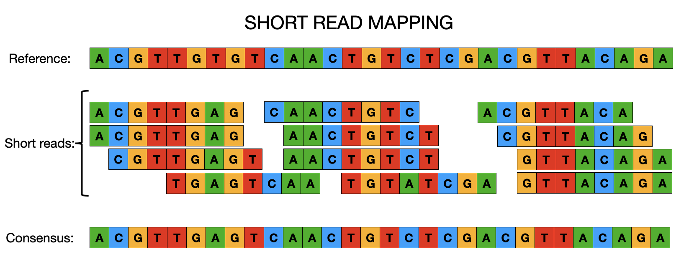

::: {.callout-tip}
## Learning Objectives

- Understand what mapping is and why the need to map to a reference genome.
- To introduce mapping and variant calling software, BWA, SAMtools, bcftools.
- To show how sequence variation data such as SNPs and INDELs can be viewed in
single and multiple BAM files, and VCF variant filtering using simple genome browsers.
- To recognise what the main steps are in processing raw sequencing short read data to generate consensus genome sequences.

:::

## Mapping to a reference

There are two main approaches that are used for reconstructing bacterial genomes:

- *de novo* assembly
- Reference-based assembly

Each approach has its benefits and limitations and will be appropriate to the species and analysis you'd like to perform.  We'll cover *de novo* assembly later in the week and, for now, will focus on reference-based assembly or mapping.  When it comes to mapping, regardless of whether we're dealing with viruses, bacteria or even much larger genomes, the concepts are essentially the same. Instead of *de novo* (i.e. without any prior knowledge of the genome structure) assembling sequence reads to reconstruct a genome, it is often easier and faster to map/align the sequence data to a previous constructed reference genome.  From there we can easily identify SNPs or INDELs that clearly distinguish closely related populations or individuals and use this information to identify genetic differences that may, for instance, cause drug resistance or increase virulence in pathogens.  It is important to remember that for the mapping of sequence data to work, the reference and resequenced target must have the same genome architecture.  There are a number of different tools for mapping sequence data to a reference genome (`bwa`, `bowtie2`) and calling variants (`bcftools`, `freebayes`).   

### Picking a reference

Picking the best reference for your dataset is very important as this can have a large effect on the downstream analsyses such as phylogenetic tree construction. For some species with low diversity e.g. *M. tuberculosis*, it is usual to use the same reference (the lab strain H37v) regardless of what your dataset is comprised of. If your dataset is comprised of a single lineage (e.g. ST, CC), the best reference to use is one that is from the same or a closely related lineage.  For many of the most commonly sequenced bacteria, there are several different reference sequences available in public databases such as RefSeq, meaning that, in most instances, you can find a suitable reference.  However, for more diverse organisms, a single reference may not represent all the samples in your dataset.  In this instance, you may want consider comparing the similarity of your samples to a number of different reference sequences and pick the one that is similar to most samples in your dataset.

## Multiple sequence alignments

## Summary

::: {.callout-tip}
## Key Points

:::