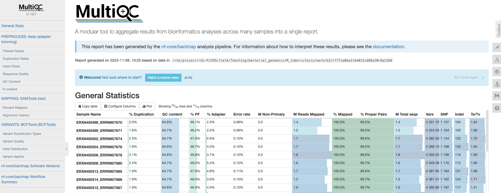
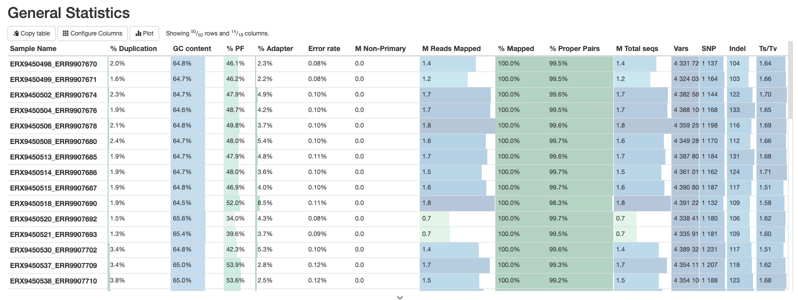
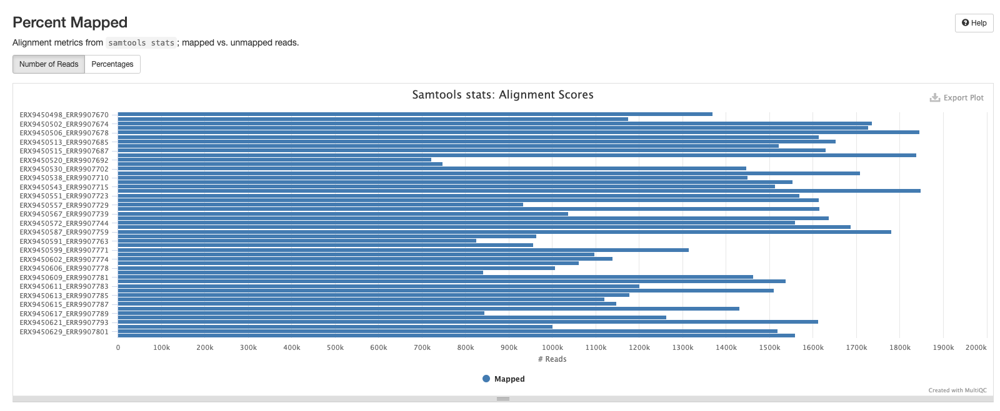
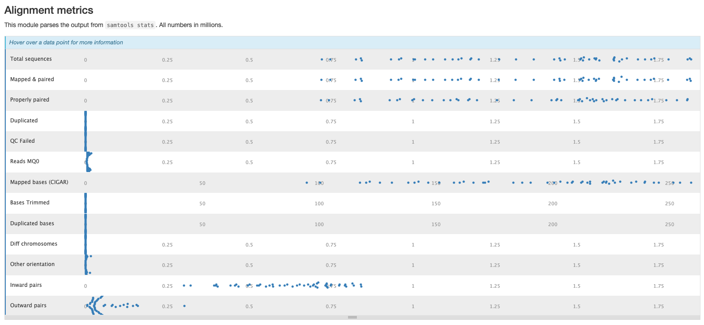
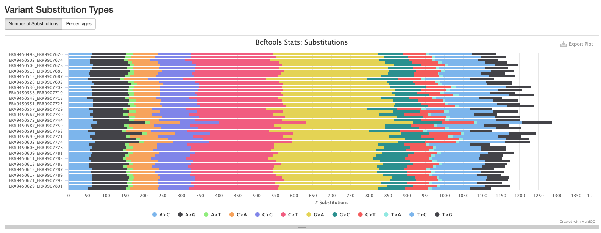
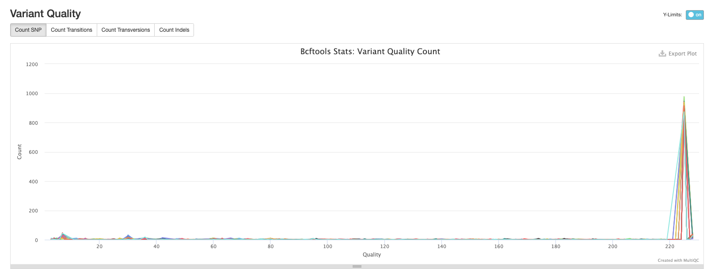
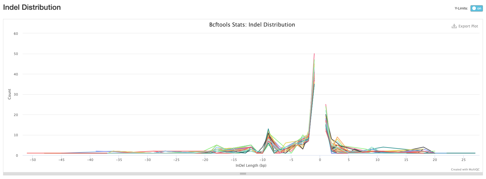
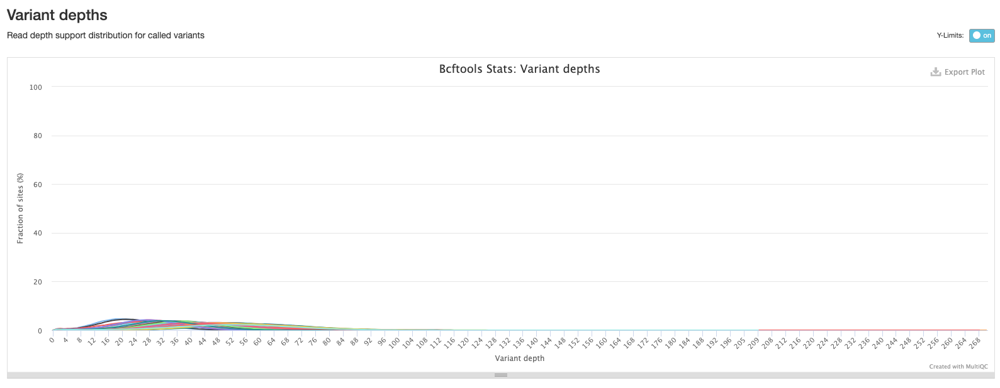
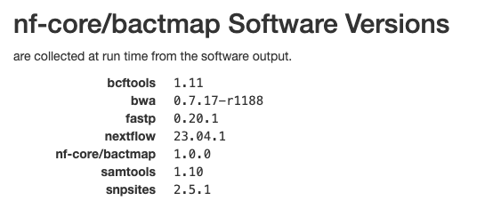

::: {.callout-tip}
## Learning Objectives

- Summarise the steps performed by the `nf-core/bactmap` pipeline
- Memorise where the output files created by pipeline are located.
- Describe the main output files created by the pipeline.
- Interpret the output QC report generated by the pipeline and use it make a decision about whether to exclude poor quality samples.
- Apply the `nf-core/bactmap` to a set of samples.

:::

## Pipeline Overview


[`nf-core/bactmap`](https://nf-co.re/bactmap/) is a bioinformatics analysis pipeline for mapping short reads from bacterial WGS to a reference sequence, creating filtered VCF files, making pseudogenomes based on high quality positions in the VCF files and optionally creating a phylogeny from an alignment of the pseudogenomes.  

It runs the following tools:

- [`BWA index`](https://github.com/lh3/bwa) - indexes reference fasta file
- [`fastp`](https://github.com/OpenGene/fastp) - trims reads for quality and adapter sequences (Optional)
- [`mash sketch`](https://mash.readthedocs.io/en/latest/index.html) - estimates genome size if not provided
- [`Rasusa`](https://github.com/mbhall88/rasusa) - downsamples fastq files to 100X by default (Optional)
- [`BWA mem`](https://github.com/lh3/bwa) - maps reads to the reference
- [`SAMtools`](https://sourceforge.net/projects/samtools/files/samtools/) - sorts and indexes alignments 
- [`BCFtools`](http://samtools.github.io/bcftools/bcftools.html) - calls and filters variants
- [`vcf2pseudogenome.py`](https://github.com/nf-core/bactmap/blob/dev/bin/vcf2pseudogenome.py) - converts filtered bcf to pseudogenome FASTA
- [`calculate_fraction_of_non_GATC_bases.py`](https://github.com/nf-core/bactmap/blob/dev/bin/) - creates whole genome alignment from pseudogenomes by concatenating fasta files having first checked that the sample sequences are high quality
- [`Gubbins`](https://sanger-pathogens.github.io/gubbins/) - identifies recombinant regions (Optional)
- [`SNP-sites`](https://github.com/sanger-pathogens/snp-sites) - extracts variant sites from whole genome alignment
- [`RapidNJ`](https://birc.au.dk/software/rapidnj/), [`FastTree2`](http://www.microbesonline.org/fasttree/), [`IQ-TREE`](http://www.iqtree.org/), [`RAxML-NG`](https://github.com/amkozlov/raxml-ng) - construct phylogenetic tree (Optional)

See [Course Software](appendices/02-course_software.md) for a more detailed description of each tool.

Along with the outputs produced by the above tools, the pipeline produces the following summary containing results for all samples run through the pipeline:

- `multiqc_report.html` - final summary of trimming and mapping statistics for input files in HTML format

## Running nf-core/bactmap

The bactmap pipeline requires a samplesheet CSV file in the same format as the one we used for bacQC so we can re-use that samplesheet CSV file. If you decided to remove any samples because they didn't pass the QC, then edit the samplesheet CSV file accordingly. There are [many options](https://nf-co.re/bactmap/latest/parameters) that can be used to customise the pipeline but a typical command is shown below:

```bash
nextflow run nf-core/bactmap \
  -profile singularity \
  --max_memory '16.GB' --max_cpus 8 \
  --input SAMPLESHEET \
  --outdir results/bactmap \
  --reference REFERENCE \
  --genome_size 4.3M
```

The options we used are: 

- `-profile singularity` - indicates we want to use the _Singularity_ program to manage all the software required by the pipeline (another option is to use `docker`). See [Data & Setup](../setup.md) for details about their installation.
- `--max_memory` and `--max_cpus` - sets the available RAM memory and CPUs. You can check this with the commands `free -h` and `nproc --all`, respectively.
- `--input` - the samplesheet with the input files, as explained above.
- `--outdir` - the output directory for the results.
- `--reference` - the path and name of the reference genome.
- `--genome_size` - estimated size of the genome - `Rasusa` uses this value to calculate the genome coverage. 

:::{.callout-exercise}

#### Exercise: Running nf-core/bactmap

Your next task is to run the **bactmap** pipeline on your data.  In the folder `scripts` (within your analysis directory) you will find a script named `03-run_bactmap.sh`. This script contains the code to run bactmap. 

- Edit this script, adjusting it to fit your input files and the name and location of the reference you're going to map to:
  - use the same samplesheet as before with the `avantonder/bacQC` pipeline. 
  - the reference genome is located in `resources/reference`.

- Activate the Nextflow software environment: `mamba activate nextflow`.

- Run the script using `bash scripts/03-run_bactmap.sh`.
  
If the script is running successfully it should start printing the progress of each job in the bactmap pipeline. The pipeline will take a while to run.

:::{.callout-answer}

The fixed script is: 

```bash
#!/bin/bash

nextflow run nf-core/bactmap \
  -profile singularity \
  --max_memory '16.GB' --max_cpus 8 \
  --input samplesheet.csv \
  --outdir results/bactmap \
  --reference resources/reference/MTBC0.fasta \
  --genome_size 4.3M
```

We ran the script as instructed using:

```bash
bash scripts/03-run_bactmap.sh
```

While it was running it printed a message on the screen: 

```bash
N E X T F L O W  ~  version 23.04.1
Launching `https://github.com/nf-core/bactmap` [cranky_swartz] DSL2 - revision: e83f8c5f0e [master]


------------------------------------------------------
                                        ,--./,-.
        ___     __   __   __   ___     /,-._.--~'
  |\ | |__  __ /  ` /  \ |__) |__         }  {
  | \| |       \__, \__/ |  \ |___     \`-._,-`-,
                                        `._,._,'
  nf-core/bactmap v1.0.0
------------------------------------------------------
```

:::
:::

## `bactmap` results

After running the pipeline, we can look at the output directory in `results/bactmap` (if your pipeline finished running), or you can also use the `preprocessed/bactmap` results.
There are various directories containing output files:

| Directory | Description |
|:-- | :---------- |
| `bwa/index` | Contains the index of the reference sequence |
|`fastp` | Contains the results of the trimming and adapter removal performed by `fastp` |
|`fastqc` | Contains QC metrics for the fastq files generated with `fastQC` |
|`multiqc` | Contains a html file containing summaries of the various outputs |
|`pipeline_info` | Contains information about the pipeline run |
|`pseudogenomes` | Contains consensus fasta files for each sample which have the sample variants compared to the reference included.  The alignment we'll use for the next step can also be found in this directory (`aligned_pseudogenomes.fas`) |
|`rasusa` | Contains the subsampled post-trimmed fastq files |
|`samtools` | Contains the sorted bam files and indices created by `bwa` and `samtools` as part of the mapping process |
|`snpsites` | Contains a variant alignment file created from `aligned_pseudogenomes.fas` with `snp-sites `that can be used as input for tree inference tools |
|`variants` | Contains filtered `vcf` files which contain the variants for each sample |

### The MultiQC summary report

The first thing we'll check is the HTML report file created by `MultiQC`.  Open your File Explorer <i class="fa-solid fa-folder"></i>, navigate to `preprocessed/bactmap/multiqc/` and double click on `multiqc_report.html`.  This will open the file in your web browser of choice:



#### General statistics

Let's go through each section starting with the "**General Statistics**":



This is a compilation of statistics collected from the outputs of tools such as `fastp`, `samtools` and `BCFtools`.  Sequencing metrics such as the % of duplicated reads and GC content of the reads are shown alongside the results of the mapping (% reads mapped, num). This is a useful way of quickly identifying samples that are of lower quality or perhaps didn't map very well due to species contamination. 

#### fastp

There are a number of plots showing the results of the `fastp` step in the pipeline.  These plots are explained in [The bacQC pipeline](09-bacqc.md).

#### Samtools

The plots in this section are created from the results of running `samtool stats` on the sorted bam files produce during the mapping process.  The first shows the number or percentage of reads that mapped to the reference.



The second plot shows the overall alignment metrics for each sample.  Hover over each dot to see more detailed information.



#### BCFtools

The plots in this section provide information about the variants called using `bcftools`.  The first plot shows the numbers or percentage of each type of variant in each sample.



The second plot shows the quality of each variant called by `bcftools`. The majority of variants in each sample are high quality.



The third plot shows the distribution of lengths of Indels (insertions are positive values and deletions are negative values).  This is useful information to have, but in practice we tend to exclude indels when building alignments for phylogenetic tree building.



The final bcftools plot shows the distribution of the number of reads mapping to each variant position and is one of the metrics used to filter out low quality variants (the fewer the reads mapping to a variant position, the lower the confidence we have that the variant is in fact real).



#### Software versions

This section of the report shows the software run as part of `nf-core/bactmap` and the versions used.  This is particularly important when reproducing the analysis on a different system or when writing the methods section of a paper.




## Check how much of the reference was mapped {#sec-seqtk}

It's good practice to do an additional check of our mapping results before proceeding to the next step of our analysis, phylogenetic tree inference.  We can do this by checking how much of the reference genome was mapped in each sample and use a tool called `seqtk` to do this.  If a position in the reference genome is not found in the sample it is marked as a `N` and any regions of the reference that were not mapped to sufficient quality are marked as `-`. So we use `seqtk comp` to count the number of A's, C's, G's and T's, sum the totals and then divide by the length of the reference sequence.  This gives us a proportion (we can convert to a % by multiplying by 100) of the reference sequence that was mapped in each sample.  Ideally, we would like to see more than 90% of the reference mapped but this will depend on the species and how close the reference is to the samples you're analysing. However, anything more than 75% should be sufficient for most applications.  The main impact of less mapping is fewer phylogenetically informative positions for constructing phylogenetic trees.

We'll start by activating the `seqtk` software environment to make `seqtk` available:

```bash
mamba activate seqtk
```

To run `seqtk comp` on a single sample (in this example we'll analyse `ERX9450498_ERR9907670`), the following commands can be used:

```bash
# create output directory
mkdir -p results/bactmap/pseudogenomes_check

# run seqtk comp
seqtk comp results/bactmap/pseudogenomes/ERX9450498_ERR9907670.fas > results/bactmap/pseudogenomes_check/ERX9450498_ERR9907670.tsv
```

If you open the output file `ERX9450498_ERR9907670.tsv` in the terminal with `cat`:

```bash
cat results/bactmap/pseudogenomes_check/ERX9450498_ERR9907670.tsv
```

You should see output like this:

```bash
ERX9450498_ERR9907670	4435783	715550	1348517	1343684	715401	0	0	312631	1040588	0	0	0
```
There are no headers in the output but the important information is contained in the first six columns:

- **Column 1** - our sample ID.
- **Column 2** - the total length of the sequence (this is the length of the reference).
- **Column 3** - the total number of 'A's in the sequence.
- **Column 4** - the total number of 'C's in the sequence.
- **Column 5** - the total number of 'G's in the sequence.
- **Column 6** - the total number of 'T's in the sequence.

To calculate the percentage of the reference mapped we divide the sum of 'A's, 'C's, 'G's and 'T's, divide by the total length of the sequence and multiply by 100:

```
(715550+1348517+1343684+715401)/4435783 * 100 = 92.95%
```

This is more than 90% so we can proceed with the analysis of this sample.

:::{.callout-exercise}
#### Exercise: How much of the reference was mapped?

We have calculated the percentage of the reference mapped for a single sample.  However, we have five samples that we need to repeat the analysis on. To do this, we've provided a script that runs `seqtk comp` on all the samples in the `pseudogenomes` directory using a _for loop_.

- In the folder `scripts` (inside your analysis directory), you'll find a script named `04-pseudogenome_check.sh`.
- Open the script, which you will notice is composed of two sections: 
    - `#### Settings ####` where we define some variables for input and output files names. If you were running this script on your own data, you may want to edit the directories in this section.
    - `#### Analysis ####` this is where `seqtk comp` is run on each sample as detailed in @sec-seqtk. You should not change the code in this section, although examining it is a good way to learn about running a _for loop_.
- Activate the software environment: `mamba activate seqtk`
- Run the script with `bash scripts/04-pseudogenome_check.sh`. If the script is running successfully it should print a message on the screen as the samples are processed.
- Once the analysis finishes open the `mapping_summary.tsv` file in _Excel_ from your file browser <i class="fa-solid fa-folder"></i>.
- Sort the results by the `%ref mapped` column and identify the sample which has the lowest percentage of the reference mapped.

:::{.callout-answer}

We opened the script `04-pseudogenome_check.sh` and these are the settings we used:

- `fasta_dir="results/bactmap/pseudogenomes"` - the name of the directory with the pseudogenomes produced by `bactmap` in it.
- `outdir="results/bactmap/pseudogenomes_check"` - the name of the directory where we want to save our results.
- `parser="scripts/seqtk_parser.py"` - the path to a python script that takes the `seqtk` TSV files as input and does the calculation we performed above for all the samples.

We then ran the script using `bash scripts/04-pseudogenome_check.sh`. The script prints a message while it's running:

```bash
Processing ERX9450498_ERR9907670.fas
Processing ERX9450499_ERR9907671.fas
Processing ERX9450502_ERR9907674.fas
...
```
We opened the `mapping_summary.tsv` file in _Excel_ and sorted the `%ref mapped` in ascending order to identify which sample had the lowest percentage of the reference mapped. 

```
sample	ref_length	#A	#C	#G	#T	mapped	%ref mapped
ERX9450498_ERR9907670	4435783	715550	1348517	1343684	715401	4123152	92.95206731258044
ERX9450499_ERR9907671	4435783	711436	1338950	1334043	711328	4095757	92.33447623564994
ERX9450502_ERR9907674	4435783	726446	1373546	1368600	726342	4194934	94.57031599607105
ERX9450504_ERR9907676	4435783	728780	1377603	1372394	728397	4207174	94.84625375046525
ERX9450506_ERR9907678	4435783	726076	1376188	1370635	726568	4199467	94.67250764972046
```

We can see that `ERX9450520_ERR9907692` only mapped to 79.9% of the reference. Whilst this is less than the other samples, it's still above 75% so we'll include it for now.

:::
:::

## Create final alignment

Now that we've mapped our sequence data to the ancestral reference, called and filtered variants and created consensus pseudogenomes that we checked, we can create the final alignment we will use for inferring a phylogenetic tree.  As we are not excluding any samples based on the pseudogenome check we did above, we can use the `aligned_pseudogenomes.fas` file that was created by `bactmap` (it's worth remembering that this alignment includes the reference as well as the pseudogenomes).  If any of the pseudogenomes contained more than 25% missing data and were removed, we could create our final alignment with `cat` as described below.

:::{.callout-tip}
### Building a final alignment from pseudogenome FASTA files
One of the advantages of working with pseudogenome FASTA files is that the files are all the same length i.e. the length of the reference.  This means that they are effectively already aligned so we don't need to do any additional aligning like we might do with gene sequences from different isolates.  If you need to create a final alignment from the pseudogenome files, it's as simple as using `cat`:

First create a `tmp` directory and move the pseudogenome files you want to include to the `tmp directory`:

```bash
mkdir tmp

mv *.fas tmp
```

Now change to the `tmp` directory and `cat` the pseudogenome files to create the alignment:

```bash
cd tmp

cat *.fas > aligned_pseudogenomes.fas
```
:::

## Mask final alignment

It's standard practice to mask certain regions of the TB genome when we build alignments for building phylogenetic trees.  In particular, repetitive regions of the genome such as PE/PPE genes and regions with an abundance of SNPs are removed as they are often difficult for the mapping software to accurately align and may cause misalignments leading to errors in variant calling with may lead to inaccurate tree topologies.  There are two ways to do the masking:

- Mask the regions in the VCF files before creating the pseudogenomes.
- Create the final alignment then apply the masking to all the samples at once.

As we've already created our final alignment, we're going to take the second approach and apply the mask to the `aligned_pseudogenomes.fas` file.  The co-ordinates we're going to use come from Goig _et al._ 2020 and have been transferred to the new ancestral reference sequence. We'll use a tool called `remove_blocks_from_aln.py` to do the masking. 

Let's start by activating the `remove_blocks` environment:

```bash
mamba activate remove_blocks
```

To run `remove_blocks_from_aln.py` on `aligned_pseudogenomes.fas`, the following commands can be used:

```bash
# create output directory
mkdir -p results/bactmap/masked_alignment

# remove_blocks_from_aln.py
remove_blocks_from_aln.py -a results/bactmap/pseudogenomes/aligned_pseudogenomes.fas -t resources/masking/MTBC0_Goigetal_regions_toDiscard.bed -o results/bactmap/masked_alignment/aligned_pseudogenomes_masked.fas
```
The options we used are:

- `-a` - the alignment file we want to mask.
- `-t` - a BED file containing the coordinates of the regions we wish to mask.
- `-o` - the name of the masked alignment file.

You should see output like this:

```bash
Found 1024 regions
Adjusted 51 sequences
Original alignment length: 4435783	New alignment length:4435783
Done.
```

The masked final alignment will be saved to the `results/bactmap/masked_alignment/` directory.  

Alternatively we've provided a script, `05-mask_pseudogenome.sh` in the `scripts` directory which could be used instead with `bash`:

```bash
bash scripts/05-mask_pseudogenome.sh
```

## Summary

::: {.callout-tip}
## Key Points

- The `nf-core/bactmap` pipeline automates several steps to generate reference-based consensus genomes, such as: indexing the reference genome; quality-trimming reads; mapping the reads to the reference; calling variants; and generating the final consensus genomes.
- Several key output files include: 
  - An interactive quality report located in `multiqc/multiqc_report.html`.
  - FASTA files for each new pseudogenome in `pseudogenomes/SAMPLE-NAME.fas`.
  - A single FASTA file with all the genomes concatenated in `pseudogenomes/aligned_pseudogenomes.fas`.
- Key quality control statistics output by the pipeline include the % of reads mapped to the reference, the number and type of called variants, amongst others. 
- Additional steps not included in the pipeline are: 
  - Calculating the fraction of missing bases in each pseudogenome. 
  - Masking repetitive regions of the genome.
:::

#### References

Goig G, _et al._ Contaminant DNA in bacterial sequencing experiments is a major source of false genetic variability. BMC Biology. 2020. [DOI](https://doi.org/10.1186/s12915-020-0748-z)