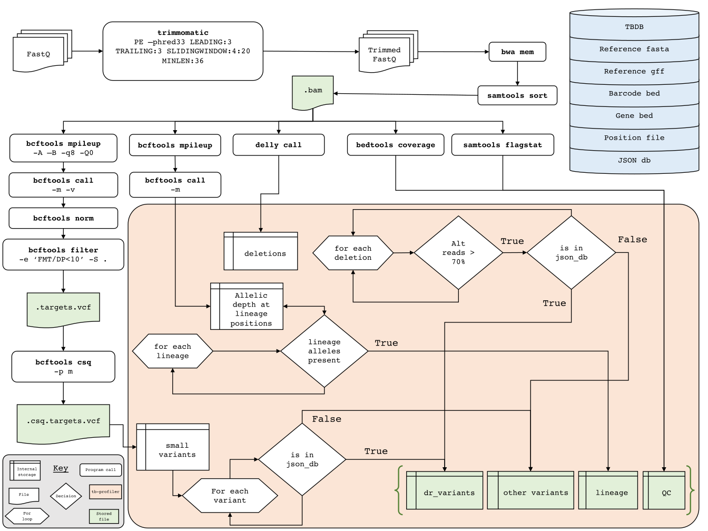
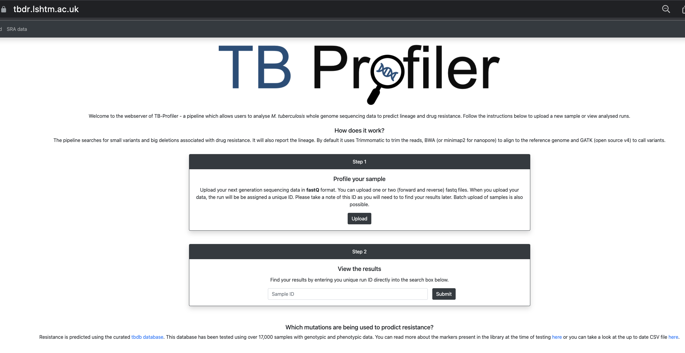

::: {.callout-tip}
## Learning Objectives

- Describe how TB-profiler can be used to further annotate _Mycobacterium tuberculosis_ genomes.
- Run TB-profiler on a single sample and on multiple samples using a bespoke script. 
- Prepare TB-profiler data to annotate phylogenetic trees.
:::

## Introduction

[TB-Profiler](https://github.com/jodyphelan/TBProfiler) is a tool used to detect antimicrobial resistance and the lineages of MTBC genomes. It is made up of a pipeline which by default uses `Trimmomatic` to trim reads, aligns the reads to the H37Rv reference using `bowtie2`, `BWA` or `minimap2` and then calls variants using `bcftools`. These variants are then compared to a drug-resistance database and a database of lineage-defining variants. 



:::{.callout-tip}
## Keeping up to date

Note that, like many other database-based tools TB-Profiler is under constant rapid development. If you plan to use the program in your work please make sure you are using the most up to date version! Similarly, the database is not static and is continuously being improved so make sure you are using the most latest version. If you use TBProfiler in your work please state the version of both the tool and the database as they are developed independently from each other.
:::

There is an online version of the tool which is very useful for analysing few genomes. You can try it out later at your free time by following this [link](https://tbdr.lshtm.ac.uk/). 



## Running TB-Profiler on the command line {#sec-tbprofiler}

Given we have five TB genomes to analyse, we're going to run `TB-Profiler` on the command line instead of uploading the FASTQ files to the web version, starting with a single sample `ERX9450498_ERR9907670`.

We'll start by activating the software environment:

```bash
mamba activate tb-profiler
```

To run `TB-Profiler` on `ERX9450498_ERR9907670`, the following commands can be used:

```bash
# create output directory
mkdir -p results/tb-profiler

# run TB-Profiler
tb-profiler profile -1 data/reads/ERX9450498_ERR9907670_1.fastq.gz -2 data/reads/ERX9450498_ERR9907670_2.fastq.gz -p ERX9450498_ERR9907670 -t 8 --csv -d results/tb-profiler 2> results/tb-profiler/ERX9450498_ERR9907670.log
```
The options we used are:

- `-1` - the read 1 FASTQ file.
- `-2` - the read 2 FASTQ file.
- `-p` - the prefix of the output files, in this case the sample ID.
- `-t` - the number of CPUs to use.
- `--csv` - saves the output files in CSV format.
- `-d` - the name of the directory to save the results to.
- `2>` - to help with identifying if a sample fails we redirect any error messages to a log file.

While it was running it printed a message on the screen:

```bash
[17:24:20] INFO     Using ref file: /home/ajv37/miniconda3/envs/tb-profiler/share/tbprofiler//tbdb.fasta                       db.py:795
           INFO     Using gff file: /home/ajv37/miniconda3/envs/tb-profiler/share/tbprofiler//tbdb.gff                         db.py:795
           INFO     Using bed file: /home/ajv37/miniconda3/envs/tb-profiler/share/tbprofiler//tbdb.bed                         db.py:795
           INFO     Using version file: /home/ajv37/miniconda3/envs/tb-profiler/share/tbprofiler//tbdb.version.json            db.py:795
           INFO     Using json_db file: /home/ajv37/miniconda3/envs/tb-profiler/share/tbprofiler//tbdb.dr.json                 db.py:795
           INFO     Using variables file: /home/ajv37/miniconda3/envs/tb-profiler/share/tbprofiler//tbdb.variables.json        db.py:795
           INFO     Using spoligotype_spacers file:                                                                            db.py:795
                    /home/ajv37/miniconda3/envs/tb-profiler/share/tbprofiler//tbdb.spoligotype_spacers.txt                              
           INFO     Using spoligotype_annotations file:                                                                        db.py:795
                    /home/ajv37/miniconda3/envs/tb-profiler/share/tbprofiler//tbdb.spoligotype_list.csv                                 
           INFO     Using bedmask file: /home/ajv37/miniconda3/envs/tb-profiler/share/tbprofiler//tbdb.mask.bed                db.py:795
           INFO     Using barcode file: /home/ajv37/miniconda3/envs/tb-profiler/share/tbprofiler//tbdb.barcode.bed             db.py:795
           INFO     Trimming reads
```

You can open the results file (`results/tb-profiler/results/ERX9450498_ERR9907670.results.csv`) with a spreadsheet software such as _Excel_ from your file browser <i class="fa-solid fa-folder"></i>.  There is a lot of information in this file but `TB-Profiler` helpfully provides a summary of the most useful information at the top:

```
TBProfiler report	
=================	
	
The following report has been generated by TBProfiler.	
	
Summary	
-------	
ID	ERX9450498_ERR9907670
Date	Thu Nov  9 11:09:46 2023
Strain	lineage4.3.4.1
Drug-resistance	MDR-TB
Median Depth	84
```

These key fields are:

- **ID** - our sample ID.
- **Date** - the date and time TB-Profiler was run on this sample.
- **Strain** - the lineage of the sample.
- **Drug-resistance** - the drug resistance profile of the sample.
- **Median Depth** - the median read depth coverage across the reference genome.

From these results we can see that sample `ERX9450498_ERR9907670` belongs to lineage 4.3.4.1 and is multi-drug resistant (MDR) i.e. resistant to more than one drug, in this case Rifampicin, Isoniazid and Ethambutol.

## TB-Profiler collate

`TB-Profiler` has an option to collect the outputs from multiple samples and collate these together into a useful summary CSV file. We're going to use this command in the exercise below.

:::{.callout-warning}
#### TB-Profiler sometimes fails

Hopefully, we'll be able to successfully run `TB-Profiler` on all our samples but, unfortunately, sometimes it'll fail.  If this does happen, identify which sample didn't complete and re-run `TB-Profiler`. This is the reason we save the error messages to a log file.
:::

:::{.callout-exercise}

#### Run TB-Profiler on all samples

We have run `TB-Profiler` on a single sample.  However, we have five samples that we need to repeat the analysis on. To do this, we've provided a script that runs `TB-Profiler` on all the FASTQ files for all the samples in the `data/reads` directory using a _for loop_.

- In the folder `scripts` (inside your analysis directory), you'll find a script named `06-run_tb-profiler.sh`.
- Open the script, which you will notice is composed of two sections: 
    - `#### Settings ####` where we define some variables for input and output files names. If you were running this script on your own data, you may want to edit the directories in this section.
    - `#### Analysis ####` this is where `TB-Profiler` is run on each sample as detailed in @sec-tbprofiler. You should not change the code in this section.
- Activate the software environment: `mamba activate tb-profiler`
- Run the script with `bash scripts/06-run_tb-profiler.sh`. If the script is running successfully it should print a message on the screen as the samples are processed.
- Once the analysis finishes open the `Nam_TB.txt` file and copy/paste the data into _Excel_ (we've provided the results for all 50 samples in the `preprocessed` directory).
- How many Lineage 2 isolates are there in the dataset?
- Are any of the isolates antimicrobial-susceptible?

:::{.callout-answer}

We opened the script `06-run_tb-profiler.sh` and these are the settings we used:

- `fastq_dir="data/reads"` - the name of the directory with the read 1 and read 2 FASTQ files in it.
- `outdir="results/tb-profiler"` - the name of the directory where we want to save our results.
- `prefix="Nam_TB"` - the prefix for the output files created using `tb-profiler collate`.

We then ran the script using `bash scripts/06-run_tb-profiler.sh`. The script prints a message while it's running:

```bash
Processing ERX9450498_ERR9907670.fas
[17:24:20] INFO     Using ref file: /home/ajv37/miniconda3/envs/tb-profiler/share/tbprofiler//tbdb.fasta                       db.py:795
           INFO     Using gff file: /home/ajv37/miniconda3/envs/tb-profiler/share/tbprofiler//tbdb.gff                         db.py:795
           INFO     Using bed file: /home/ajv37/miniconda3/envs/tb-profiler/share/tbprofiler//tbdb.bed                         db.py:795
           INFO     Using version file: /home/ajv37/miniconda3/envs/tb-profiler/share/tbprofiler//tbdb.version.json            db.py:795
           INFO     Using json_db file: /home/ajv37/miniconda3/envs/tb-profiler/share/tbprofiler//tbdb.dr.json                 db.py:795
           INFO     Using variables file: /home/ajv37/miniconda3/envs/tb-profiler/share/tbprofiler//tbdb.variables.json        db.py:795
           INFO     Using spoligotype_spacers file:                                                                            db.py:795
                    /home/ajv37/miniconda3/envs/tb-profiler/share/tbprofiler//tbdb.spoligotype_spacers.txt                              
           INFO     Using spoligotype_annotations file:                                                                        db.py:795
                    /home/ajv37/miniconda3/envs/tb-profiler/share/tbprofiler//tbdb.spoligotype_list.csv                                 
           INFO     Using bedmask file: /home/ajv37/miniconda3/envs/tb-profiler/share/tbprofiler//tbdb.mask.bed                db.py:795
           INFO     Using barcode file: /home/ajv37/miniconda3/envs/tb-profiler/share/tbprofiler//tbdb.barcode.bed             db.py:795
           INFO     Trimming reads
...
```
For this part, we opened the `Nam_TB.txt` file in the `preprocessed/tb-profiler` directory and copy/pasted the data into _Excel_ (only the first four columns shown for brevity):  

```
sample	main_lineage	sub_lineage	DR_type
ERX9450587_ERR9907759	lineage4	lineage4.3.4.1	RR-TB
ERX9450613_ERR9907785	lineage4	lineage4.3.2.1	RR-TB
ERX9450602_ERR9907774	lineage2	lineage2.2.1	RR-TB
ERX9450530_ERR9907702	lineage4	lineage4.3.2	MDR-TB
ERX9450610_ERR9907782	lineage4	lineage4.3.2	MDR-TB
ERX9450515_ERR9907687	lineage4	lineage4.3.2	MDR-TB
ERX9450606_ERR9907778	lineage4	lineage4.3.4.1	MDR-TB
ERX9450537_ERR9907709	lineage4	lineage4.3.4.1	MDR-TB
ERX9450548_ERR9907720	lineage4	lineage4.3.4.1	MDR-TB
ERX9450623_ERR9907795	lineage4	lineage4.3.4.1	MDR-TB
```

We can see that there were three Lineage 2 isolates in our dataset and none of the isolates are drug-susceptible which is not unexpected as these isolates were sequenced because they were at least resistant to rifampicin, one of the front-line drugs used to treat TB.

:::

:::

## Data cleaning

The final thing we need to do before we visualize our TB phylogeny is to combine the metadata contained in `sample_info.csv` with the TB-profiler so we have some interesting information to annotate our tree with.  We provide a `python` script to do this for you but you could, of course, do this yourself in _Excel_ or using _R_.  You can run the script using the following command (make sure to `mamba activate tb-profiler`):

```bash
python scripts/merge_tb_data.py -s sample_info.csv -t preprocessed/tb-profiler/Nam_TB.txt
```

The options we used are:

- `-s` - the CSV file containing the metadata extracted from the publication.
- `-t` - the TB-Profiler summary TSV file (in this case the version in the `preprocessed` directory).

This will create a TSV file called `TB_metadata.tsv` in your analysis directory.  We'll use this file along with the TB phylogenetic tree in the next section.

## Summary

::: {.callout-tip}
## Key Points

- TB-profiler can be used to detect the presence of antimicrobial resistance genes in a genome, as well as assign it to its most likely lineage.
- TB-profiler can be run from the command line to process a single sample. Multiple samples can be conveniently processed using a _for loop_. 
- TB-profiler outputs a CSV file with information about lineages and drug resistance genes.
- Multiple output files from TB-profiler can be combined with metadata of our samples to generate a TSV file to annotate phylogenetic trees. 

:::