::: {.callout-tip}
## Learning Objectives

- Visualize and annotate your tree with `Microreact`

:::

There are many programs that can be used to visualise phylogenetic trees.  Some of the popular programs include `FigTree`, `iTOL` and the R library `ggtree`.  For this course, we're going to use the web-based tool `Microreact` as it allows users to interactively manipulate the tree, add metadata and generate other plots including maps and histograms of metadata variables in a single interface.

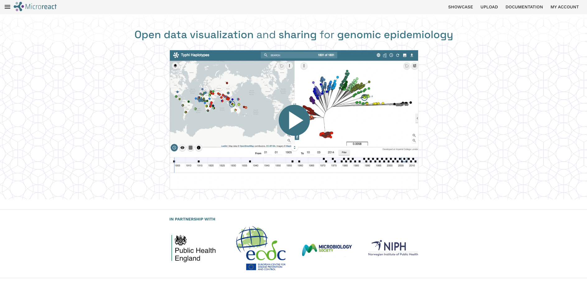

In order to use this platform you will first need to [**create an account**](https://microreact.org/api/auth/signin) (or sign-in through your existing Google, Facebook or Twitter).

## Uploading tree files and metadata

Once you've logged into Microreact, you can upload the Namibian tree file (`Nam_TB.treefile`) and combined metadata TSV file (`TB_metadata.tsv`) we created earlier. 

1. First, copy `Nam_TB.treefile` to the analysis directory so that both files are in the same location:

```bash
cp results/iqtree/Nam_TB.treefile .
```

2. Click on the **UPLOAD** link in the top-right corner of the page:

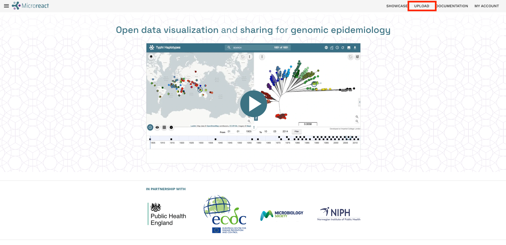

3. Click the **+** button on the bottom-right corner then **Browse Files** to upload the files:

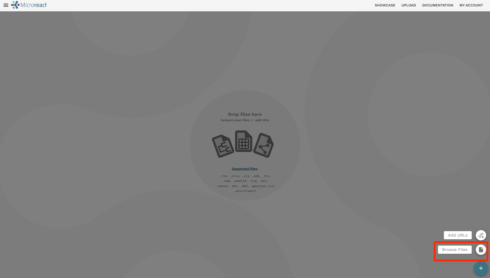

4. This will open a file browser, where you can select the tree file and metadata from your local machine. Go to the `M_tuberculosis` folder where you have the results we've generated so far this week. Click and select the `Nam_TB.treefile` and `TB_metadata.tsv` files while holding the <kbd>Ctrl</kbd> key. Click Open on the dialogue window after you have selected both files.

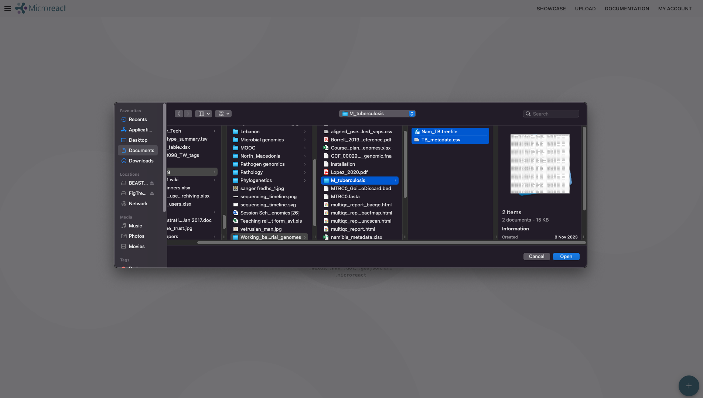

5. A new dialogue box will open with files you've uploaded and the File kind which is done automatically by Microreact.  As the File kind for both files is correct, go ahead and click **CONTINUE**:

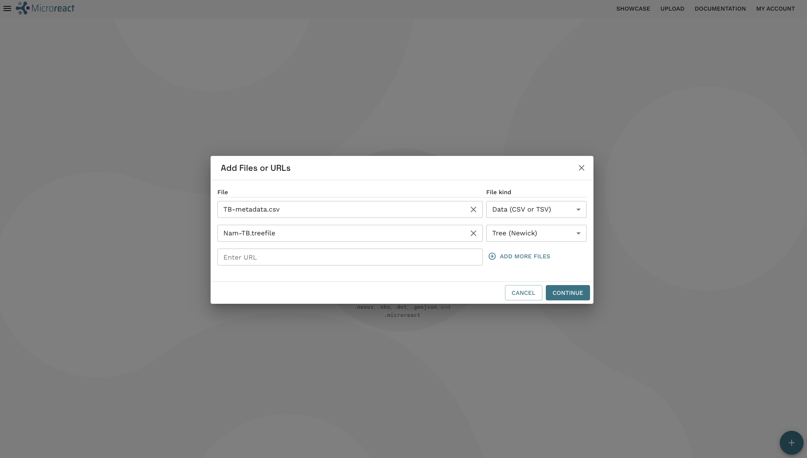

6. Microreact will load the data and process it.  The final step before we can have a look at the tree and annotate it is to confirm to Microreact which column in the metadata corresponds to the tip labels in the tree so it can match them.  By default Microreact will use the first column, in this case `sample` which is correct so click **CONTINUE**:

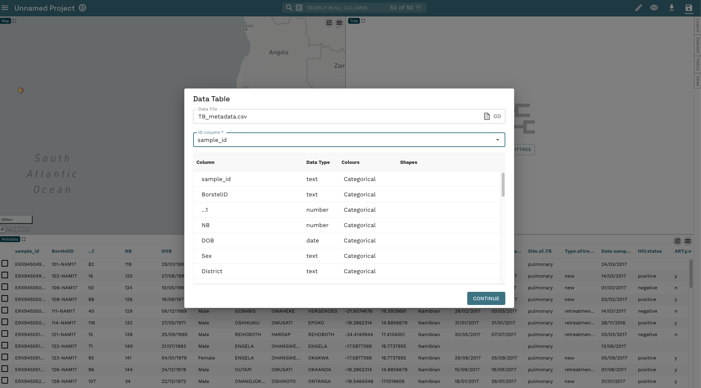

7. You should now see three windows in front of you.  The top-left has a map with the locations of your isolates based on the longitude and latitude values included in `TB_metadata.tsv`.  The top-right has the phylogenetic tree with a separate colour for each tip (by default Microreact will colour the tips by `BorstelID`).  Across the bottom you have the metadata from `TB_metadata.tsv`.

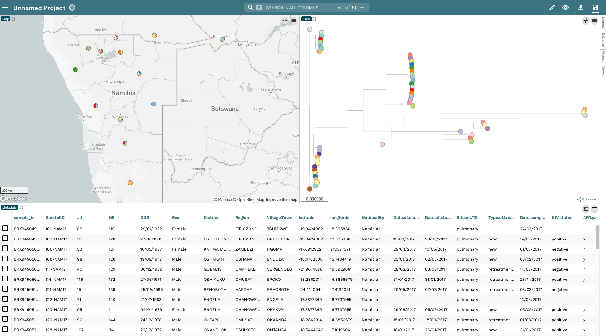

8. The first thing we're going to do is change the colour of the tip nodes to **Region**.  Click on the **Eye** icon in the top-right hand corner and change **Colour Column** to **Region**: 

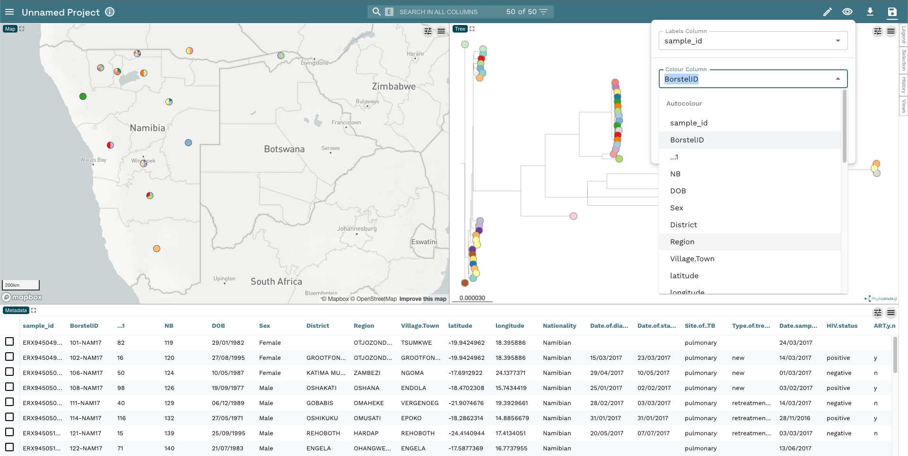

9. This will change the colour of the tip nodes as well as the pie charts on the map - each region has its own colour as you'd expect:

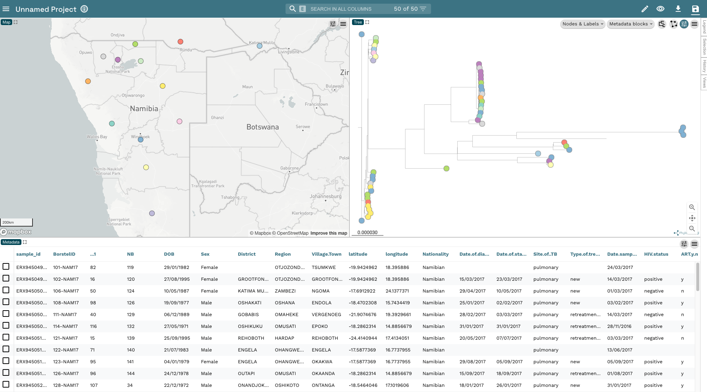

10. At this point, before we proceed any further, let's save the project to your accounts. Click on the **Save** button in the top-right corner, change the project name to **Namibia TB** and add some kind of description so you know what the dataset is.  Then click **Save as a New Project** (another dialogue box will appear asking if you want to share your project; for now, close this box):

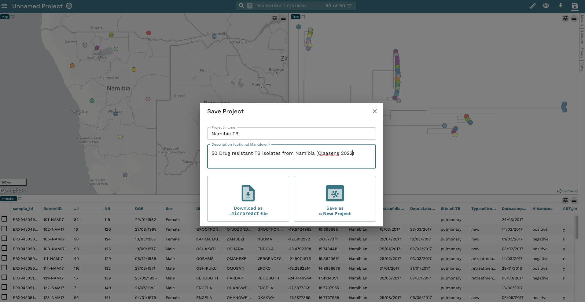

11. Now, let's make our phylogenetic tree a bit more informative.  First, let's add the tip labels to the display by clicking on the left-hand of the two buttons in the phylogeny window then the drop down arrow next to **Nodes & Labels**. Now click the slider next to **Leaf Labels** and the slider next to **Align Leaf Labels**. We'll also make the text a little smaller by moving the slider to _12px_:


12. The tip labels are still the European Nuclotide Accessions we used to download the FASTQ files. Let's change the tip labels to the `BorstelID` which is what's used in the paper.  Click on the **Eye** icon again and change **Labels Column** to `BorstelID`:

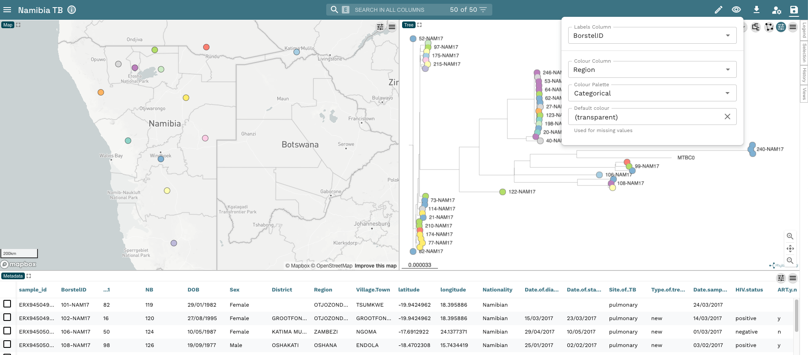

13. It's often useful to root a phylogenetic tree as it will more accurately reflect the relationships between our samples.  As we have the ancestral reference sequence `MTBC0` which we used to build the tree included in our tree, we can use this as our root. To root the tree, hover over the node that joins `MTBC0` to three other samples and right click when a circle appears. Then click **Set as Root (Re-root)**:

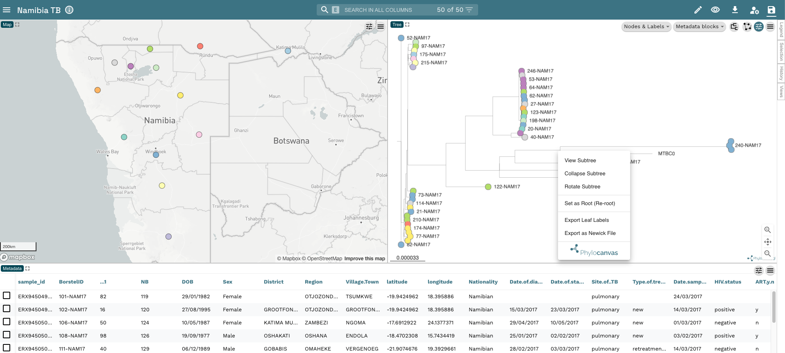

14. From the rooted tree, we can see we have two distinct clades within the tree.  These are the two major lineages we identified in our dataset (Lineage 1 and Lineage 2). To make this clearer, change the colour of the tip nodes to `main_lineage` and click on **Legend** on the far right-hand side of the plot. Now we have a tree and map annotated with the two lineages in our dataset:

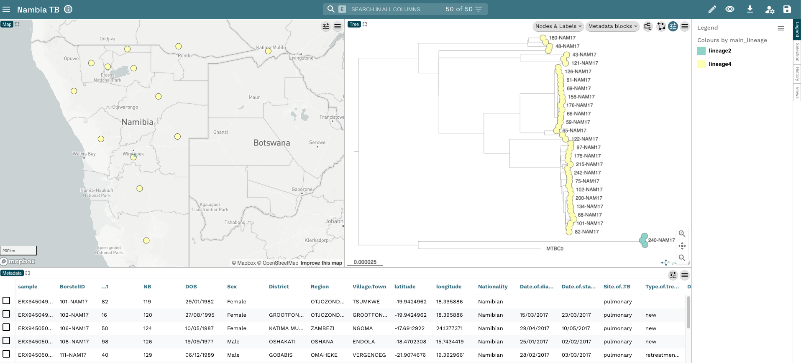

15. The last thing we're going to do is add a histogram to show the frequency of lineages across the different regions to our Microreact window. Click on the **Pencil** icon on the top-right corner and click **Create New Chart** then move your mouse into the right hand side of the metadata box at the bottom of the window and click when you see the blue box appear. A blank chart should appear. Click **Chart Type** and select **Bar chart** and change the **X Axis Column** to `Region`.  The plot should auto populate with the region on the X-axis and the Number of entries on the Y-axis.  The bars are coloured according to `main_lineage` which is what we're currently using to colour our plots:

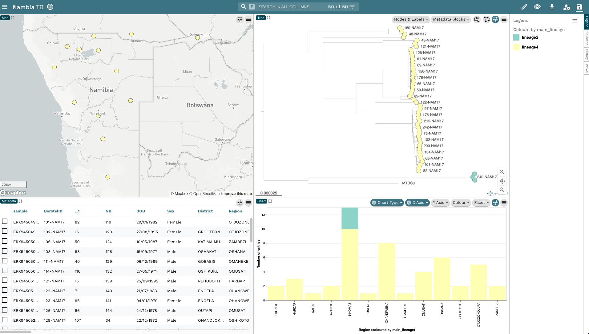
 
## Summary

::: {.callout-tip}
## Key Points

:::