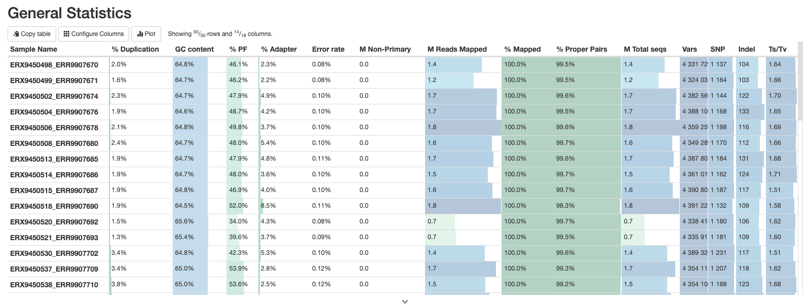
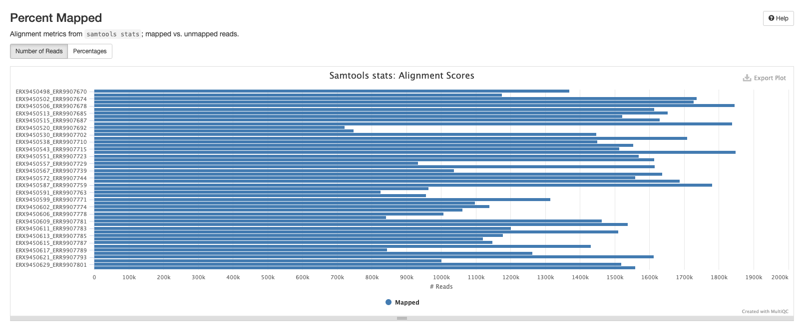

::: {.callout-tip}
## Learning Objectives

- Learn where the output files created by nf-core/bactmap are located.
- Understand the output files created by nf-core/bactmap.
- Learn how to interpret a MultiQC summary and make a decision whether to exclude poor quality samples.
- Understand that nf-core/bactmap produces a lot of intermediate files which take up space and can be deleted once the pipeline has run successfully.

:::

## nf-core/bactmap results

This morning, we left nf-core/bactmap running.  Now, we can look at the output directory (`results/bactmap`) to see the various directories containing output files created by `nf-core/bactmap`.

```bash
cd results/bactmap

ls
```

You should see the following:

```bash
bwa  fastp  multiqc  pipeline_info  pseudogenomes  rasusa  samtools  snpsites  variants 
```
The directories in `results/bactmap/` contain the following:

| Directory | Description |
|:-- | :---------- |
| `bwa/index` | Contains the index of the reference sequence |
|`fastp` | Contains the results of the trimming and adapter removal performed by `fastp` |
|`fastqc` | Contains QC metrics for the fastq files generated with `fastQC` |
|`multiqc` | Contains a html file containing summaries of the various outputs |
|`pipeline_info` | Contains information about the pipeline run |
|`pseudogenomes` | Contains consensus fasta files for each sample which have the sample variants compared to the reference included.  The alignment we'll use for the next step can also be found in this directory (`aligned_pseudogenomes.fas`) |
|`rasusa` | Contains the subsampled post-trimmed fastq files |
|`samtools` | Contains the sorted bam files and indices created by `bwa` and `samtools` as part of the mapping process |
|`snpsites` | Contains a variant alignment file created from `aligned_pseudogenomes.fas` with `snp-sites `that can be used as input for tree inference tools |
|`variants` | Contains filtered `vcf` files which contain the variants for each sample |

### The MultiQC summary report

The first thing we'll check is the `html` report file created by `MultiQC`.  Copy this to your desktop:

```bash
cp results/bactmap/multiqc/multiqc_report.html ~/Desktop
```

Go to `File Explorer`, navigate to your Desktop and double click on `multiqc_report.html`.  This will open the file in your web browser of choice:


#### General statistics

Let's go through each section starting with the `General Statistics`:



This is a compilation of statistics collected from the outputs of tools such as fastp, samtools and BCFtools.  Sequencing metrics such as the % of duplicated reads and GC content of the reads are shown alongside the results of the mapping (% reads mapped, num). This is a useful way of quickly identifying samples that are of lower quality or perhaps didn't map very well due to species contamination. 

#### fastp

There are a number of plots showing the results of the fastp step in the pipeline.  The first shows the results of the read filtering step where reads are trimmed, adapters removed and low quality reads are thrown out.  The reads that passed this step are highlighted in blue.


The second plot shows the frequency of duplicated reads in each sample.  If you hover over the plot around 1 on the x-axis you'll see that the majority of reads in each sample only appear once.


The third plot shows the distribution of insert sizes for each set of sequence files.  As we've included data sequenced on different Illumina platforms with different library construction protocols, there's a mix of insert sizes.


The next plot shows the average sequence quality across the reads in each sample. You can see we have drop offs in quality at the beginning and end of reads; this is pretty typical and is an artefact of the sequencing process.


The fifth plot shows the average GC content across the reads in each sample.  As you might expect, the average GC content is conserved across all the samples as they are all from the same organism (MTB).


The final fastp plot shows the average N content across the reads in each sample.  Similar to what we see in the sequence quality plot, the number of Ns tends to increase towards the end of reads.


#### Samtools

The plots in this section are created from the results of running `samtool stats` on the sorted bam files produce during the mapping process.  The first shows the number or percentage of reads that mapped to the reference.



The second plot shows the overall alignment metrics for each sample.  Hover over each dot to see more detailed information.


#### BCFtools

The plots in this section provide information about the variants called using `bcftools`.  The first plot shows the numbers or percentage of each type of variant in each sample.


The second plot shows the quality of each variant called by `bcftools`. The majority of variants in each sample are high quality.


The third plot shows the distribution of lengths of Indels (insertions are positive values and deletions are negative values).  This is useful information to have, but in practice we tend to exclude indels when building alignments for phylogenetic tree building.


The final bcftools plot shows the distribution of the number of reads mapping to each variant position and is one of the metrics used to filter out low quality variants (the fewer the reads mapping to a variant position, the lower the confidence we have that the variant is in fact real).


#### Software versions

This section of the report shows the software run as part of nf-core/bactmap and the versions used.  This is particularly important when reproducing the analysis on a different system or when writing the methods section of a paper.


### The pseudogenomes directory

This directory contains the files that are most useful for our downstream analyses (at least for now).  Change to the directory and list the files:

```bash
cd bactmap_results/pseudogenomes

ls
```

You will see the pseudogenome fasta files (a version of the reference file where the sample variants have been inserted and low-quality or missing data has been masked) for each sample, an alignment of all the samples  and the reference sequence (`aligned_pseudogenomes.fas`), and a tsv file of genomes removed from the complete alignment due to poor mapping (`low_quality_pseudogenomes.tsv`):

```bash
aligned_pseudogenomes.fas
low_quality_pseudogenomes.tsv
```

Let's check to see if any of our samples were removed from our alignment:

```bash
cat low_quality_pseudogenomes.tsv
```
This returns an empty file; all of our samples mapped well enough to the reference to be included in our complete alignment.  That means we can proceed to the next step of our analysis: phylogenetic tree inference.

## Check how much of the reference was mapped

It's good practice to do an additional check of our mapping results before proceeding to the next step of our analysis, phylogenetic tree inference.  We can do this by checking how much of the reference genome was mapped in each sample and use a tool called `seqtk` to do this.  If a position in the reference genome is not found in the sample it is marked as a `N` and any regions of the reference that were not mapped to sufficient quality are marked as `-`. So we use `seqtk` to count the number of A's, C's, G's and T's, sum the totals and then divide by the length of the reference sequence.  This gives us a proportion (we can convert to a % by multiplying by 100) of the reference sequence that was mapped in each sample.  Ideally, we would like to see more than 90% of the reference mapped but this will depend on the species and how close the reference is to the samples you're analysing. However, anything more than 75% should be sufficient for most applications.  The main impact of less mapping is less phylogenetically informative positions for constructing trees.

:::{.callout-exercise}
#### How much of the reference was mapped?

`conda activate seqtk`

`bash scripts/03-pseudogenome_check.sh`

:::{.callout-answer}

```bash
bash scripts/03-pseudogenome_check.sh
```

:::
:::

## Mask final alignment

```bash
conda activate remove_blocks

remove_blocks_from_aln.py -a aligned_pseudogenomes.fas -t ../../../resources/masking/MTBC0_Goigetal_regions_toDiscard.bed -o aligned_pseudogenomes_masked.fas

bash scripts/04-mask_pseudogenome.sh
```
### The work directory

Each step of the pipeline produces one or more files that are not saved to the results directory but are kept in the work directory.  This means that if, for whatever reason, the pipeline doesn't finish successfully you can resume it.  However, once the pipeline has completed successfully, you no longer need this directory (it can take up a lot of space) so you can delete it:

```bash
rm -rf work
```

## Summary

::: {.callout-tip}
## Key Points

:::