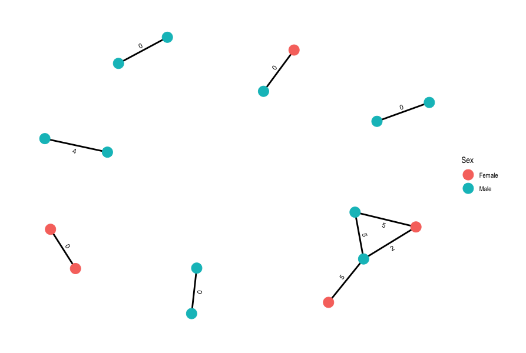
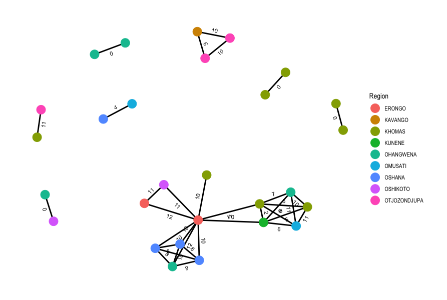

::: {.callout-tip}
## Learning Objectives

- Understand how to predict putative transmission events using genomic data.
- Understand TB transmission.
- Use networks to display putative transmission events.


:::

## Transmission networks in bacteria

### Identifying transmission networks in TB

## Generating a pairwise SNP distance matrix
The first step in building putative transmission networks is to calculate the pairwise SNP distances between all the samples in our dataset and we can do this by running a tool call `pairsnp` on the SNP alignment we used to build our phylogenetic tree.

We'll start by activating the `pairsnp` software environment:

```bash
mamba activate pairsnp
```

To run `pairsnp` on `aligned_pseudogenomes_masked_snps.fas`, the following commands can be used:

```bash
# create output directory
mkdir -p results/transmission/

# run pairsnp
pairsnp results/snp-sites/aligned_pseudogenomes_masked_snps.fas -c > results/transmission/aligned_pseudogenomes_masked_snps.csv
```
The option we used is:

- `-c` - saves the `pairsnp` output in CSV format.

The pairwise SNP matrix will be saved to the `results/transmission/` directory.  

Alternatively we've provided a script, `07-run_pairsnp.sh` in the `scripts` directory which could be used instead with `bash`:

```bash
bash scripts/07-run_pairsnp.sh
```

## Calculating and plotting transmission networks in R

Now that we've generated a pairwise SNP distance matrix, we can use **R** to calculate and plot our transmission network using a pre-determined threshold of **5** SNPs to identify putative transmission events. Open RStudio then open the script `08-transmission.R` in the `scripts` directory. Run the code in the script, going line by line (remember in RStudio you can run code from the script panel using <kbd>Ctrl</kbd> + <kbd>Enter</kbd>). As you run the code check the tables that are created (in your "Environment" panel on the top-right) and see if the SNP matrix was correctly imported.  Once you reach the end of the script, you should have created a plot showing the putative transmission networks identified in the data with the nodes coloured by Sex and the pairwise SNP distances shown along the edges:



:::{.callout-exercise}
#### Adjust the pairwise SNP threshold
As discussed in the introduction above, various SNP thresholds are used when inferring putative transmission networks in TB.  We used the most conservative threshold of 5 SNPs.  For this exercise:

- Change the SNP threshold to 12 SNPs and recalculate the transmission networks
- Change the colour of the nodes to show Region instead of Sex 
- How many additional networks did we infer compared to using a threshold of 12 SNPs?

:::{.callout-answer}
- We changed the variable `threshold` to `12` then re-ran the subsequent code to generate new networks.  
- In the command to generate the final plot, we changed `geom_node_point(aes(colour = Sex), size = 6)` to `geom_node_point(aes(colour = Region), size = 6)` and changed `labs(colour = "Sex")` to `labs(colour = "Region")`.
- We generated one additional network but identified a much more complex network comprised of 13 isolates when using the higher SNP threshold of 12.



:::
:::


## Summary

::: {.callout-tip}
## Key Points

:::