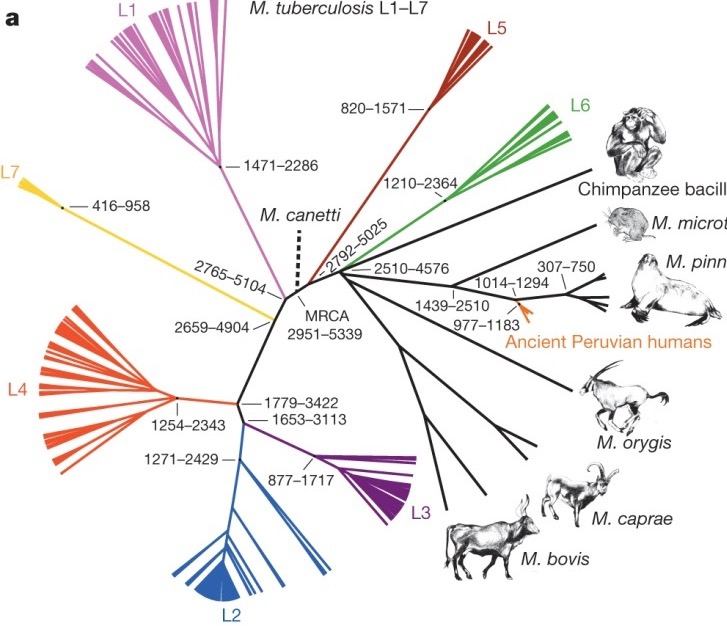
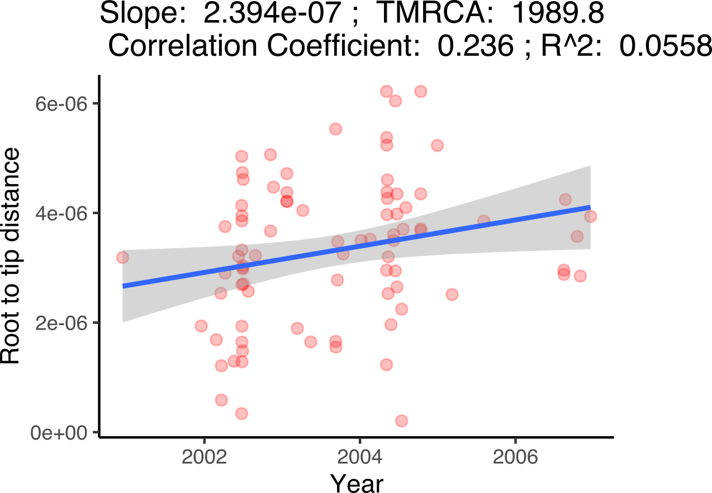
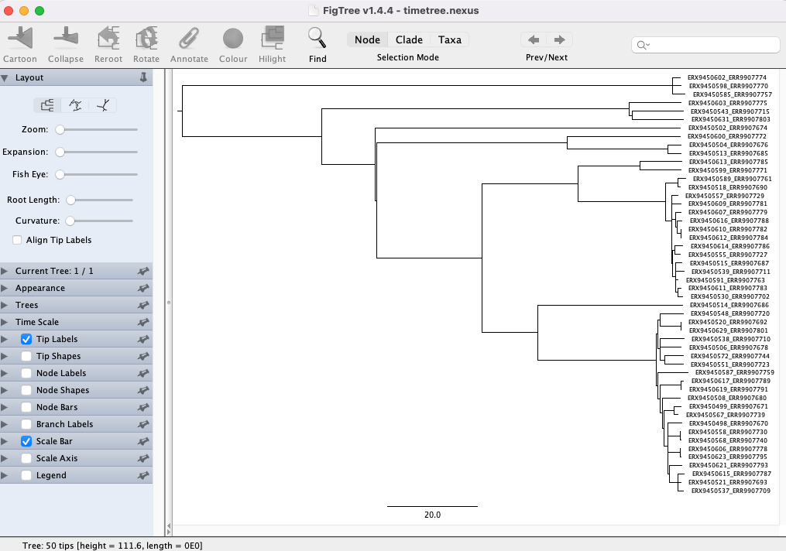
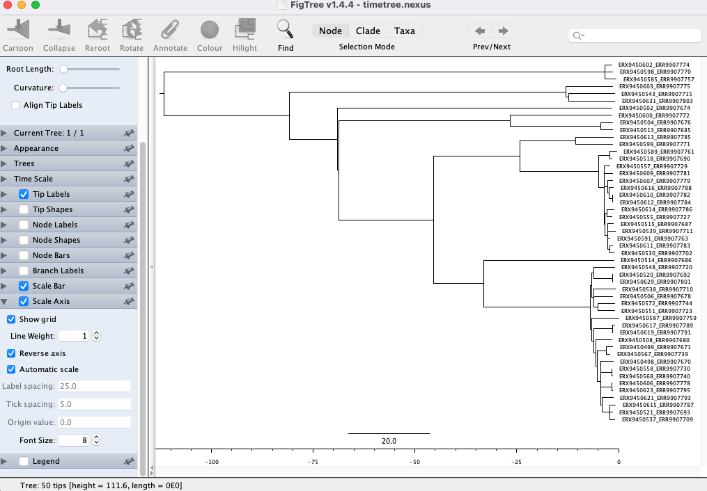
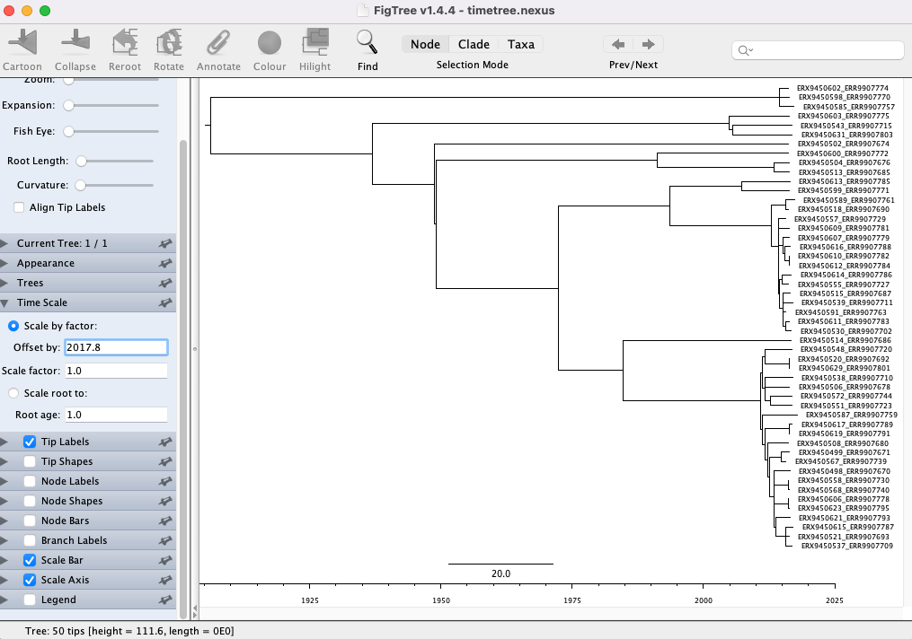

::: {.callout-tip}
## Learning Objectives

- Describe how incorporating temporal data into phylogenetic tree inference can be used to estimate the timing of evolutionary events.
- Understand the different types of tools that can be used to estimate time-scaled phylogenies.
- Learn how to assess whether there is a molecular clock signal in your data.
- Describe how TreeTime can be used to infer a time-scaled phylogenetic tree.
- Generate a time-scaled phylogeny with TreeTime.
- Visualize your time-scaled phylogeny with Figtree.
:::

## Time-scaled phylogenies

Time-scaled phylogenetics is an approach in evolutionary biology that integrates temporal data into the construction of phylogenetic trees, providing a framework to estimate the timing of evolutionary events. This method combines molecular sequence data with collection dates and known mutation rates to produce trees where branch lengths represent time, rather than merely genetic change. By doing so, it allows researchers to infer not only the relationships between different species but also the chronological sequence of divergence events. This approach can uncover insights into the rates of evolution, the timing of speciation events, and the impact of historical environmental changes on evolutionary processes.

The incorporation of time into phylogenetic analysis enhances our understanding of the evolutionary timeline and facilitates more accurate reconstructions of ancestral states. For example, it enables the estimation of the age of the most recent common ancestor of a group of species, offering a temporal perspective on the diversification of lineages. Time-scaled phylogenetics is crucial for fields such as paleontology, where it can help correlate fossil records with molecular data, and for biogeography, where it aids in understanding the temporal patterns of species distributions. By integrating genetic, paleontological, and geochronological data, this method provides a comprehensive view of evolutionary history that is essential for unraveling the complexities of life's past.



## Tools for estimating time-scaled phylogenies

The most commonly used tools for estimating time-scaled phylogenies include BEAST (Bayesian Evolutionary Analysis Sampling Trees), MrBayes, and RAxML. BEAST is a powerful software package that uses Bayesian inference to estimate phylogenies and divergence times simultaneously, incorporating molecular clock models and various priors on the rates of evolution. It is particularly well-suited for complex datasets and allows for the incorporation of different types of data, such as molecular sequences and fossil calibrations. MrBayes, another Bayesian inference tool, is also widely used for phylogenetic analysis and can estimate time-scaled trees by applying relaxed or strict molecular clocks. RAxML (Randomized Axelerated Maximum Likelihood), although primarily a maximum likelihood-based tool, has features for dating phylogenies when combined with other tools that can handle molecular clock models.

Despite its widespread use and powerful capabilities, BEAST has several drawbacks when estimating time-scaled phylogenies. One significant challenge is its computational intensity; BEAST requires substantial processing power and time, especially for large datasets or complex models, making it less accessible for researchers without high-performance computing resources. Additionally, BEAST's reliance on Bayesian inference means that results can be highly sensitive to the choice of priors, which requires careful consideration and can introduce subjective bias. The complexity of the software also presents a steep learning curve for new users, necessitating substantial expertise to correctly implement and interpret analyses. These limitations highlight the need for cautious application and interpretation of BEAST's results in phylogenetic studies.

## Assessing molecular clock signal

Estimating a molecular clock signal in genome data involves determining the rate at which genetic mutations accumulate over time, providing a "clock" to date evolutionary events. We do this by extracting the root-to-tip distances for each genome in a phylogenetic tree ("genetic divergence") and plot this against the collection date for each genome. A positive correlation between genetic divergence and time indicates a molecular clock signal with the slope being the mutation rate over time and the x-intercept the inferred date of the MRCA. It's worth remembering that this analysis is designed to provide an indication of a molecular clock signal in your data and a shallow slope doesn't necessarily mean that you may not be able to infer a robust time-scaled phylogenetic tree.



## TreeTime

`TreeTime` is a computational tool designed to estimate time-scaled phylogenies with a focus on efficiency and simplicity. It employs a maximum likelihood framework to integrate molecular sequence data with temporal information, such as sampling dates, to infer the timing of evolutionary events. `TreeTime` optimizes the placement of mutations along the phylogenetic tree while simultaneously adjusting branch lengths to reflect chronological time. This method leverages a relaxed molecular clock model, allowing for variations in the rate of evolution across different branches. By combining sequence data with temporal constraints, `TreeTime` rapidly produces time-calibrated phylogenies that are both accurate and computationally efficient, making it particularly useful for analyzing large datasets, such as those encountered in viral and bacterial evolution studies. Its user-friendly interface and robust performance make `TreeTime` an accessible and valuable tool for researchers aiming to elucidate the temporal dynamics of evolutionary processes.

### Running `TreeTime`

We're going to run `TreeTime` on the rooted phylogenetic tree of our Namibian TB genomes.  As well as the tree, we also need the masked alignment we created in [The nf-core/bactmap pipeline](11-bactmap.md) and, as we're inferring a time-scaled phylogenetic tree, the sample collection dates that can be found in the `TB_metadata.tsv` file.  Before we run `TreeTime`, we need to remove the outgroup MTBC0 from both the alignment and the phylogenetic tree:

```bash
mamba activate treetime

# create output directory
mkdir -p results/treetime/

# Remove outgroup from alignment
seqkit grep -v -p MTBC0 preprocessed/bactmap/masked_alignment/aligned_pseudogenomes_masked.fas > results/treetime/aligned_pseudogenomes_masked_no_outgroups.fas 

# Remove outgroup from rooted tree
python scripts/remove_outgroup.py -i Nam_TB_rooted.treefile -g MTBC0 -o Nam_TB_rooted_no_outgroup.treefile

# Move no outgroup tree to results/treetime
mv Nam_TB_rooted_no_outgroup.treefile results/treetime
```

Now we can run `TreeTime`:

```bash
# Run TreeTime
treetime --tree results/treetime/Nam_TB_rooted_no_outgroup.treefile \
        --dates TB_metadata.tsv \
        --name-column sample \
        --date-column Date.sample.collection \
        --aln results/treetime/aligned_pseudogenomes_masked_no_outgroups.fas \
        --outdir results/treetime \
        --report-ambiguous \
        --time-marginal only-final \
        --clock-std-dev 0.00003 \
        --relax 1.0 0
```

The options used are: 

- `--tree results/treetime/Nam_TB_rooted_no_outgroup.treefile` - the rooted phylogenetic tree with the outgroup removed.
- `--dates TB_metadata.tsv` - a TSV file containing the sample collection dates.
- `--name-column sample` - the column within the TSV file that contains the sample names (this needs to match the names in the tree).
- `--date-column Date.sample.collection` - the column within the TSV file that contains the sample collection dates.
- `--aln results/treetime/aligned_pseudogenomes_masked_no_outgroups.fas` - the masked whole genome alignment with the outgroup removed.
- `--outdir results/treetime` - directory to save the output files to.
- `--report-ambiguous` - include transitions involving ambiguous states.
- `--time-marginal only-final` - assigns nodes to their most likely divergence time after integrating over all possible configurations of the other nodes.
- `--clock-std-dev 0.00003` - standard deviation of the provided clock rate estimate.
- `--relax 1.0 0` - use an autocorrelated molecular clock. Coupling 0 (–relax 1.0 0) corresponds to an un-correlated clock.

We can look at the output folder: 

```bash
ls results/treetime
```

```
aligned_pseudogenomes_masked_no_outgroups.fas  dates.tsv                           root_to_tip_regression.pdf    timetree.pdf
ancestral_sequences.fasta                      divergence_tree.nexus               sequence_evolution_model.txt  trace_run.log
auspice_tree.json                              molecular_clock.txt                 substitution_rates.tsv
branch_mutations.txt                           Nam_TB_rooted_no_outgroup.treefile  timetree.nexus
```

There are several files produced by TreeTime but the most useful ones for our purposes are: 

- `root_to_tip_regression.pdf` - contains a plot showing the correlation between root to tip distance and collection date. 
- `timetree.pdf` - contains a plot showing the time-scaled phylogenetic tree produced by TreeTime.
- `timetree.nexus` - contains the time-scaled phylogeny in NEXUS format.

:::{.callout-exercise}
#### Build a time-scaled phylogenetic tree

We've provided a script, `08-run_treetime.sh`, to remove the outgroup from the alignment and tree and then run `TreeTime`. 

- Activate the software environment: `mamba activate treetime`.
- Run the script with `bash scripts/08-run_treetime.sh`. If the script is running successfully it should print a message on the screen as `TreeTime` constructs a time-scaled phylogenetic tree.
- Assess the strength of the molecular clock signal in the data.
- Examine the dates estimated by TreeTime. Do these seem reasonable based on what we know about the MTBC?

:::{.callout-answer}

We ran the script using `bash scripts/08-run_treetime.sh`. The script prints a message while it's running:

```bash
0.00	-TreeAnc: set-up

153.00	TreeTime.reroot: with method or node: least-squares

153.00	TreeTime.reroot: rerooting will ignore covariance and shared ancestry.

153.04	TreeTime.reroot: with method or node: least-squares

153.04	TreeTime.reroot: rerooting will ignore covariance and shared ancestry.

164.17	###TreeTime.run: INITIAL ROUND
...
```

We opened the `root_to_tip_regression.pdf` file in the `results/treetime` directory:


We can see that the correlation between root-to-tip distance and collection date isn't particularly strong. However, the inferred mutation rate (the slope) is 1.14e-06 mutations per site per year (~5 mutations per genome per year) which is around 10 times as fast as published estimates for the mutation rate of TB. This is the mutation rate that TreeTime uses as its prior so we should bear that in mind when we consider the dates in the time-scaled phylogenetic tree.

Then we looked at the `timetree.pdf` file:


We can see that the date of the MRCA for the genomes we included in our analysis is around 1906. Given this is the MRCA of the L2 and L4 genomes in our dataset, this likely to be a gross under-estimate for this date (Look at the Bos tree in the introduction which inferred the split between L2 and L4 to have occurred at least 1779 years before present). The likely reasons for this result include the small number of genomes we've included with a small range for the collection dates, the high mutation rate taken from the root-to-tip correlation plot and the fact that we've included three genomes from L2 in the dataset.  The analysis was run this way to make use of the analysis we've already done thus far so you'd want to give more careful consideration when deciding which genomes to include when building a time-scaled phylogenetic tree. For instance, it may have been better to have removed the L2 genomes and just calculate the time-scaled evolutionary history of the the Namibian L4 genomes.  

:::

:::

### Visualizing time-scaled phylogenetic trees

Now that we've generated a time-scaled phylogenetic tree with `TreeTime`, we can use `FigTree` to visualize the tree (the PDF produced by `TreeTime` doesn't include the sample ids and we can't edit it). You can open `FigTree` from the terminal by running the command `figtree`.

To open the tree:

1. Go to <kbd><kbd>File</kbd> > <kbd>Open...</kbd></kbd> and browse to the `results/treetime` folder with the `TreeTime` output files.

2. Select the `timetree.nexus` file and click <kbd>Open</kbd>. You will be presented with a visual representation of the tree:



3. First, let's add the time scale on the bottom. Click the arrow and Tick box next to **Scale Axis**. Then click the tick box next to **Reverse axis**:



4. Now we need to correct the scale to account for our sample collection dates. Click the arrow next to **Time Scale** and input **2017.8** (the date of the most recently sampled genome)in the box next to **Offset by:**



## Summary

::: {.callout-tip}
## Key Points

- Temporal data can be incorporated into the inference of phylogenetic trees to provide estimates for dates of evolutionary events.
- The most commonly used tools to infer time-scaled phylogenies are Bayesian and often require significant computational resources as well as time to run.
- Molecular clock signal in your data can be assessed by looking for a positive correlation between sampling date and root-to-tip distance.
- TreeTime is a computational tool designed to estimate time-scaled phylogenies with a focus on efficiency and simplicity.
- FigTree can be used to visualize time-scaled phylogenetic trees. 
:::

## References