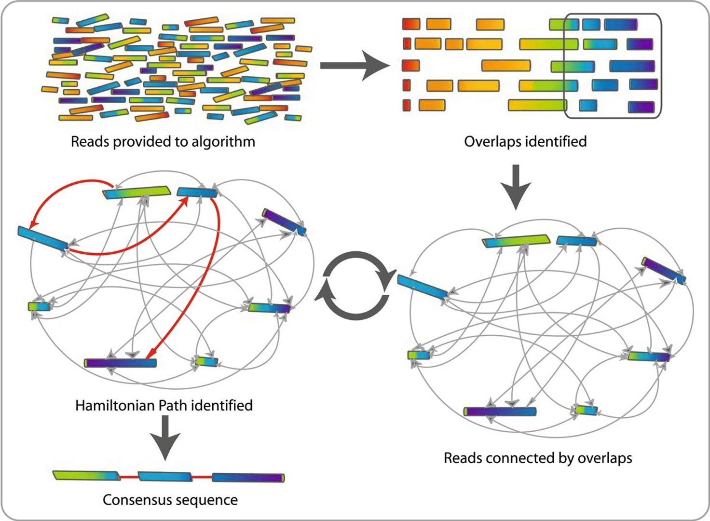

::: {.callout-tip}
## Learning Objectives

- Describe the process of *de novo* genome assembly and how it differs from reference-based assembly.
- List some of the common software that is used for _de novo_ assembly. 
- Describe the purpose of genome annotation. 

:::

## Introduction

There are two approaches for genome assembly: reference-based (or comparative)  or *de novo*.  In a reference-based assembly, we use a reference genome as a guide to map our sequence data to and thus reassemble our sequence this way (this is what we did in the previous module).  Alternatively, we can create a 'new' (*de novo*) assembly that does not rely on a map or reference and more closely reflects the actual genome structure of the isolate that was sequenced. Genome assemblers work by calculating overlaps between reads and (usually) represent these as a graph or network.  They then "walk" the graph to determine the original sequence

## Genome assemblers

Several tools are available for *de novo* genome assembly, depending on whether you use short-read sequence data, long reads, or a combination of both.  Two of the most commonly used assemblers for short-read Illumina data are `Velvet` and `SPAdes`.  SPAdes has become the *de facto* standard de novo genome assembler for Illumina whole genome sequencing data of bacteria and is a major improvement over previous assemblers like Velvet. However, some of its components can be slow and it traditionally did not handle overlapping paired-end reads well.  `Shovill` is a pipeline which uses `SPAdes` at its core, but alters the steps before and after the primary assembly step to get similar results in less time. Shovill also supports other assemblers like `SKESA`, `Velvet` and `Megahit`.

## Genome annotation

Genome annotation is a multi-level process that includes prediction of protein-coding genes (CDSs), as well as other functional genome units such as structural RNAs, tRNAs, small RNAs, pseudogenes, control regions, direct and inverted repeats, insertion sequences, transposons and other mobile elements.  The most commonly used tools for annotating bacterial genomes are `Prokka` and, more recently, `Bakta`.  Both use a tool called `prodigal` to predict the protein-coding regions along with other tools for predicting other genomic features such as `Aragorn` for tRNA.  Once the genomic regions have been predicted, the tools use a database of existing bacterial genome annotations, normally generated from a large collection of genomes such as UniRef, to add this information to your genome.

## Summary

::: {.callout-tip}
## Key Points

- _de novo_ genome assembly consists of reconstructing a genome from sequencing reads, without prior information about its structure. 
- Assembling genomes _de novo_ requires identifying how the millions of sequencing reads overlap with each other, inferring a "path" through an overlap graph. 
- There are many software packages for _de novo_ assembly, which can be chosen depending on the type of data being used (short read, long read, or both).
- _SPades_ is a popular software for bacterial _de novo_ assembly from short read data. In particular, the _Shovill_ pipeline uses this software in a more efficient way. 
- Genome annotation consists of identifying the location of functional elements in the genome, such as genes.
- _Bakta_ is a recent genome annotation package for bacteria, which relies in part on known annotated sequences available from public databases such as UniRef.  
:::

#### References

Comparative Genomics ([link](https://mmbdtp.github.io/modules/comparative-genomics/programme/)) (accessed 2023) 

De novo genome assembly - T.Seemann - IMB winter school 2016 - brisbane, au - 4 july 2016 ([link](https://tinyurl.com/torstaseembler)) (accessed 2023)
