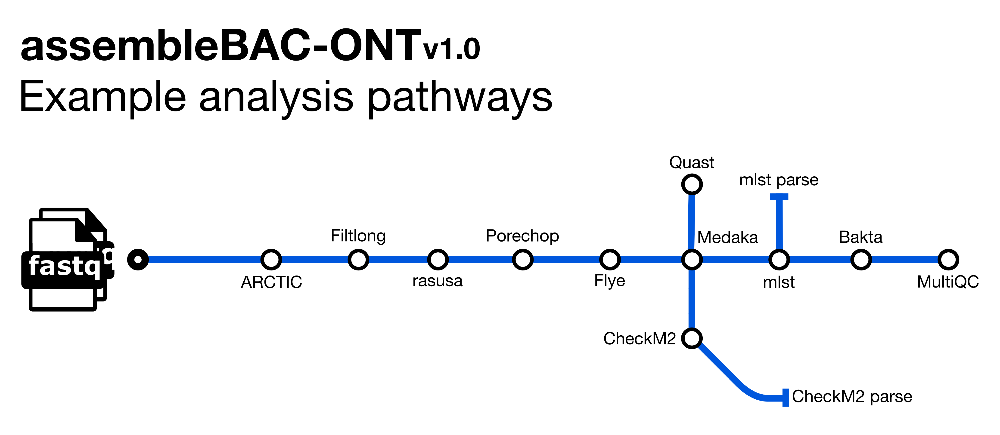

::: {.callout-tip}
## Learning Objectives

- Understand what the assembleBAC pipeline does.

:::

## Pipeline Overview



**assembleBAC** is a bioinformatics analysis pipeline written in Nextflow for assembling and annotating bacterial genomes. It also predicts the Sequence Type (ST) and provides QC metrics with `Quast` and `CheckM2`.  It runs the following tools: 

- [`Shovill`](https://github.com/tseemann/shovill) - *de novo* genome assembly
- [`mlst`](https://github.com/tseemann/mlst) - Sequence Type assignment
- [`Bakta`](https://github.com/oschwengers/bakta) - annotation
- [`Quast`](https://quast.sourceforge.net/) - assembly metrics
- [`CheckM2`](https://github.com/chklovski/CheckM2) - assembly completeness
- [`MultiQC`](https://multiqc.info/) - assembly metrics summary and pipeline information

See [Course Software](appendices/02-course_software.md) for a more detailed description of each tool.

Along with the outputs produced by the above tools, the pipeline produces the following summaries containing results for all samples run through the pipeline (found in the `metadata` directory):

- `checkm2_summary.tsv` - final summary of CheckM2 statistics for input files in TSV format
- `transposed_report.tsv` - final summary of Quast summary statistics for input files in TSV format
- `MLST_summary.tsv` - final summary of Sequence Type assignments in TSV format

## Prepare a samplesheet

As with `bacQC` and `bactmap`, we need to prepare a CSV file containing the information about our sequencing files which will be used as an input to the `assembleBAC` pipeline.  Refer back to [The bacQC pipeline](07-bacqc.md#prepare-a-samplesheet) page for how to do this if you've forgotten.

## Running assembleBAC

Now that we have the samplesheet, we can run the `assembleBAC` pipeline.  There are [many options](https://github.com/avantonder/assembleBAC/blob/main/docs/parameters.md) that can be used to customise the pipeline but a typical command is shown below:

```bash
nextflow run avantonder/assembleBAC \
  -r main \
  -profile singularity \
  --max_memory '16.GB' --max_cpus 8 \
  --input SAMPLESHEET \
  --outdir results/assemblebac \
  --baktadb databases/db-light \
  --genome_size GENOME_SIZE \
  --checkm2db databases/checkme2/uniref100.KO.1.dmnd
```

- `-r` - tells `Nextflow` to pull the `main` version of `bacQC` from Github
- `-profile singularity` - indicates we want to use the _Singularity_ program to manage all the software required by the pipeline (another option is to use `docker`). See [Data & Setup](../setup.md) for details about their installation.
- `--max_memory` and `--max_cpus` - sets the available RAM memory and CPUs. You can check this with the commands `free -h` and `nproc --all`, respectively.
- `--input` - the samplesheet with the input files, as explained above.
- `--outdir` - the output directory for the results.
- `--baktadb` - the path to the directory containing the `Bakta ` database files.
- `--genome_size` - estimated size of the genome - `Shovill` uses this value to calculate the genome coverage.
- `--checkm2db` - the path to the diamond file required by `CheckM2`. 

:::{.callout-warning}

**Remember to QC your data!**

Remember, the first step of any analysis of a new sequence dataset is to perform Quality Control. For the purposes of time, we've run bacQC for you and the results are in `preprocessed/bacqc`.  Before you run assembleBAC, have a look at the read stats and species composition TSV files and make sure that the data looks good before we go ahead and assemble it. 

:::

:::{.callout-exercise}
#### Running assembleBAC

Your next task is to run the **assembleBAC** pipeline on your data.  In the folder `scripts` (within your analysis directory) you will find a script named `01-run_assemblebac.sh`. This script contains the code to run assembleBAC. Edit this script, adjusting it to fit your input files and the estimated genome size of _Staphylococcus aureus_.

Now, run the script using `bash scripts/01-run_assemblebac.sh`.
  
If the script is running successfully it should start printing the progress of each job in the assembleBAC pipeline. This will take a little while to finish. <i class="fa-solid fa-mug-hot"></i>

:::{.callout-answer}

The fixed script is: 

```bash
#!/bin/bash

nextflow run avantonder/assembleBAC \
  -r main \
  -profile singularity \
  --max_memory '16.GB' --max_cpus 8 \
  --input samplesheet.csv \
  --outdir results/assemblebac \
  --baktadb databases/db-light \
  --genome_size 2M
  --checkm2db databases/checkme2/uniref100.KO.1.dmnd
```

We ran the script as instructed using:

```bash
bash scripts/01-run_assemblebac.sh
```

While it was running it printed a message on the screen: 

```
executor >  local (1), slurm (125)
[5b/76f045] process > ASSEMBLEBAC:INPUT_CHECK:SAMPLESHEET_CHECK (samplesheet.csv) [100%] 1 of 1 ✔
[e6/2ea670] process > ASSEMBLEBAC:SHOVILL (ERX3876931_ERR3864878_T1)              [100%] 30 of 30 ✔
[94/bcfb5b] process > ASSEMBLEBAC:MLST (ERX3876931_ERR3864878_T1)                 [100%] 30 of 30 ✔
[9c/f528af] process > ASSEMBLEBAC:MLST_PARSE                                      [100%] 1 of 1 ✔
[07/e7d6bf] process > ASSEMBLEBAC:BAKTA (ERX3876931_ERR3864878_T1)                [100%] 30 of 30 ✔
[7f/6e833a] process > ASSEMBLEBAC:CHECKM2 (ERX3876931_ERR3864878_T1)              [100%] 30 of 30 ✔
[dc/41e8df] process > ASSEMBLEBAC:CHECKM2_PARSE                                   [100%] 1 of 1 ✔
[80/9598f1] process > ASSEMBLEBAC:QUAST                                           [100%] 1 of 1 ✔
[b1/dded73] process > ASSEMBLEBAC:CUSTOM_DUMPSOFTWAREVERSIONS (1)                 [100%] 1 of 1 ✔
[80/f2d907] process > ASSEMBLEBAC:MULTIQC (1)                                     [100%] 1 of 1 ✔
-[avantonder/assembleBAC] Pipeline completed successfully-
Completed at: 16-Nov-2023 11:45:37
Duration    : 32m 24s
CPU hours   : 41.5
Succeeded   : 126
```

:::
:::

## Summary

::: {.callout-tip}
## Key Points

:::