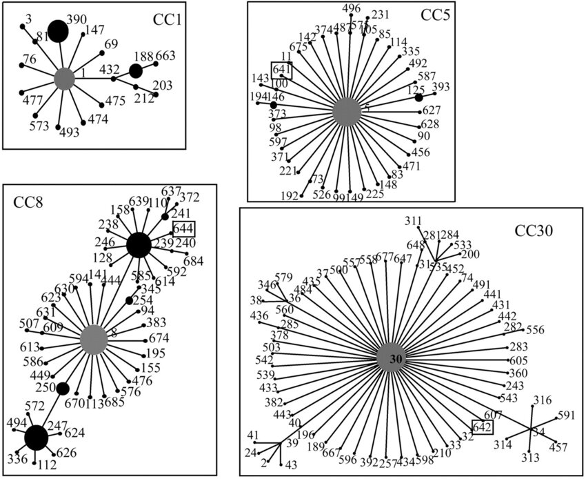

::: {.callout-tip}
## Learning Objectives

- Describe what multilocus sequence typing (MLST) is and its use for genomic surveillance.
- Understand that closely related Sequence Types can be grouped into Clonal Complexes.
- Perform MLST using command line software. 

:::

Strain typing of bacteria is a critical process in microbiology that allows for the identification and differentiation of bacterial strains within a species. Traditional lab-based methods for bacterial strain typing include techniques such as serotyping, phage typing, and antibiograms. Serotyping involves the identification of distinct bacterial strains based on their unique surface antigens, while phage typing differentiates strains by their susceptibility to specific bacteriophages. Antibiograms, on the other hand, classify bacteria based on their patterns of antibiotic resistance. Although these methods are valuable and widely used, they can be labor-intensive, time-consuming, and sometimes lack the resolution needed to distinguish closely related strains.

## Typing bacteria using MLST

Over the past 25 years, molecular techniques like Multilocus Sequence Typing (MLST) have revolutionized bacterial strain typing. MLST involves sequencing internal fragments of multiple housekeeping genes and assigning a unique allelic profile to each strain based on the sequence variation at these loci. Each unique combination of alleles is called a sequence type (ST) and the [PubMLST project](https://pubmlst.org/) curates and maintains these sequence types in the form of large, comprehensive databases that facilitates global surveillance of bacterial populations and enhances our understanding of bacterial evolution and diversity. Although this method might seem a bit old-fashioned in the age of genomic analysis (as it focuses on only 7 genes), it offers a uniform and comparable way to categorize strains across different labs and locations.


### Clonal complexes

Clonal complexes (CCs) are groups of related STs that share a high degree of genetic similarity, typically differing by only a single allele. By comparing ST profiles using algorithms such as eBURST or using clustering methods, closely related STs are grouped into CCs, reflecting their evolutionary relationships and likely descent from a common ancestor. This assignment of STs to CCs allows researchers to study the population structure, epidemiology, and evolutionary history of bacterial species, facilitating the tracking of disease outbreaks and the identification of major lineages responsible for infections.



## MLST with command line {#sec-mlst-cli}

We start our analysis by activating our software environment, to make all the necessary tools available: 

```bash
mamba activate mlst
```

We're going to run a tool called `mlst` on the assemblies we generated with `assembleBAC`:

```bash
# create output directory
mkdir results/mlst

# run mlst
mlst --scheme saureus results/assemblebac/assemblies/*.fa > results/mlst/mlst_typing.tsv
```

This command outputs a tab-delimited file (TSV), which we can open in a spreadsheet software such as _Excel_. 
Here is the result for our samples:

```
results/assemblebac/assemblies/ERX3876905_ERR3864852_T1_contigs.fa	saureus	398	arcC(3)	aroE(35)	glpF(19)	gmk(2)	pta(20)	tpi(26)	yqiL(39)
results/assemblebac/assemblies/ERX3876907_ERR3864854_T1_contigs.fa	saureus	34	arcC(8)	aroE(2)	glpF(2)	gmk(2)	pta(6)	tpi(3)	yqiL(2)
results/assemblebac/assemblies/ERX3876908_ERR3864855_T1_contigs.fa	saureus	97	arcC(3)	aroE(1)	glpF(1)	gmk(1)	pta(1)	tpi(5)	yqiL(3)
results/assemblebac/assemblies/ERX3876909_ERR3864856_T1_contigs.fa	saureus	30	arcC(2)	aroE(2)	glpF(2)	gmk(2)	pta(6)	tpi(3)	yqiL(2)
results/assemblebac/assemblies/ERX3876929_ERR3864876_T1_contigs.fa	saureus	45	arcC(10)	aroE(14)	glpF(8)	gmk(6)	pta(10)	tpi(3)	yqiL(2)
```

We get a column for each of the 7 genes used for _S. aureus_ sequence typing, with the gene name followed by the allele number in parenthesis. 
The allele number is an identifier used by PubMLST, and it means that allele has a specific sequence with a certain set of variants ([search for alleles here](https://pubmlst.org/bigsdb?db=pubmlst_saureus_seqdef&page=alleleQuery)). 
For example, `arcC(3)` corresponds to [allele 3 of the _arcC_ gene](https://pubmlst.org/bigsdb?db=pubmlst_saureus_seqdef&page=alleleInfo&locus=arcC&allele_id=3).

The command line version of `mlst` also reports when an allele has an inexact match to the allele in the database, with the following notation (copied from [the README documentation](https://github.com/tseemann/mlst)):

| Symbol | Meaning                                   | Length            | Identity       |
| ------ | ----------------------------------------- | ----------------- | -------------- |
| `n`    | Exact intact allele                       | 100%              | 100%           |
| `~n`   | Novel full length allele _similar_ to `n` | 100%              | ≥ `--minid`    |
| `n?`   | Partial match to known allele             | ≥ `--mincov`      | ≥ `--minid`    |
| `-`    | Allele missing                            | < `--mincov`      | < `--minid`    |
| `n,m`  | Multiple alleles                          |                   |                |

The third column of the output indicates the Sequence Type (ST) of our samples based on the combination of the 7 alleles identified by `mlst`.

:::{.callout-tip}
#### MLST schemes available

To check the list of MLST schemes available, you can use the command `mlst --list`.
:::

:::{.callout-exercise}
#### MLST with assemblebac

The sharp-eyed amongst you may have noticed that `assemblebac` runs `mlst` alongside assembly and annotation.

- Open the `mlst_summary.tsv` file in the `results/assemblebac/metadata` directory
- Are the assigned alleles and Sequence Types the same as those you obtained by running `mlst` yourself?

:::{.callout-answer}

- We opened the `mlst_summary.tsv` file which contained the following:

```
ERX3876905_ERR3864852_T1_contigs.fa	saureus	398	arcC(3)	aroE(35)	glpF(19)	gmk(2)	pta(20)	tpi(26)	yqiL(39)
ERX3876907_ERR3864854_T1_contigs.fa	saureus	34	arcC(8)	aroE(2)	glpF(2)	gmk(2)	pta(6)	tpi(3)	yqiL(2)
ERX3876908_ERR3864855_T1_contigs.fa	saureus	97	arcC(3)	aroE(1)	glpF(1)	gmk(1)	pta(1)	tpi(5)	yqiL(3)
ERX3876909_ERR3864856_T1_contigs.fa	saureus	30	arcC(2)	aroE(2)	glpF(2)	gmk(2)	pta(6)	tpi(3)	yqiL(2)
ERX3876929_ERR3864876_T1_contigs.fa	saureus	45	arcC(10)	aroE(14)	glpF(8)	gmk(6)	pta(10)	tpi(3)	yqiL(2)
```
- The alleles and STs were the same as those assigned when we ran `mlst` ourselves

:::
:::

## Summary

::: {.callout-tip}
#### Key Points

- MLST (Multilocus Sequence Typing) is a genotyping method used to identify and categorize bacterial strains based on the sequences of specific housekeeping genes.
- It aids in tracking and monitoring the spread of bacterial pathogens, understanding their genetic diversity, and detecting outbreaks.
- MLST results reveal the Sequence types (STs) of bacterial strains, which can help in identifying clonal complexes and their relatedness.
- Dedicated command-line software such as `mlst` allows for automation and give a more detailed output.

:::

#### References

Vivoni AM, Diep BA, de Gouveia Magalhães AC, Santos KR, Riley LW, Sensabaugh GF, Moreira BM. Clonal composition of _Staphylococcus aureus_ isolates at a Brazilian university hospital: identification of international circulating lineages. _J Clin Microbiol._ 2006. [DOI](https://doi.org/10.1128/JCM.44.5.1686-1691.2006)