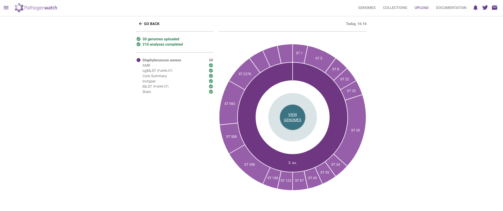
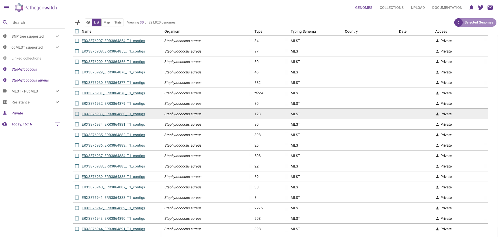
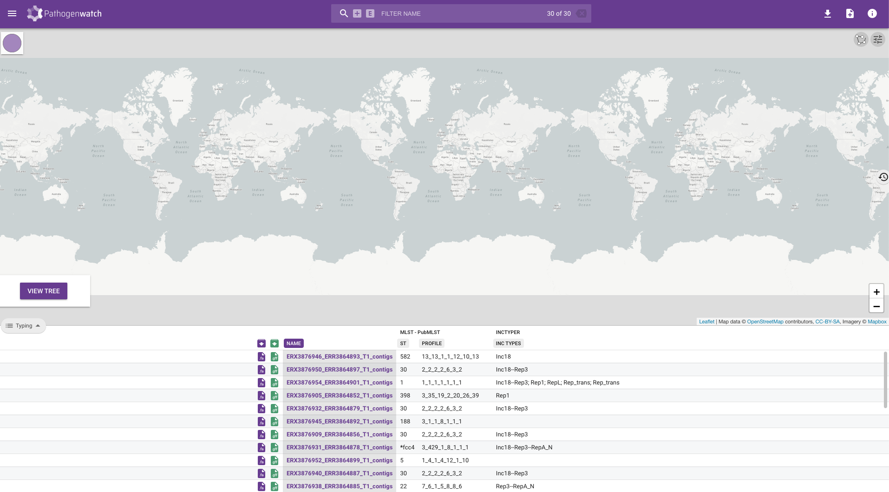
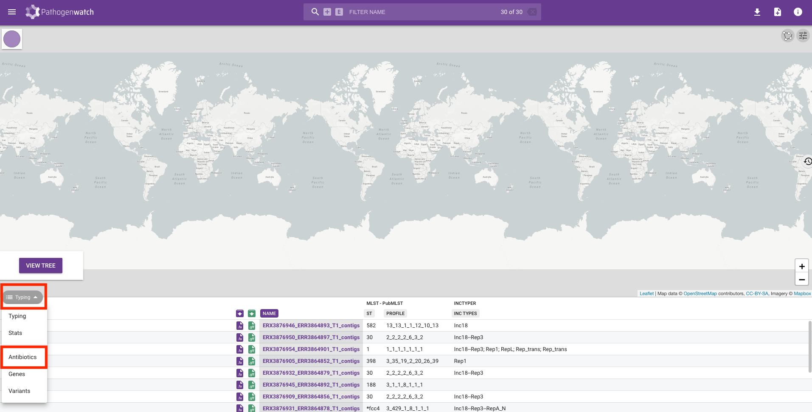

::: {.callout-tip}
## Learning Objectives

- Describe what _Pathogenwatch_ is and how it can be used to aid in genomic surveillance.
- Upload files and create collections from our assemblies. 
- Become familiar with the interface to _Pathogenwatch_.
- Download and combine key results from _Pathogenwatch_.

:::

## Pathogenwatch

Pathogenwatch is a web-based platform for common genomic surveillance analysis tasks, including: 

- Identifying strains for pathogens of concern.
- Cluster sequences using phylogenetic analysis.
- Identifying the presence of antibiotic resistance genes. 

Pathogenwatch is designed to be user-friendly, supporting the analysis of over 100 species, including _Staphylococcus aureus_, which is our organism of focus.
In this chapter, we will cover the basics of loading genomes and creating collections for analysis on this platform. 
The details of the _Pathogenwatch_ analysis will then be covered in following chapters.

In order to use this platform you will first need to [**create an account**](https://pathogen.watch/sign-in) (or sign-in through your existing Google, Facebook or Twitter).


## Uploading FASTA files

Once you have logged in to Pathogenwatch, you can load the FASTA files with the sequences you want to analyse. 
In our case, we will load the assemblies we have provided in the `preprocessed` directory which were built using [assembleBAC](20-assemblebac.md). 

1. Click the **Upload** link in the top-right corner of the page:

{#fig-pathogenwatch1}

2. Click in the **Upload FASTA(s)** button, in the "Single Genome FASTAs" section: 

{#fig-pathogenwatch2}

3. If your internet connection is slow and/or unstable, you can tick "Compress files" and "Upload files individually".Click the **+** button on the bottom-right corner to upload the sequences:

{#fig-pathogenwatch3}

4. This will open a file browser, where you can select the FASTA files from your local machine. Go to the `preprocessed/assemblebac/assemblies` folder where you have the results from your earlier genome assembly analysis. You can upload several files at once by clicking and selecting several FASTA files while holding the <kbd>Ctrl</kbd> key. Click **Open** on the dialogue window after you have selected all of your FASTA files.

{#fig-pathogenwatch4}

5. A new page will open showing the progress of the samples being uploaded and processed.

{#fig-pathogenwatch5}

6. Click in the **VIEW GENOMES** button, which will take you to a tabular view of your samples:

{#fig-pathogenwatch6}

_Pathogenwatch_ performs the following major analyses useful for genomic surveillance: sequence typing (ST), antimicrobial resistance (AMR) analysis, phylogenetics, as well as reporting general statistics about your samples (such as genome completeness, which we also assessed with `checkM2`).
We will detail several of these analyses in the coming chapters, but here is a brief description of each column: 

- **Name** - the names of the uploaded samples.
- **Organism** - the species that was detected for our samples, in this case _Staphylococcus aureus_.
- **Type** and **Typing schema** - the sequence type assigned to each sample, based on MLST analysis 
- **Country** and **Date** - the country and date of collection, respectively; only shown if we provided that information as metadata.
- **Access** - whether these samples are private or public; in this case, because they were uploaded by us, they are private (only we can see them). 


:::{.callout-note}
#### Metadata

If you have metadata files associated with your sequenced samples, you can upload those files following [these instructions](https://cgps.gitbook.io/pathogenwatch/how-to-use-pathogenwatch/uploading-assemblies#metadata).
Make sure all metadata files are in **CSV** format, with five recommended columns named 'latitude', 'longitude', 'year', 'month', and 'day'. 
You can also use the template provided by _Pathogenwatch_ on the upload page, to help you prepare your metadata files before the analysis.

Having this type of information is highly recommended, as it will allow you to visualise your samples on a map, which is useful if you want to match particular strains to the geographic locations where outbreaks occur. 
:::


## Collections

A useful feature of _Pathogenwatch_ is to group our samples into **collections**. 
This allows us to manage and analyse samples in batches of our choice. 
The same sample can exist in different collections. 
For example you might create a collection with only the genomes you sequenced recently, another collection with all the genomes you ever sequenced in your facility, or even a collection that includes your samples together with public samples available online (if you want to compare them with each other). 

To create a collection from your sequences, check the box next to the "Name" header to select all of the uploaded genomes. 
Then, from the top-right of the table, click **Selected Genomes** --> **Create Collection**:

{#fig-pathogenwatch7}

In the next window give a name and description to your collection: 

{#fig-pathogenwatch8}

It is highly recommended to provide details for your collection:

- **Title** - give your collection a title that is meaningful to you, for example: "WBG 2023".
- **Description** - give a brief description of your samples, for example: "Culture-based sequencing of Staphylococcus aureus.  Samples were collected from school children in Cambridgeshire in 2018."
- If your data come from a published study, provide a DOI of the study, for example: "10.1099/mgen.0.000993".

Finally, click <kbd>Create Now</kbd> button to create your collection. 
You will be shown a table and map, with the samples you just added to the collection:

{#fig-pathogenwatch9}

This table contains several columns:

- **Purple <i class="fa-solid fa-download" style="color:purple"></i> download button** - download the assembled genome in FASTA format. 
  This is the same file that you just uploaded, so it's not very useful in our case. 
  It can be useful if you want to download the public sequences available from within _Pathogenwatch_. 
- **Green <i class="fa-solid fa-download" style="color:green"></i> download button** - download the gene annotation performed by _Pathogenwatch_ in GFF format. 
  Note that our assembly script already performed gene annotation using _Bakta_, so this feature is also not so useful for us. 
  But again, if you were using public sequences from _Pathogenwatch_, you could download their GFF files.
- **NAME** - your sample name. 
- **ST** and **PROFILE** - these columns refer to the "sequence type" (ST) assigned to each of our samples.- **ST** and **PROFILE** - these columns refer to the "sequence type" (ST) assigned to each of our samples.
- **INC TYPES** - identification of plasmids relevant for Staphylococcal species ("inc" stands for "incompatibility", refering to [plasmid incompatibility groups](https://blog.addgene.org/plasmids-101-plasmid-incompatibility)). Inc plasmids often carry antibiotic resistance and virulence genes, making them of particular relevance for public health (e.g. [Foley et al 2021](https://doi.org/10.1128/mmbr.00031-20)).
 
Along with the typing, we can also look at the drug susceptibility profiles of the samples by clicking on the **Typing** button on the left-hand side of the screen and changing it to **Antibiotics**:

{#fig-pathogenwatch10}

You will see a table containing the drugs that **Pathogenwatch** is able to identify resistance to using genetic variants identified in the genomes we uploaded.  Resistance to a drug is shown by a red circle and we can see that the majority of our genomes are resistant to penicillin:

{#fig-pathogenwatch11}

We will add some of this information to our phylogenetic tree in the next section. 

:::{.callout-exercise}
#### Downloading data from _Pathogenwatch_

For the next step, [visualising our phylogeny](25-tree_visualization), you will need to download the results of the lineage typing and antibiotic susceptibility from `Pathogenwatch`:

- Download the Typing table 
- Download the AMR profile.
- Two CSV files will be downloaded.  Rename the appropriate files to the following as this will help with the next exercise:
  - `wbg-2023-typing.csv`
  - `wbg-2023-amr-profile.csv`

Now, move these two files into the `S_aureus` analysis directory.

:::{.callout-answer}

- Click on the **download** icon in the top right-hand corner and select **Typing table**:


- Click on the **download** icon again and select **AMR profile**: 


- Two files were downloaded (the longer names will likely be slightly different) to our `Downloads` directory:

  - `pathogenwatch-saureus-pi6kp4oqdawi-wbg-2023-typing.csv`
  - `pathogenwatch-saureus-pi6kp4oqdawi-wbg-2023-amr-profile`

- We renamed the files on the command line (you could do this in the File Explorer too):

```bash
mv pathogenwatch-saureus-pi6kp4oqdawi-wbg-2023-typing.csv wbg-2023-typing.csv
mv pathogenwatch-saureus-pi6kp4oqdawi-wbg-2023-amr-profile wbg-2023-amr-profile.csv
```

- We moved the files from the `Downloads` (or `Desktop`, depending on your browser settings) directory to our `S_aureus` directory.
  The following command assumes we were in the `S_aureus` directory to start with:

```bash
# if your browser downloads to "Downloads" folder:
mv ~/Downloads/wbg-2023* .
# if your browser downloads to the "Desktop" folder:
mv ~/Desktop/wbg-2023* .
```

:::
:::

:::{.callout-exercise}
#### Preparing data for _Microreact_

Now that we have analysed our genomes with `Pathogenwatch` and downloaded the typing and AMR profiles, we need to merge this metadata with the existing information we have for the 30 _S. aureus_ genomes.  We could do this with _Excel_. Alternatively, we provide a _Python_ script called `merge_staph_data.py` in the `scripts` directory.

- Make sure you are in the `base` software environment (where we have the _Pandas_ library for _Python_).
- Run `merge_staph_data.py` to create the final metadata file we need for `Microreact`. Look at the help documentation of this script to find out how to specify inputs and outputs to this script.

**Note:** If you have not managed to run the Pathogenwatch analysis, we provide the output files from the previous exercise in `preprocessed/pathogenwatch` that you can use instead. 

:::{.callout-hint}

Depending on how they are written, most `Python` scripts will print the available options if you use the help flag (`--help` or `-h`):

```bash
python scripts/merge_staph_data.py -h
```

:::

:::{.callout-answer}

- We activated the `base` software environment with `mamba activate base`
- We ran the `merge_staph_data.py` script to create a TSV file called `staph_metadata.tsv` in your analysis directory:

    ```bash
    python scripts/merge_staph_data.py -s sample_info.csv -t wbg-2023-typing.csv -a wbg-2023-amr-profile.csv
    ```

:::
:::

## Summary

::: {.callout-tip}
#### Key Points

- _Pathogenwatch_ is a web-based platform designed for genomic surveillance of bacterial pathogens. It assists in the analysis and interpretation of genomic data to monitor disease outbreaks and track pathogen evolution.
- You can upload genome assemblies in FASTA format and accompanying metadata as CSV files.
- Assemblies can be organized into collections, making it simpler to manage and analyze multiple samples together.
- _Pathogenwatch_'s interface offers an intuitive user experience designed for users with varying levels of expertise, providing results such as biotype/serogroup, strain classification, antimicrobial resistance (AMR) and phylogenetic placement.
- Downloading and combining the output files from _Pathogenwatch_ as well as any metadata can be of use to annotate phylogenetic trees.
:::