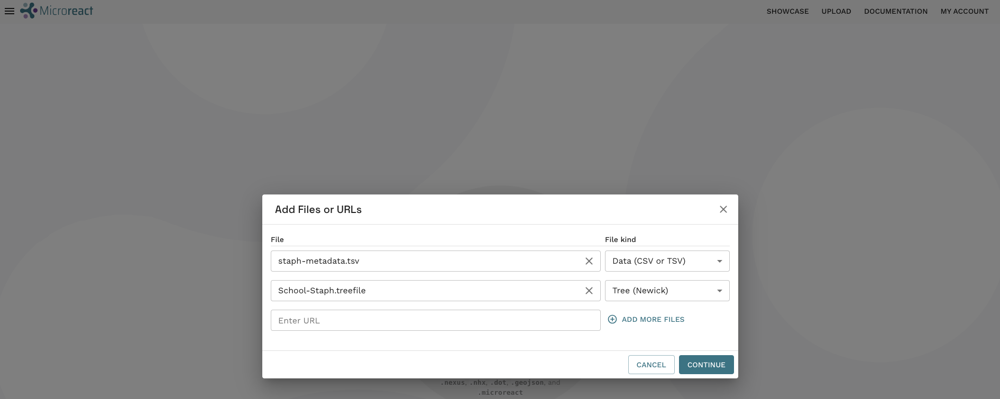
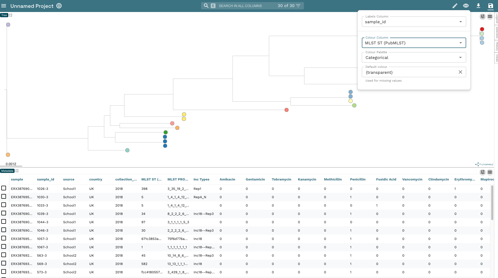
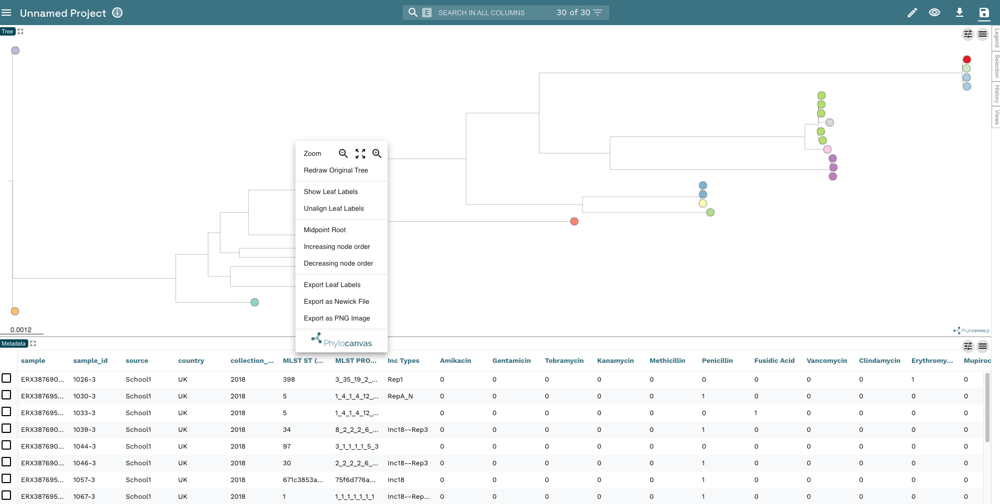
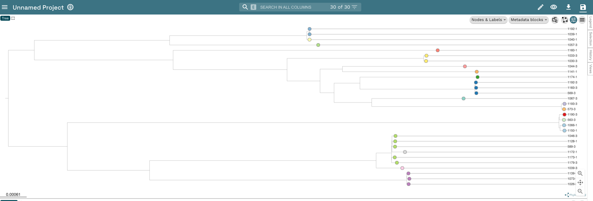
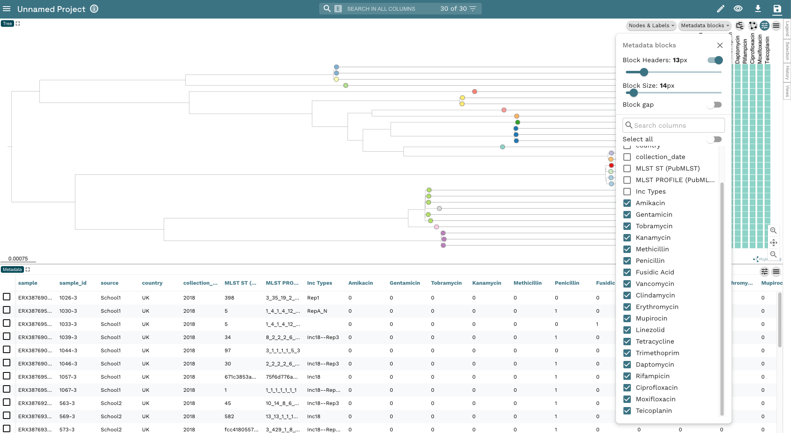
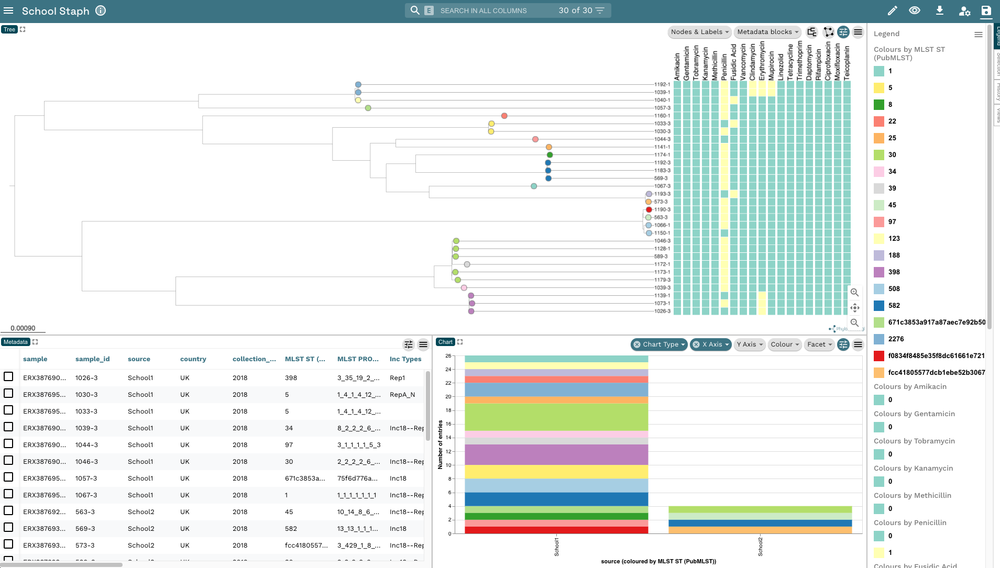

::: {.callout-tip}
## Learning Objectives

- Visualise and annotate your _S. aureus_ tree with _Microreact_.
- Explore the large number of features in _Micoreact_ that can be used to enrich your tree visualisations.
:::


In the [Visualising phylogenies](14-tree_visualization.md) chapter we used `Microreact` to visualize the phylogenetic tree of Namibian TB isolates. We're going to do the same with the _S.aureus_ phylogeny and metadata but use some of the other features in `Microreact` we didn't use before.

1. First, copy `School_Staph.treefile` to the analysis directory so that it's in the same location as `Staph_metadata.tsv`:

    ```bash
    cp preprocessed/iqtree/School_Staph.treefile .
    ```
2. Upload the two files to `Microreact`:



3. Now change the **Labels Column** to `sample_id` and the **Colour Column** to `MLST ST (PubMLST)`:



4. In the previous tree, we used the TB ancestral reference sequence as an outgroup to root the tree. As we haven't included an outgroup in our _S. aureus_ dataset, we'll midpoint root the tree (the root is positioned at the midpoint between the two longest branches). Right click on the tree plot and click **Midpoint Root**:



5. Edit the tree so the tip labels are shown (you may need to adjust the size of the text) and reduce the size of the leaf nodes:



6. We used `Pathogenwatch` to predict the AMR profile of our isolates. Let's go ahead and add that information as metadata blocks. Click on the **Metadata blocks** button in the top-right corner and select all of the drugs in the list:



7. Save your project calling it something helpful like "School Staph".

:::{.callout-exercise}
#### Add Legend and bar plot to the window

- Add a legend to the window so you can identify what each colour corresponds to.
- Add a bar chart to the window showing the distribution of STs in each school.

:::{.callout-answer}

- We clicked on the **Legend** button on the far right-hand side of the window to show the legend.
- We clicked, the **Pencil** icon, then **Create New Chart** and added a plot to the bottom left-hand side of the window. We then changed **Chart Type** to `Bar Chart`and **X Axis Column** to `source` to create the chart:



:::
:::

## Summary

::: {.callout-tip}
## Key Points

- _Microreact_ is a user-friendly and flexible tool for tree visualisation. 
- Several analysis results can be plotted alongside our tree, providing a richer view of our data.

:::
