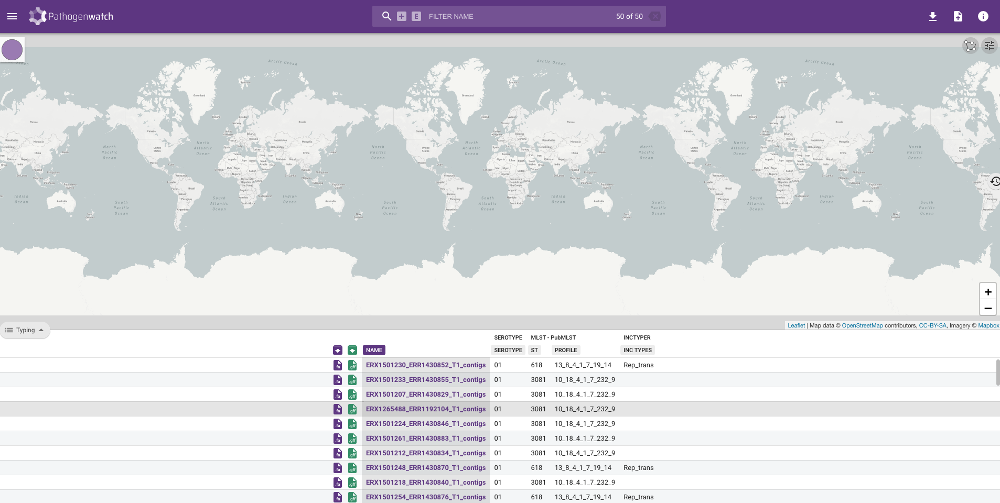

::: {.callout-tip}
## Learning Objectives

- Obtain pneumo metadata from pneumowatch.

:::

:::{.callout-exercise}
#### Analysing Pneumococcal genomes with Pathogenwatch

Whilst you can upload FASTQ files to Pathogenwatch, it's quicker if we work with already assembled genomes.  We've provided pre-processed results for the _S. pneumoniae_ data generated with `assembleBAC` in the `preprocessed/` directory which you can use to upload to Pathogenwatch in this exercise.

- Upload the assembled _S. pneumoniae_ genomes to `Pathogenwatch`.
- Once `Pathogenwatch` has finished processing the genomes, save the results to a collection called **Chaguza Serotype 1**.
- Download the Typing and AMR profile tables to the `Course_materials/S_pneumoniae` directory.
- Rename the tables to `chaguza-serotype-1-typing.csv` and `chaguza-serotype-1-amr-profile.csv` respectively.
- Merge the two tables with `sample_info.csv` by running the `merge_pneumo_data.py` script in the `scripts` directory.

:::{.callout-hint}

Refer back to [Pathogenwatch](29-pathogenwatch.md) if you need a reminder on how to run a python script like `merge_pneumo_data.py`. 

:::

:::{.callout-answer}

- We opened `Pathogenwatch` in our web browser and logged in.  We then clicked on **UPLOAD**, the **Upload FASTA(s)** button in the "Single Genome FASTAs" section and the **+** button before navigating to the `preprocessed/assemblebac/assemblies` directory. We then selected all the assembly files and clicked **Open** on the dialogue window.
- We waited for `Pathogenwatch` to finish processing the genomes, clicked the **VIEW GENOMES** button, then saved the results to a collection called **Chaguza Serotype 1** by clicking **Selected Genomes** --> **Create Collection** and adding **Chaguza Serotype 1** to the Title box. Finally, we clicked <kbd>Create Now</kbd> button to create our collection.



- We clicked on the **download** icon in the top right-hand corner and selected **Typing table**.
- We clicked on the **download** icon in the top right-hand corner and selected **AMR profile**.
- We renamed the files to `chaguza-serotype-1-typing.csv` and `chaguza-serotype-1-amr-profile.csv` respectively and moved them to the `S_pneumoniae` directory.
- We activated the `tb-profiler` software environment with `mamba activate tb-profiler`
- We ran the `merge_pneumo_data.py` script to create a TSV file called `pneumo_metadata.tsv` in your analysis directory:

```bash
python scripts/merge_pneumo_data.py -s sample_info.csv -t chaguza-serotype-1-typing.csv -a chaguza-serotype-1-amr-profile.csv
```
:::

:::


## Summary

::: {.callout-tip}
## Key Points

:::