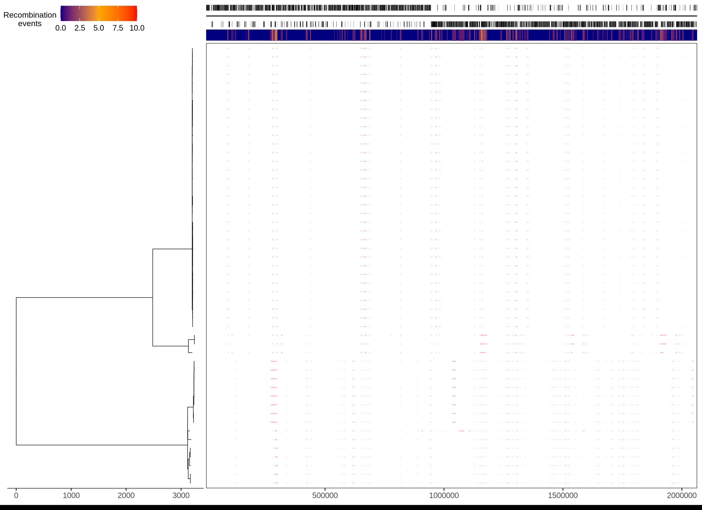

::: {.callout-tip}
## Learning Objectives

- Describe what recombination in bacteria is.
- Apply the _Gubbins_ software to generate recombination-free alignments. 
- Build a phylogeny from a recombination-free alignment.

:::

## Removing recombination

Recombination in bacteria is characterized by DNA transfer from one organism or strain (the donor) to another organism/strain (the recipient) or the uptake of exogenous DNA from the surrounding environment.  Broadly, there are three different types of bacterial recombination:

- **Transformation:** the uptake of exogenous DNA from the environment
- **Transduction:** virus-mediated (phage) transfer of DNA between bacteria
- **Conjugation:** the transfer of DNA from one bacterium to another via cell-to-cell contact

The sequences transferred via recombination can influence genome-wide measures of sequence simularity more than vertically-inherited point mutations that are the signal of shared common ancestor.  Thus, identifying recombinant regions and accounting for their potentially different phylogenetic history is crucial when examining the evolutionary history of bacteria.  In practice, what this means is that we remove (mask) previously identified recombinant regions in our multiple sequence alignments, before we proceed with phylogenetic tree inference.  

The two most commonly used tools to do this are `Gubbins` and `ClonalFrameML`. It's important to note that `Gubbins` cannot be used on the core gene alignment produced by tools like `roary` or `panaroo`. Instead, `Gubbins` requires a whole-genome alignment as input, in order to analyse the spatial distribution of base substitutions.  For this reason, the finer-scale phylogenetic structure of trees generated using a core gene alignment may be less accurate.  If we want to properly account for recombination in this instance, typically we would perform clustering on our initial tree, then map sequence data for the samples within a cluster to a suitable reference before running our recombination removal tool of choice.

## Gubbins

`Gubbins` (Genealogies Unbiased By recomBinations In Nucleotide Sequences) is an algorithm that iteratively identifies loci containing elevated densities of base substitutions, while concurrently constructing a phylogeny based on the putative point mutations outside of these regions.  We're going to use Gubbins to identify the recombinant regions in the alignment we generated using `bactmap`.

## Running `Gubbins`

We'll start by activating the `gubbins` software environment:

```bash
mamba activate gubbins
```

To run `Gubbins` on the `aligned_pseudogenomes.fas` file, the following commands can be used:

```bash
# create output directory
mkdir -p results/gubbins/

# run gubbins
run_gubbins.py --prefix sero1 --tree-builder iqtree results/bactmap/pseudogenomes/aligned_pseudogenomes.fas

# move gubbins outputs to results directory
mv sero1.* results/gubbins/
```
The options we used are:

- `--prefix` - prefix to use for the `Gubbins` output files.
- `--tree-builder` - `Gubbins` can be run with different phylogenetic software including `IQ-TREE`, `FastTree` and `RAxML`.

As it runs, `Gubbins` prints several messages to the screen.

We moved the output files to `results/gubbins/` where we can see all the output files it generated:

```bash
ls results/gubbins
```

```
sero1.final_tree.tre                     sero1.per_branch_statistics.csv     sero1.summary_of_snp_distribution.vcf
sero1.branch_base_reconstruction.embl    sero1.log                           sero1.recombination_predictions.embl
sero1.filtered_polymorphic_sites.fasta   sero1.node_labelled.final_tree.tre  sero1.recombination_predictions.gff
sero1.filtered_polymorphic_sites.phylip       
```

## Masking recombinant regions

In a similar way to how we masked the TB alignment to remove certain regions of the reference genome from downstream analyses, the next step is to mask the recombinant regions in our `aligned_pseudogenomes.fas` file, so these do not influence our phylogenetic tree inference.  Instead of using `remove_blocks_from_aln.py`, we will use `mask_gubbins_aln.py` (included with `Gubbins`):

```bash
mask_gubbins_aln.py --aln results/bactmap/pseudogenomes/aligned_pseudogenomes.fas --gff results/gubbins/sero1.recombination_predictions.gff --out results/gubbins/aligned_pseudogenomes_masked.fas
```

The options we used are:

- `--aln` - the input alignment, in this case the alignment created by `bactmap`.
- `--gff` - the GFF file containing the coordinates for the recombinant regions identified by `Gubbins`.
- `--out` - the masked alignment.

The masked final alignment will be saved to the `results/gubbins/` directory.

## Visualizing recombinant regions

The outputs from `Gubbins` can be visualised by running a R script included as part of `Gubbins`:

```bash
plot_gubbins.R -t results/gubbins/sero1.final_tree.tre -r results/gubbins/sero1.recombination_predictions.gff -a resources/reference/GCF_000299015.1_ASM29901v1_genomic.gff -o results/gubbins/sero1.recombination.png
```
The options we used are:

- `-t` - the recombination-free phylogenetic tree created by `Gubbins`.
- `-r` - the GFF file containing the coordinates for the recombinant regions identified by `Gubbins`.
- `-a` - the GFF file for the reference genome containing the coordinates for the coding regions.
- `-o` - the figure showing the recombinant regions identified by `Gubbins`.



The panel on the left shows the maximum-likelihood phylogeny built from the clonal frame of serotype isolates. The scale below shows the length of branches in base substitutions. The tree is coloured according to the classification of isolates, each of which corresponds to a row in the panel on the right. Each column in this panel is a base in the reference annotation, the annotation of which is shown at the top of the figure. The panel shows the distribution of inferred recombination events, which are coloured blue if they are unique to a single isolate, or red, if they are shared by multiple isolates through common ancestry.

:::{.callout-exercise}
#### Exercise: Run `Gubbins`

Using Gubbins, create a recombination-masked alignment.

- Activate the software environment: `mamba activate gubbins`.
- Run the script we provide in `scripts` using `bash scripts/03-run_gubbins.sh`.
- When the analysis starts you will get several messages and progress bars print on the screen.

:::{.callout-answer}

We ran the script using `bash scripts/03-run_gubbins.sh`. The script prints a message while it's running:

```bash
--- Gubbins 3.3.1 ---

Croucher N. J., Page A. J., Connor T. R., Delaney A. J., Keane J. A., Bentley S. D., Parkhill J., Harris S.R. "Rapid phylogenetic analysis of large samples of recombinant bacterial whole genome sequences using Gubbins". Nucleic Acids Res. 2015 Feb 18;43(3):e15. doi: 10.1093/nar/gku1196.

Checking dependencies and input files...

Checking input alignment file...

Filtering input alignment...
...
```

In the `results/gubbins` directory we can see the following files:

```
aligned_pseudogenomes_masked.fas         sero1.final_tree.tre                sero1.recombination.png
sero1.branch_base_reconstruction.embl    sero1.log                           sero1.recombination_predictions.embl
sero1.filtered_polymorphic_sites.fasta   sero1.node_labelled.final_tree.tre  sero1.recombination_predictions.gff
sero1.filtered_polymorphic_sites.phylip  sero1.per_branch_statistics.csv     sero1.summary_of_snp_distribution.vcf
```

Along with the `Gubbins` outputs the script also created the masked alignment file (`aligned_pseudogenomes_masked.fas`) and a figure showing the location of the recombinant regions in the reference genome (`sero1.recombination.png`).

:::
:::

:::{.callout-exercise}
#### Exercise: Build post-Gubbins phylogeny

Now that we have created a recombination-masked alignment, we can extract the variant sites and count of constant sites and use these to build a recombination-free phylogenetic tree with `IQ-TREE`.

- Activate the software environment: `mamba activate iqtree`.
- Fix the script provided in `scripts/04-run_iqtree.sh`. See @sec-iqtree if you need a hint of how to fix the code in the script.
- Run the script using `bash scripts/04-run_iqtree.sh`. Several messages will be printed on the screen while `IQ-TREE` runs. 

:::{.callout-hint}
For _SNP-sites_: 

- The input alignment should be the output from the `gubbins` program found in `results/gubbins/` (or in the `preprocessed` folder if you are still waiting for your analysis to finish).
:::

:::{.callout-answer}

The fixed script is: 

```bash
#!/bin/bash

# create output directory
mkdir -p results/snp-sites/
mkdir -p results/iqtree/

# extract variable sites
snp-sites preprocessed/gubbins/aligned_pseudogenomes_masked.fas > results/snp-sites/aligned_pseudogenomes_masked_snps.fas

# count invariant sites
snp-sites -C preprocessed/gubbins/aligned_pseudogenomes_masked.fas > results/snp-sites/constant_sites.txt

# FIX!!
# Run iqtree
iqtree \
  -fconst $(cat results/snp-sites/constant_sites.txt) \
  -s results/snp-sites/aligned_pseudogenomes_masked_snps.fas \
  --prefix results/iqtree/sero1 \
  -nt AUTO \
  -ntmax 8 \
  -mem 8G \
  -m MFP \
  -bb 1000
```

- We extract the variant sites and count of invariant sites using `SNP-sites`.
- As input to both `snp-sites` steps, we use the `aligned_pseudogenomes_masked_snps.fas` file produced in the previous exercise.
- The next step runs _IQ-tree_:
  - We specify the number of constant sites, also generated from the previous exercise. We can use `$(cat results/snp-sites/constant_sites.txt)` to directly add the contents of `constant_sites.txt` without having to open the file to obtain these numbers.
  - We use as prefix for our output files "sero1" (since we are using the data from the Chaguza serotype 1 paper), so all the output file names will be named as such.
- We automatically detect the number of threads/CPUs for parallel computation.

After the analysis runs we get several output files in our directory: 

```bash
ls results/iqtree/
```

```
sero1.bionj  sero1.ckp.gz  sero1.iqtree  
sero1.log    sero1.mldist  sero1.treefile
```

The main file of interest is `sero1.treefile`, which contains our tree in the standard [Newick format](https://en.wikipedia.org/wiki/Newick_format). 
:::

:::

## Summary

::: {.callout-tip}
#### Key Points

- In bacteria, recombination refers to the process of genetic material exchange between organisms, through processes such as transformation, transduction and conjugation.
- The _Gubbins_ software can be to produce recombination-free alignments. It requires as input a multiple sequence alignment from whole genomes.
- After identifying recombinant regions, these are masked from the alignment (i.e. converted to 'N's).
- The output from _Gubbins_ can then be used as input to _SNP-sites_ and _IQ-tree_ as demonstrated before. 
:::