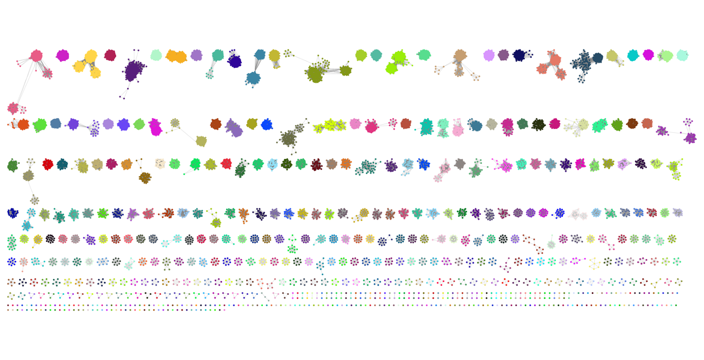

::: {.callout-tip}
## Learning Objectives

- Understand that there are newer whole genome based methods that are increasingly being used instead of MLST.
- Use PopPUNK to assign Global Pneumococcal Sequence Clusters (GPSCs) to _Streptococcus pneumoniae_ genomes.

:::

## Newer methods for strain typing

Although Multilocus Sequence Typing (MLST) has been highly effective, newer methods leveraging whole-genome sequencing (WGS) are beginning to replace it due to their enhanced resolution and comprehensiveness. WGS provides a complete picture of the bacterial genome, allowing for the identification of single nucleotide polymorphisms (SNPs) across the entire genome rather than just a limited set of housekeeping genes. This approach offers a finer scale of differentiation between strains, which is crucial for detailed epidemiological investigations and understanding transmission dynamics. Additionally, WGS facilitates the detection of horizontal gene transfer, virulence factors, and antibiotic resistance genes, providing a more holistic view of bacterial pathogenicity and evolution. Tools and platforms such as core genome MLST (cgMLST) and SNP-based phylogenetic analysis have been developed to utilize WGS data, offering higher resolution and more accurate strain typing. As sequencing technologies become faster and more cost-effective, WGS is increasingly becoming the gold standard for bacterial strain typing, enabling precise and comprehensive bacterial surveillance and research.

## PopPUNK

PopPUNK (Population Partitioning Using Nucleotide K-mers) is a bioinformatics tool designed for the rapid and scalable analysis of bacterial population structure using whole-genome sequencing data. It works by comparing genomes based on k-mer frequencies, where k-mers are short, fixed-length sequences of nucleotides. PopPUNK creates a distance matrix by calculating the genetic distances between all pairs of genomes, capturing both core and accessory genome variations. This matrix is then used to cluster genomes into distinct populations or clades using a combination of hierarchical and density-based clustering algorithms. PopPUNK can handle large datasets efficiently, providing insights into the evolutionary relationships, population dynamics, and epidemiological patterns of bacterial species. Its ability to integrate core and accessory genome data makes it a powerful tool for understanding microbial diversity and for tracking the spread of bacterial strains in public health contexts.

### Global Pneumococcal Sequence Clusters (GPSCs)

PopPUNK has been instrumental in assigning Global Pneumococcal Sequence Clusters (GPSCs), thereby enhancing our understanding of the worldwide population structure of _Streptococcus pneumoniae_. By analyzing extensive collections of whole-genome sequences from pneumococcal isolates collected globally, PopPUNK clusters these genomes into distinct lineages based on k-mer frequency comparisons. This high-resolution clustering allows for the identification of major lineages and sub-lineages, providing insights into the genetic diversity and evolutionary relationships among pneumococcal strains across different geographic regions. The tool has been used to trace the spread of specific lineages, monitor the impact of pneumococcal conjugate vaccines (PCVs) on the population structure, and identify emerging strains that may pose new public health threats. By integrating global genomic data, PopPUNK facilitates a comprehensive and detailed understanding of pneumococcal epidemiology, which is crucial for devising effective vaccination strategies and managing antibiotic resistance on a global scale.



## Running PopPUNK

We'll start by activating the `poppunk` software environment:

```bash
mamba activate poppunk
```

Now we need to create a tab-delimited file (called `assemblies.txt`) containing the samples we want to assign GPSCs to and where the assemblies are located:

```
ERX1265396_ERR1192012_T1	preprocessed/assemblebac/assemblies/ERX1265396_ERR1192012_T1_contigs.fa
ERX1265488_ERR1192104_T1	preprocessed/assemblebac/assemblies/ERX1265488_ERR1192104_T1_contigs.fa
ERX1501202_ERR1430824_T1	preprocessed/assemblebac/assemblies/ERX1501202_ERR1430824_T1_contigs.fa
ERX1501203_ERR1430825_T1	preprocessed/assemblebac/assemblies/ERX1501203_ERR1430825_T1_contigs.fa
ERX1501204_ERR1430826_T1	preprocessed/assemblebac/assemblies/ERX1501204_ERR1430826_T1_contigs.fa
```

To run PopPUNK on our assemblies, the following commands can be used:

```bash
# create output directory
mkdir -p results/poppunk

# run PopPUNK
poppunk_assign --db GPS_v8_ref --external-clustering GPS_v8_external_clusters.csv --query qfile.txt --output results/poppunk --threads 8
```
The options we used are:

- `--db` - GPSC reference database.
- `--external-clustering` - GPSC designations.
- `--query` - a 2-column tab-delimited file containing sample names and their assembly paths.
- `--output` - the output directory for the results.
- `--threads 8` - specifies how many CPUs to use.

:::{.callout-exercise}
#### Exercise: Run `PopPUNK`

Using `PopPUNK`, assign your Pneumococcal genomes to GPSCs.

- Activate the software environment: `mamba activate poppunk`.
- Run the script we provide in `scripts` using `bash scripts/05-run_poppunk.sh`.
- When the analysis starts you will get several messages print on the screen.
- Were any of the assemblies not assigned to an existing GPSC?

:::{.callout-answer}
We ran the script using `bash scripts/05-run_poppunk.sh`. The script prints a message while it's running:

```bash
PopPUNK: assign
	(with backend: sketchlib v2.1.4
	 sketchlib: /rds/user/ajv37/hpc-work/micromamba/envs/poppunk/lib/python3.10/site-packages/pp_sketchlib.cpython-310-x86_64-linux-gnu.so)
Mode: Assigning clusters of query sequences


Graph-tools OpenMP parallelisation enabled: with 8 threads
Sketching 5 genomes using 5 thread(s)
Progress (CPU): 5 / 5
Writing sketches to file
Loading previously refined model
Completed model loading
WARNING: versions of input databases sketches are different, results may not be compatible
Calculating distances using 8 thread(s)
Progress (CPU): 100.0%
Loading network from /home/ajv37/rds/rds-pathogen-CvaldwrLQm4/databases/poppunk/GPS_v8_ref/GPS_v8_ref_graph.gt
Network loaded: 2946 samples

Done
```

In the `results/poppunk` directory we can see the following files:

```
poppunk_clusters.csv  poppunk.dists.npy  poppunk.dists.pkl  poppunk_external_clusters.csv  poppunk.h5  poppunk_unword_clusters.csv
```

We can check the results of the clustering by opening the `poppunk_clusters.csv` file in the `results/poppunk` directory:

```
Taxon,Cluster
ERX1501203_ERR1430825_T1,2
ERX1501202_ERR1430824_T1,2
ERX1265396_ERR1192012_T1,2
ERX1265488_ERR1192104_T1,2
ERX1501204_ERR1430826_T1,2
```
- We can see that all the genomes were assigned to GPSC2.

:::

:::

## Summary

::: {.callout-tip}
#### Key Points

- There are whole genome based alternatives to MLST such as cgMLST and PopPUNK
- PopPUNK can be used to assign existing GPSCs to new genomes.
:::

#### References

Gladstone RA, Lo SW, Lees JA, Croucher NJ, van Tonder AJ, Corander J, Page AJ, Marttinen P, Bentley LJ, Ochoa TJ, Ho PL, du Plessis M, Cornick JE, Kwambana-Adams B, Benisty R, Nzenze SA, Madhi SA, Hawkins PA, Everett DB, Antonio M, Dagan R, Klugman KP, von Gottberg A, McGee L, Breiman RF, Bentley SD; Global Pneumococcal Sequencing Consortium. International genomic definition of pneumococcal lineages, to contextualise disease, antibiotic resistance and vaccine impact. _EBioMedicine_ 2019. [DOI](https://doi.org/10.1016/j.ebiom.2019.04.021) 