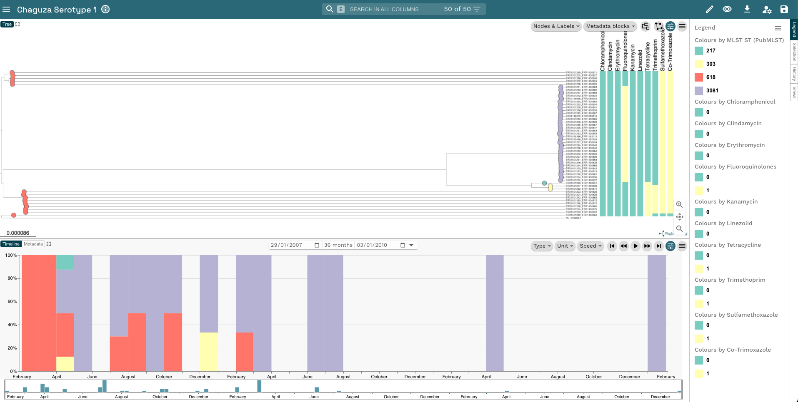

::: {.callout-tip}
## Learning Objectives

- Visualise and annotate a _S. pneumoniae_ phylogenetic tree.

:::

:::{.callout-exercise}
#### Visualize the Pneumococcal tree and edit the timeline

- Copy the preprocessed `sero1.treefile` to the analysis directory so that it's in the same location as `pneumo_metadata.tsv`
- Upload the two files to `Microreact`.
- Change the **Colour Column** to `MLST ST (PubMLST)`.
- Edit the tree so the tip labels are shown and reduce the size of the leaf nodes.
- Root the tree with the reference sequence.
- Add the AMR profile as metadata blocks.
- Add a legend to the window so you can identify what each colour corresponds to.
- Edit the Timeline plot so that the data in the bars are normalized and summarised by month.
- Save your project as **Chaguza Serotype 1**.

:::{.callout-answer}

- We copied `sero1.treefile` to the analysis directory:

    ```bash
    cp preprocessed/iqtree/sero1.treefile .
    ```

- We uploaded the two files to `Microreact` by clicking **Upload** then the **+** button on the bottom-right corner then **Browse Files** to upload the files.
- We clicked on the **Eye** icon and changed the **Colour Column** to `MLST ST (PubMLST)`.
- We clicked on the left-hand of the two buttons in the phylogeny window then the drop down arrow next to **Nodes & Labels**, clicked the slider next to **Leaf Labels** and moved the slider next to **Leaf Nodes** to reduce the size.
- We right-clicked on the node leading to `NC_018630_1` and clicked **Set as Root (Re-root)** to root the tree.
- We click on the **Metadata blocks** button in the top-right corner and select all of the drugs in the list.
- We clicked on the **Legend** button on the far right-hand side of the window to show the legend.
- We clicked the left-hand of the two buttons in the Timeline window then changed **Type** to **Normalised Bar Chart** and **Unit** to **Month**.
- We click on the **Save** button in the top-right corner and changed the project name to **Chaguza Serotype 1**.



:::
:::
