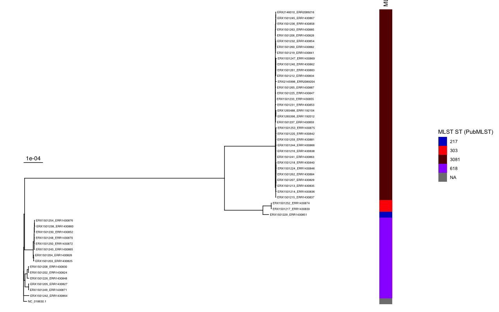

::: {.callout-tip}
## Learning Objectives

- Visualise and annotate a _S. pneumoniae_ phylogenetic tree with the R library ggtree.

:::

## Plotting phylogenetic trees with R

Plotting phylogenetic trees with `ggtree` in R offers a powerful and flexible approach for visualizing evolutionary relationships. The `ggtree` package, built on the ggplot2 framework, enables the creation of complex and highly customizable phylogenetic tree plots. With `ggtree`, users can easily manipulate tree layouts, annotate nodes and branches, and incorporate additional data layers such as heatmaps or bar charts. The package supports various tree formats, including Newick, Nexus, and PhyloXML, making it versatile for different datasets. Researchers can enhance their plots with a wide array of aesthetic options, such as color coding by clade, adding tip labels, and highlighting specific evolutionary events or traits. This flexibility makes `ggtree` an essential tool for evolutionary biologists and bioinformaticians, facilitating the clear and informative presentation of phylogenetic data.

:::{.callout-exercise}
#### Plot the Pneumococcal tree with `ggtree`

- Copy the preprocessed `sero1.treefile` to the analysis directory so that it's in the same location as `pneumo_metadata.tsv`.
- Open the script `06-plot_phylogeny.R` in the `scripts` directory in RStudio.
- Edit the script so it points to the `sero1.treefile` and `pneumo_metadata.tsv` files in the analysis directory.
- Run the script to generate the annotated phylogenetic tree. 

:::{.callout-answer}

- We copied `sero1.treefile` to the analysis directory:

```bash
cp preprocessed/iqtree/sero1.treefile .
```

- We edited the script to point to the location of the metadata and tree files:

```R
metadata <- read_tsv("../pneumo_metadata.tsv")

pneumo_phylogeny <- read.tree("../sero1.treefile")
```

- We ran the script to generate a rooted phylogenetic tree:



:::
:::

## Summary

::: {.callout-tip}
#### Key Points

- ggtree is a highly customisable R package for generating publication quality images of phylogenetic trees.
:::