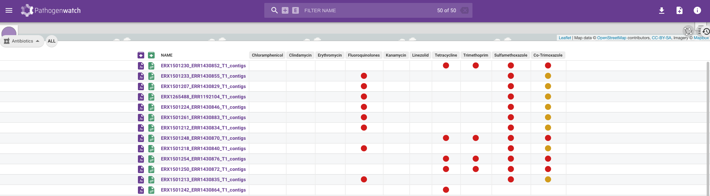

::: {.callout-tip}
## Learning Objectives

- Apply both command line and web applications to find potential AMR genes in a set of genomes.
:::

## Which AMR do my isolates have?

At this stage you may notice that different tools will give you a different answer to this question and it is therefore recommended to **compare the results across multiple tools**.
For example, _Pathogenwatch_ generally detects AMR for comparatively more antimicrobial drugs (ten in this case) compared to the `funcscan` analysis. When we filtered the `hamronization_combined_report.tsv` table we found that `funcscan` had only identified resistance to Tetracycline (table below, showing some of the columns from the _hAMRonization_ table):

```
input_file_name	gene_symbol	reference_accession	antimicrobial_agent	coverage_percentage	sequence_identity
ERX1501203_ERR1430825_T1.tsv.amrfinderplus	tet(M)	WP_002414694.1	TETRACYCLINE	100	100
ERX1501204_ERR1430826_T1.tsv.amrfinderplus	tet(M)	WP_002414694.1	TETRACYCLINE	100	100
ERX1501217_ERR1430839_T1.tsv.amrfinderplus	tet(M)	WP_002414694.1	TETRACYCLINE	100	99.84
ERX1501229_ERR1430851_T1.tsv.amrfinderplus	tet(M)	WP_002414694.1	TETRACYCLINE	100	99.84
ERX1501230_ERR1430852_T1.tsv.amrfinderplus	tet(M)	WP_002414694.1	TETRACYCLINE	100	100
ERX1501238_ERR1430860_T1.tsv.amrfinderplus	tet(M)	WP_002414694.1	TETRACYCLINE	100	100
ERX1501242_ERR1430864_T1.tsv.amrfinderplus	tet(M)	WP_000691741.1	TETRACYCLINE	100	100
ERX1501243_ERR1430865_T1.tsv.amrfinderplus	tet(M)	WP_002414694.1	TETRACYCLINE	100	100
ERX1501248_ERR1430870_T1.tsv.amrfinderplus	tet(M)	WP_002414694.1	TETRACYCLINE	100	100
ERX1501250_ERR1430872_T1.tsv.amrfinderplus	tet(M)	WP_002414694.1	TETRACYCLINE	100	100
ERX1501252_ERR1430874_T1.tsv.amrfinderplus	tet(M)	WP_002414694.1	TETRACYCLINE	100	99.84
ERX1501254_ERR1430876_T1.tsv.amrfinderplus	tet(M)	WP_002414694.1	TETRACYCLINE	100	100          
```
The main reason for `funcscan` only identifying resistance to Tetracycline whilst `Pathogenwatch` identified resistance to for up to ten drugs is the resistance-determinant databases used for the predictions.  For species such as _S. pneumoniae_, `Pathogenwatch` uses a curated database specific to the species whilst `funcscan` uses databases such as `amrfinderplus` which contain variants for all species and may not contain the variants in the `Pathogenwatch` database.

In conclusion, always be critical of the analysis of your results at this stage, comparing the output from different tools as well as considering the quality of your assemblies. 
Ultimately, the safest way to assess AMR is with **experimental validation**, by testing those strains against the relevant antimicrobial agents in the lab. 
However, computational analysis such as what we did can help inform these experiments and treatment decisions.

:::{.callout-exercise}
#### AMR with _Pathogenwatch_

Following from the _Pathogenwatch_ exercise in [Analysing Pneumococcal genomes with Pathogenwatch](29-pathogenwatch.md), open the "Chaguza Serotype 1" collection that you created and answer the following questions:

- Open the antibiotics summary table.
- Do all your samples have evidence for antibiotic resistance?
- If any samples have resistance to much fewer antibiotics compared to the others, do you think this could be related to assembly quality?
- How do the results from _Pathogenwatch_ compare to those from `nf-core/funcscan`?

:::{.callout-answer}

We can open the "Antibiotics" table from the top-left dropdown menu, as shown in the image below. 



We can see that _Pathogenwatch_ identified resistance to several antibiotics. We can see that there are mainly two distinct AMR-profiles in our samples.The first group is resistant to Tetracycline, Trimethoprim, Sulfamethoxazole and Co-Trimoxazole and susceptible to the other drugs. The second group is resistant to Fluroquinolones, Sulfamethoxazole and only intermediate resistant to Co-Trimoxazole. Additionally sample ERX1501242_ERR1430864 is only resistant to Tetracycline and sample ERX1501229_ERR1430851 is resistant to Tetracycline, Sulfamethoxazole intermediate resistant to Co-Trimoxazole. 

If you go back to the [_Microreact_ visualization](30-tree_visualization.md) of the "Chaguza Serotype 1" dataset and look at the distribution of the AMR profiles across the tree, you will see that there is a strong phylogenetic association. The first group that includes Tetracycline resistance forms a distinct clade at the bottom of the tree whilst the second group, susceptible to Tetracycline forms a second, larger clade in the middle of the tree.


If we look at the _funcscan_ results we can see that it identified Tetracycline resistance in the same 12 samples as _Pathogenwatch_.

:::
:::

## Summary

::: {.callout-tip}
## Key Points

:::