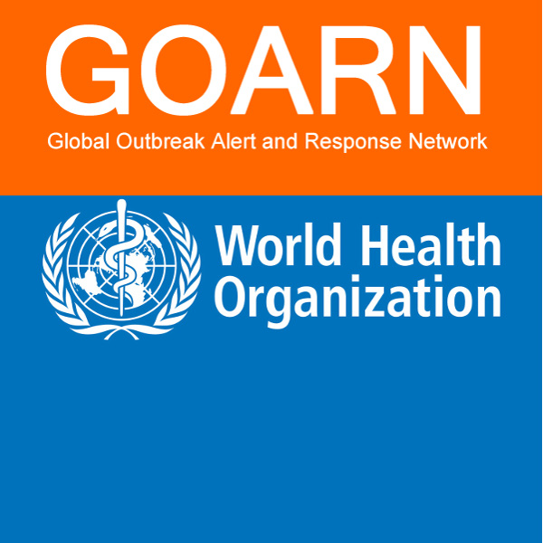

We've been contacted by the World Health Organization who are dealing with an outbreak of Acute Watery Diarrhoea in an undisclosed country. 
They need some urgent bioinformatics analysis doing on isolates collected as part of the outbreak and they’ve provided the raw data for us to analyse.

## Analyse the data

The data for this exercise can be found in the `outbreak` directory.

- Perform QC on the sequence data to identify the causative agent and check that the data is good enough for further analysis
- Have a look at the “Know Your Bug” Flowchart and decide what the best analysis approach is
- Use what you have learned this week to analyse the isolates so as to be able to provide some useful information to the WHO so they can deal with the outbreak effectively
- Have a think about what key information the WHO will want to know
- Feel free to consult your colleagues if you need some help

::{.callout-tip}
#### Long-running pipelines

One of the pipelines that we expect you to run takes a long time to complete. 
You do not need to wait for it to complete - once you are happy that your pipeline is running successfully, rather than wait, **ask the trainers where to find preprocessed data** to continue with your analysis. 
:::
