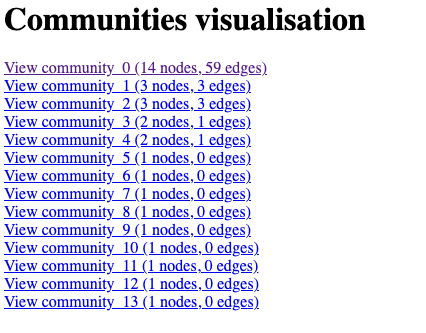
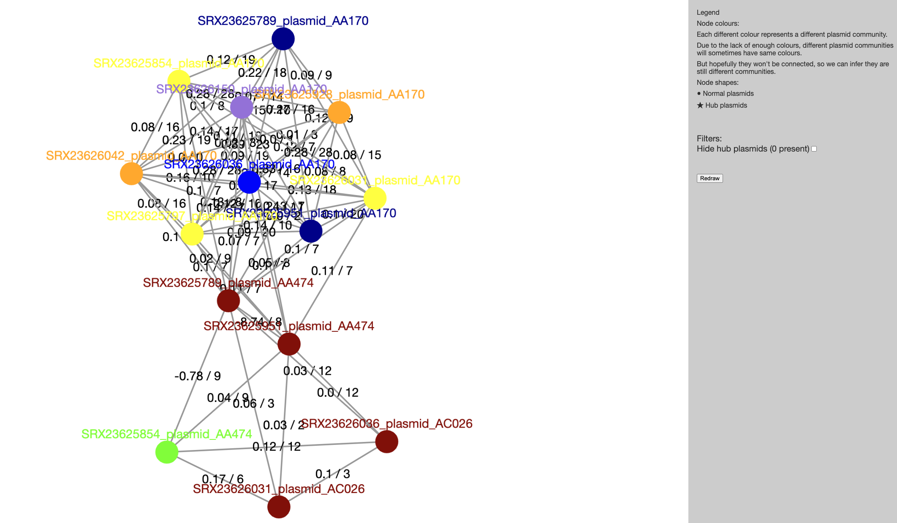
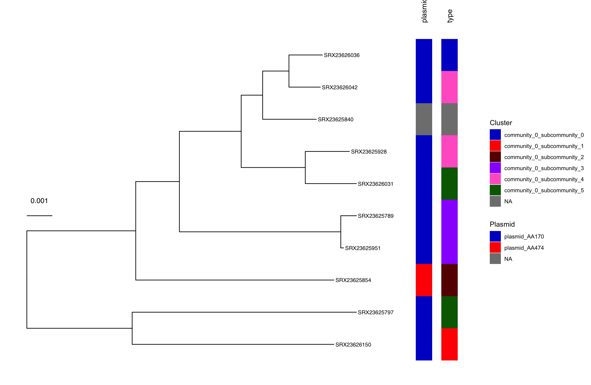

::: {.callout-tip}
#### Learning Objectives

- Describe the role of plasmids in antimicrobial resistance (AMR) spread.
- Identify plasmids in whole-genome sequencing (WGS) data using MOB-suite.
- Explore plasmid clustering using Pling to identify related plasmids.

:::

## Plasmids

Plasmids are small, circular, extrachromosomal DNA molecules that play a crucial role in the horizontal gene transfer (HGT) of antimicrobial resistance (AMR) determinants among bacteria. 
Unlike chromosomal genes, plasmids can autonomously replicate and transfer between bacterial cells via conjugation, transformation, or transduction, enabling the rapid spread of resistance genes across different species and even genera. 
Many plasmids carry mobile genetic elements (MGEs), such as transposons and integrons, which further facilitate the acquisition and dissemination of AMR genes. 
This mobility allows bacteria to quickly adapt to antibiotic pressure, contributing to the global AMR crisis. 
Clinically relevant resistance genes, including those encoding extended-spectrum β-lactamases (ESBLs), carbapenemases (e.g., NDM, KPC), and plasmid-mediated quinolone resistance (PMQR), are frequently plasmid-borne. 
Because plasmids can persist in bacterial populations even in the absence of antibiotic selection, they serve as long-term reservoirs for resistance, complicating infection control and treatment strategies. 
Understanding plasmid epidemiology is therefore essential for tracking AMR spread and developing targeted interventions.

## Plasmid Identification

Plasmid identification is a critical step in understanding the role of plasmids in the spread of antimicrobial resistance (AMR) and other traits among bacteria. 
The most commonly used tools for plasmid identification in whole-genome sequencing (WGS) data include `PlasmidFinder` and `mlplasmids`, which detect plasmid-derived sequences using curated databases of known replicons. 
Other popular tools like `MOB-suite` and `Platon` employ machine learning and homology-based approaches to predict plasmid contigs and reconstruct plasmid structures from assembled genomes.

### MOB-suite

The `MOB-suite` is designed to be a modular set of tools for the typing and reconstruction of plasmid sequences from WGS assemblies. 
It is particularly useful for identifying plasmid contigs in assembled genomes, reconstructing plasmid sequences, and predicting their potential mobility. 

### Running MOB-suite {#sec-mobsuite}

We are going to use _E.coli_ assemblies we've provided for you as input for `MOB-suite` and these are located in `E_coli/data/assemblies`. 
These assemblies were generated from ONT data using the [`assembleBAC-ONT` pipeline](https://github.com/avantonder/assembleBAC-ONT).

First activate the MOB-Suite software environment:

```bash
mamba activate mob_suite
```

To run MOB-suite on a single assembly, the following command can be used:

```bash
# create output directory
mkdir -p results/mobsuite/

# run MOB-suite
mob_recon --infile data/assemblies/SRX23625789.fa --outdir results/mobsuite/SRX23625789 -g databases/2019-11-NCBI-Enterobacteriacea-Chromosomes.fasta
```

The options we used are:

- `--infile` - the assembly to search for plasmids.
- `--outdir` - output directory for `MOB-suite` to save its outputs.
- `-g` - the path to the reference database of known plasmid sequences. This is a required parameter for `MOB-suite` to identify plasmids in the input assembly.

As it runs, `mob_recon` prints several messages to the screen.

We can see all the output files `mob_recon` generated:

```bash
ls results/mobsuite/SRX23625789
```

```
biomarkers.blast.txt  mge.report.txt        chromosome.fasta     plasmid_AA379.fasta  plasmid_AA619.fasta
contig_report.txt     mobtyper_results.txt  plasmid_AA170.fasta  plasmid_AA474.fasta  plasmid_AD548.fasta       
```

:::{.callout-exercise}
#### Running MOB-suite

Make sure you are in the `E_coli` directory for this exercise.

Above, we have run MOB-suite on a single sample. 
However, we have ten samples that we need to repeat the analysis on. 
To do this, we've provided a script that runs MOB-suite on all the FASTA files for all the samples in the `data/assemblies` directory using a _for loop_.

- In the folder `scripts` (inside your analysis directory), you'll find a script named `01-run_mobsuite.sh`.
- Open the script, which you will notice is composed of two sections: 
    - `#### Settings ####` where we define some variables for input and output files names. If you were running this script on your own data, you may want to edit the directories in this section.
    - `#### Analysis ####` this is where `MOB-suite` is run on each sample as detailed in @sec-mobsuite. You should not change the code in this section.
- Activate the software environment: `mamba activate mob_suite`
- Run the script with `bash scripts/01-run_mobsuite.sh`. If the script is running successfully it should print a message on the screen as the samples are processed.
- How many different plasmids were identified in sample SRX23625854?
- Which contig(s) were identified as `chromosome` for sample SRX23625854?

:::{.callout-answer}
We opened the script `01-run_mobsuite.sh` and these are the settings we used:

- `fasta_dir="data/assemblies"` - the name of the directory with FASTA files in it.
- `outdir="results/mobsuite"` - the name of the directory where we want to save our results.
- `database="databases/mob_suite/2019-11-NCBI-Enterobacteriacea-Chromosomes.fasta"` - the name of the directory with the plasmid database in it.

We then ran the script using `bash scripts/01-run_mobsuite.sh`. The script prints a message while it's running: 

```bash
Processing SRX23625789
2025-06-26 12:37:29,646 mob_suite.mob_recon INFO: MOB-recon version 3.1.9  [in /rds/user/ajv37/hpc-work/micromamba/envs/mob_suite/lib/python3.11/site-packages/mob_suite/mob_recon.py:984]
2025-06-26 12:37:29,729 mob_suite.mob_recon INFO: SUCCESS: Found program blastn at /rds/user/ajv37/hpc-work/micromamba/envs/mob_suite/bin/blastn [in /rds/user/ajv37/hpc-work/micromamba/envs/mob_suite/lib/python3.11/site-packages/mob_suite/utils.py:597]
2025-06-26 12:37:29,765 mob_suite.mob_recon INFO: SUCCESS: Found program makeblastdb at /rds/user/ajv37/hpc-work/micromamba/envs/mob_suite/bin/makeblastdb [in /rds/user/ajv37/hpc-work/micromamba/envs/mob_suite/lib/python3.11/site-packages/mob_suite/utils.py:597]
2025-06-26 12:37:29,803 mob_suite.mob_recon INFO: SUCCESS: Found program tblastn at /rds/user/ajv37/hpc-work/micromamba/envs/mob_suite/bin/tblastn [in /rds/user/ajv37/hpc-work/micromamba/envs/mob_suite/lib/python3.11/site-packages/mob_suite/utils.py:597]
2025-06-26 12:37:29,804 mob_suite.mob_recon INFO: Processing fasta file data/assemblies//SRX23625789.fa [in /rds/user/ajv37/hpc-work/micromamba/envs/mob_suite/lib/python3.11/site-packages/mob_suite/mob_recon.py:1011]
2025-06-26 12:37:29,804 mob_suite.mob_recon INFO: Analysis directory results/mobsuite/SRX23625789 [in /rds/user/ajv37/hpc-work/micromamba/envs/mob_suite/lib/python3.11/site-packages/mob_suite/mob_recon.py:1012]
2025-06-26 12:37:31,995 mob_suite.mob_recon INFO: Writing cleaned header input fasta file from data/assemblies//SRX23625789.fa to results/mobsuite/SRX23625789/__tmp/fixed.input.fasta [in /rds/user/ajv37/hpc-work/micromamba/envs/mob_suite/lib/python3.11/site-packages/mob_suite/mob_recon.py:1107]
...
```

There are a few different output files generated by MOB-suite for each sample. 
The most useful one to help answer the questions is `contig_report.txt`. 
We can use `less` to look at the number of plasmids identified in the sample and which contig(s) were identified as the chromosome. 

```bash
less -S results/mobsuite/SRX23625854/contig_report.txt
```

```
sample_id       molecule_type   primary_cluster_id      secondary_cluster_id    contig_id       size    gc      md5     circularity_status      rep_type(s)     rep_t>
SRX23625854     chromosome      -       -       contig_1        4835838 0.5077347504196791      76eea322d7fb7ab52954ff7c3e51074c        not tested      -       -    >
SRX23625854     plasmid AA579   AI802   contig_2        2493    0.5194544725230645      55ebe5a8c69762065dc86ecdc0b026ab        not tested      -       -       -    >
SRX23625854     plasmid AA579   AI802   contig_3        1131    0.5004420866489832      9ad46c349e5d7f1e38a7d893e35f546b        not tested      -       -       -    >
SRX23625854     chromosome      -       -       contig_4        733     0.5061391541609823      67e9da01dbdfa64d30f64bd093426d7d        not tested      -       -    >
SRX23625854     plasmid AA170   AH818   contig_5        120329  0.5314512710984052      2182898861b4a6f8bb457cd120c69577        not tested      IncFIA,IncFIA   00013>
SRX23625854     plasmid AA474   AI621   contig_6        94110   0.5004781638508129      ff6338308f3bdf00df017328dafacd98        not tested      IncI1/B/O       EU418>
SRX23625854     chromosome      -       -       contig_7        8214    0.4398587776966155      0c46e1e37a8dc1ac259f845a1346a585        not tested      ColRNAI_rep_c>
```

We can see that MOB-suite identified 3 plasmids (AA579, AA170, AA474) in this sample, and the contigs identified as the chromosome were `contig_1`, `contig_4`, and `contig_7`.

:::
:::

## Plasmid clustering

### Pling

`Pling` is a software workflow for plasmid analysis using rearrangement distances, specifically the Double Cut and Join Indel (DCJ-Indel) distance. 
By intelligently combining containment distance (shared content as fraction of the smaller) and DCJ-indel distance (“how far apart evolutionarily” in a structural sense), and by preventing shared mobile elements from clouding the issue, it infers clusters of related plasmids.

### Running Pling

To run Pling, we need to provide it with the plasmid sequences that were identified by MOB-suite. 
These need to be copied from the `results/mobsuite` directory to a new directory called `results/pling`. 
Now we can run Pling on the plasmid sequences we identified with MOB-suite:

```bash
# activate the pling software environment
mamba activate pling

# create pling output directory
mkdir -p results/pling/

# copy plasmid sequences to pling directory
cp results/mobsuite/*/*_plasmid_*.fasta results/pling/

# create the input file for pling
ls -d -1 results/pling/*.fasta > input.txt

# run pling
pling input.txt results/pling/output align
```

The options we used are:

- `input.txt` - the plasmid FASTA files to cluster.
- `results/pling/output` - output directory for `pling` to save its outputs.
- `align` - integerisation method: "align" for alignment.

As it runs, `pling` prints several messages to the screen.

We can see all the output files `pling` generated:

```bash
ls results/pling/
```

```
all_plasmids_distances.tsv  batches  containment  dcj_thresh_4_graph  unimogs       
```

:::{.callout-exercise}
#### Running Pling

Your next task is to run **Pling** on your data.  
In the folder `scripts` (within your analysis directory) you will find a script named `02-run_pling.sh`. 
This script contains the code to run Pling. 

- Edit this script, adjusting it to fit your input files and the name of your output directory.
- Activate the `pling` software environment.
- Run the script using `bash scripts/02-run_pling.sh`.
  
While the pipeline runs, you will get a progress printed on the screen, and then a message once it finishes. 

:::{.callout-answer}

The fixed script is: 

```bash
#!/bin/bash

# create output directory
mkdir -p results/pling/

# copy plasmid sequences to Pling directory
cp results/mobsuite/*/*_plasmid_*.fasta results/pling/

# create the input file for Pling
ls -d -1 results/pling/*.fasta > input.txt

# run Pling
pling input.txt results/pling/output align
```

We ran the script as instructed using:

```bash
bash scripts/02-run_pling.sh
```

While it was running it printed a message on the screen:

```
Batching...

Completed batching.

Aligning, integerising, and building containment network...

Completed distance calculations and clustering.
```

:::
:::

### Pling results

Now that Pling has run we can look at the results. 
The file we'll have a look at is `index.html`: go to the File Explorer application <i class="fa-solid fa-folder"></i>, navigate to `results/pling/output/dcj_thresh_4_graph/visualisations/communities/` and double click on `index.html`.  
This will open the file in your web browser:



You can click on any of the communities on the list to be taken to a visualisation of that community’s containment network. 
Click on the first link on this page (`View community_0 (14 nodes, 59 edges)`). 
Pling defines broad plasmid communities by building a containment network. 
Each node is a plasmid, and its colour denotes which subcommunity it’s assigned to. 
There are edges between every pair of plasmids that have a containment distance less than or equal to 0.5, and the edges are labelled by both containment distance (first number) and DCJ-Indel distance (second number). 
The layout may be a bit different, as it is regenerated each time you view the community. 



:::{.callout-exercise}
#### Examine Pling output

Open the `index.html` file in the `containment` directory of your Pling results and try to answer the following questions:

- How many plasmid communities were identified?
- How many plasmids are in the largest community?

We can also add the plasmid clustering results to a phylogenetic tree of our samples in R using the `ggtree` package. 
This will allow us to identify which plasmids are "the same" and spot horizontal gene transfer (HGT) events.

- Generate a 'quick and dirty' phylogenetic tree of our samples using `mashtree`. Run the script `03-run_mashtree.sh` in the `scripts` directory. This will generate a tree in the `results/mashtree` directory.
- Open the script `04-plot_pling.R` in the `scripts` directory in RStudio.
- Run the script line-by-line to generate the annotated phylogenetic tree.
- Do you see any HGT events in the tree?

:::{.callout-answer}

We opened the `index.html` file in the `communities` directory of our Pling results and found that:

- **How many plasmid communities were identified?**: 14 communities were identified.
- **How many plasmids are in the largest community?**: The largest community (community_0) has 14 plasmids.

We built a phylogenetic tree using `mashtree`. 
We then opened the script `04-plot_pling.R` in RStudio and ran it line-by-line. 
The script generated a phylogenetic tree of our samples and added metadata strips for plasmid "type" and community to spot HGT events. 
We can see that samples SRX23626042 and SRX23625928 have versions of the AA170 plasmid from the same community, indicating potential horizontal gene transfer (HGT) events.



:::
:::

## Summary

::: {.callout-tip}
#### Key Points

- Plasmids are small, circular DNA molecules that can carry antimicrobial resistance (AMR) genes and facilitate horizontal gene transfer (HGT) among bacteria.
- MOB-suite is a tool for identifying plasmid contigs in whole-genome sequencing (WGS) assemblies, reconstructing plasmid sequences, and predicting their potential mobility.
- Pling is a software workflow for plasmid clustering using rearrangement distances, specifically the Double Cut and Join Indel (DCJ-Indel) distance, to infer clusters of related plasmids.

:::

